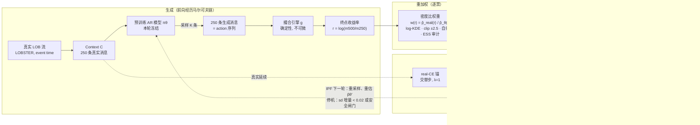
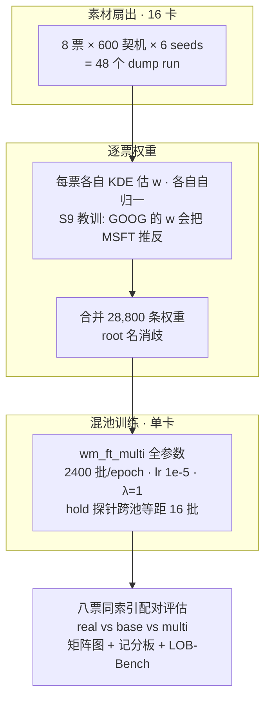

# Mid-training 管线图（mermaid 版）

保存即在 Recent Markdown 置顶；右键 → Open Preview 渲染。与 `fig_midtrain_pipeline.drawio` 同构。

## 主循环：On-policy 终点密度比蒸馏

## 多票扩量版（当前在跑的 wm_ft_multi）

产物对照：`fig_midtrain_pipeline.{drawio,pdf}`（Overleaf figures/）。
