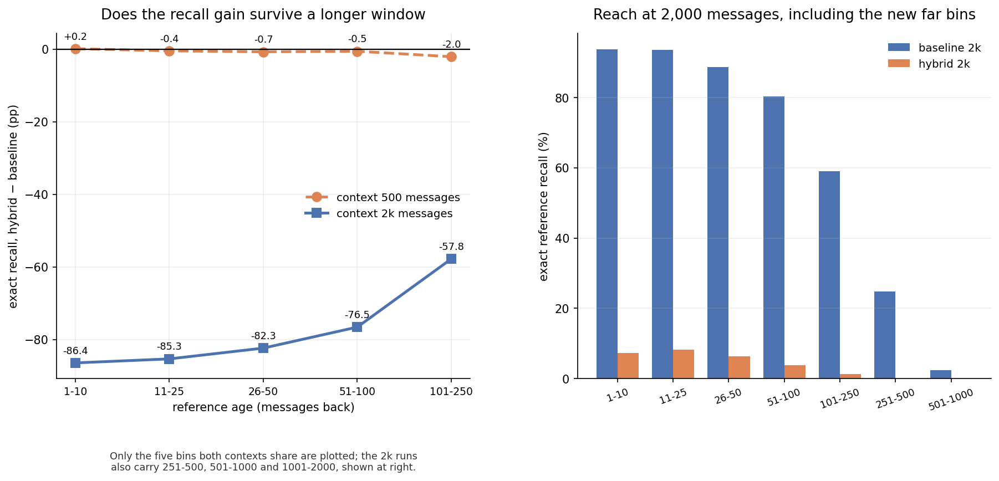

# 2k 全链路首跑：500 上下文训练的 hybrid **不能**在 2k 窗口上用（2026-08-12）

**这一轮跑的是什么**：把已训好的 **500 上下文** 两条臂（baseline `j5877859@32001`、
hybrid `j5980745@32001`），放到 **2,000 条 half-half**（cond1000 / gen1000）上评测。
**不是** 2k 训练模型的对照——那两个还在训。

**为什么先跑这个**：它是唯一能立刻走通 inference → scoring → reporting 全链路的实验
（训练占满了 16 张卡，只剩邻居让出的两张做推理），而且它回答一个必须回答的前置问题：
**能不能省掉重训，直接拿短上下文的模型跑长窗口。**

**设置**：N=64 序列，seed 2026，随机模式索引（seed 42），2 GPU，`XLA_PYTHON_CLIENT_MEM_FRACTION=0.25`。



---

## 1. ⭐ 答案：不能。hybrid 在 2k 上崩了，baseline 没有

| 指标 | base@500 | hyb@500 | **base@2k** | **hyb@2k** |
|---|---:|---:|---:|---:|
| (7.3) WS-21 ↓ | 0.20714 | **0.18428** | 0.31957 | **0.50487** |
| (7.3) KS-21 ↓ | 0.10458 | **0.10139** | 0.14485 | **0.27982** |
| (7.3) L1-21 ↓ | 0.16451 | **0.14937** | 0.22909 | **0.34485** |
| **(7.4) L1 精确** ↑ | 74.8939% | 74.4415% | **71.1674%** | **4.5503%** |
| (7.4) 未解析 ↓ | 4.0564% | 3.9787% | 3.9628% | **15.9750%** |
| (7.2) IC h=250 ↑ | 0.1639 | 0.1974 | 0.3859 | 0.2014 |

**hybrid 的引用精确率从 74.44% 塌到 4.55%**，而同样条件下 baseline 只从 74.89% 降到 71.17%。

### 分层看更清楚

| 引用年龄 | base@2k | hyb@2k |
|---|---:|---:|
| 1–10 | **93.72%** | 7.32% |
| 11–25 | **93.62%** | 8.32% |
| 26–50 | **88.74%** | 6.41% |
| 51–100 | **80.31%** | 3.77% |
| 101–250 | **59.01%** | 1.26% |
| **251–500**（新档） | **24.88%** | **0.00%** |
| **501–1000**（新档） | **2.33%** | **0.00%** |

baseline **连最近的 1–10 档都还有 93.72%**，hybrid 只有 7.32%——**这不是长程能力退化，是整个模型垮了**，
近端和远端一起垮。

---

## 2. 为什么：注意力只会插值，不会外推

递归主干与注意力对「超出训练长度」的反应根本不同：

```
mamba3      固定大小的状态，逐步推进
            → 序列多长都能跑，退化是渐进的
            实测 74.89% → 71.17%，且在新出现的 251-500 档还有 24.88%

attention   训练时见过的最长序列是 13,000 token
            推理时要在 52,000 token 上做 softmax —— 4 倍于它见过的一切
            → 注意力分布的熵随长度增长，权重被摊平，回指信号被淹没
            实测 74.44% → 4.55%
```

**NoPE 让这件事更糟。** Nemotron 的 attention 不带位置编码，位置信息全靠 mamba3 在状态里
的 RoPE 间接提供。在训练长度内这套是自洽的；一旦长度翻 4 倍，attention 既没有显式位置信号，
也没见过这个尺度的键集合，**没有任何机制让它把注意力收回到局部**。

这与既有记忆里那条一致：**Transformer 只做插值，外推需要 PI/NTK 之类的显式手段**。

---

## 3. ⭐⭐ 这直接证明了「两条臂都必须重训」

原话是「往后我们真正的用法就真的是训练长的那个东西了，所以 baseline 和 hybrid 都需要训练」。
这一轮给出了这句话的量化依据：

| 方案 | 结果 |
|---|---|
| 拿 500 训练的 hybrid 直接跑 2k | ❌ **4.55%，完全不可用** |
| 拿 500 训练的 baseline 直接跑 2k | ⚠️ 71.17%，能用但退化，且远档几乎够不着 |
| **两条臂都在 2k 上重训** | ✅ 正在跑（见 `CTX2K_EXPERIMENT.md`） |

**省掉重训这条路已经被实测关闭。**

---

## 4. 这一轮不能说什么

| 不能说 | 为什么 |
|---|---|
| 「hybrid 在长上下文上更差」 | 这测的是**长度外推**，不是**长上下文训练**。2k 训练的 hybrid 从没见过 13,000 这个长度，不受此限 |
| 「baseline 在 2k 上够用」 | 251–500 档只有 24.88%、501–1000 档只有 2.33%，**新增的窗口基本没被用上** |
| 任何 LOB-Bench 的精确数值 | N=64，远小于正式的 3,136；崩塌幅度（74%→4.5%）远超噪声，但小数点后的数不可引用 |

---

## 5. 流水线：六步已全部各走一遍

| 步骤 | 状态 | 产物 |
|---|---|---|
| 建立代码 | ✅ | 训练脚本 ×2、`bench_2k.batch`、守望器、汇总器 |
| 做测试 | ✅ | 两臂冒烟各 150 步 + 四项代码自测 |
| 跑训练 | 🔄 | 2k 两条臂训练中（本报告用的是 500 上下文的已训模型） |
| **inference** | ✅ | cond1000/gen1000，生成形状 `(8, 52001)` 正确 |
| **scoring** | ✅ | (7.2)/(7.3)/(7.4) 全部落盘，年龄分桶扩到 2000 |
| **reporting** | ✅ | 本文件 + `figures/ctx2k_grid.png` |

**时间实测**：N=64 全链路约 12 分钟（2 GPU）。外推到 3,136 条 / 4 GPU ≈ **1.55 小时**，
2k 训练结束后的正式评测可按此排期。

---

## 6. 下一步

- [ ] 2k 训练跑完（baseline 预计 +9.8h、hybrid +14.6h）
- [ ] 用守望器选定的共同步号跑正式 2k 对照（N=3136）
- [ ] 那时才是「hybrid 在 2k 上会不会变好」的答案
- [ ] 本轮 N=64 的长度泛化结论若要发表，需补到 N≥512
