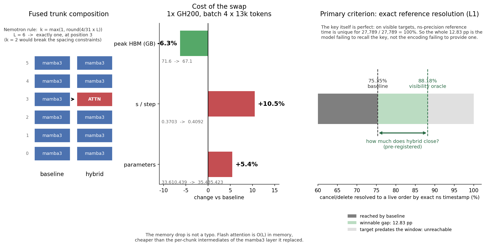

# Hybrid·阶段1：把 Nemotron 配方落到 Mamba3 主干上，并量出它的真实代价（2026-08-12）

**任务目录**：`/lus/lfs1aip2/projects/public/u6gb/tasks/hybrid_system_20260811/05_hybrid_mamba3_lob/`
**代码**：`sigma-0-worktrees/hybrid-mamba3-nemotron-20260811`，分支 `feat/hybrid-mamba3-nemotron-20260811`
**提交**：`c0bcd15`（架构）→ `5090421`（启动路径）→ `636512c`（白名单修复）

---

## 0. 本阶段回答了什么

| 问题 | 答案 |
|---|---|
| Nemotron 的比例在 L=6 上是几层 attention？ | **恰好 1 层，在 trunk 第 3 块**；k=2 违反间距约束 |
| 异构堆叠要改多少代码？ | 四处，`SequenceLayer` **一行不用改** |
| 换一层贵多少？ | **+5.43% 参数、+10.5% 每步耗时、−6.3% 峰值显存** |
| 我们要打败的是哪个数？ | 引用解析 **L1 精确 75.35%**，上界 88.18%，**可夺取 12.83 pp** |



---

## 1. 层位置：Nemotron 的比例要按「序列混合层」算

Nemotron Nano 9B v2 的模式串（56 字符，逐字取自 `config.json`）：

```
M-M-M-MM-M-M-M*-M-M-M*-M-M-M-M*-M-M-M-M*-M-MM-M-M-M-M-M-
```

`M`=Mamba-2、`*`=Attention、`-`=MLP-only，**三者是各自独立的 residual 层**，不是同一 block 内的组件。

> **一个会算错两倍的陷阱**：直接用 4/56 = 7.1% 是错的，因为 56 层里 **25 层是 MLP-only，不做任何 token mixing**。正确基数是 attention 占**序列混合层**的比例：4/(27+4) = **12.9%**。

$$k=\max\!\left(1,\ \operatorname{round}\left(\tfrac{4}{31}\cdot L\right)\right)$$

位置按 Nemotron 四个 attention 的相对深度 {0.250, 0.375, 0.536, 0.696} 抽象成 [0.26, 0.71] 深度带内插值，再 clamp 到 `[2, L-2]`。

**规则的可信度自检**（唯一可做的自检）：代回 L=31（Nemotron 自己的序列混合层数）得 `(8, 13, 17, 22)`，Nemotron 实际是 `(8, 12, 17, 22)`——**四个位置对上三个，只差一层**。

### 在 L=6 上的结论

| L | k | attention 位置 | C1 前置 | C2 后置 | C3 不相邻 | C4 间距≥3 |
|---|---|---|---|---|---|---|
| **6** | **1** | **(3,)** | 3 ✅ | 2 ✅ | n/a ✅ | n/a ✅ |
| 6（强行 k=2） | 2 | (2, 4) | 2 ✅ | **1 ❌** | 1 ✅ | **1 ❌** |
| 12 | 2 | (3, 9) | ✅ | ✅ | ✅ | ✅ |
| 24 | 3 | (6, 12, 17) | ✅ | ✅ | ✅ | ✅ |

**所以在这个深度上，Nemotron 配方只允许一层 attention。** 想要更多必须先加深，而加深会同时改变参数量与深度，破坏对照。

四条约束的出处（全部读自 Nemotron 已发布的模式串，非猜测）：

| 约束 | 内容 | 依据 |
|---|---|---|
| C1 | 第 0 层不得是 attention；之前至少 `max(2, ⌈0.2L⌉)` 个递归块 | Nemotron 全模型**无 RoPE**，第一个 attention 前有 8 个 Mamba 层 |
| C2 | 末层不得是 attention；之后至少 2 个递归块 | 最后一个 attention 在 L39，之后还有 8 Mamba + 8 MLP |
| C3 | 不允许两个 attention 相邻 | 最小间隔 6 层 |
| C4 | attention 之间至少 3 个递归块 | 实际间隔为 3/4/4 |

---

## 2. 代码改造：`SequenceLayer` 一行不用改

原有堆叠是**硬编码同构**的——`src/s5/seq_model.py:58-80` 一个列表推导，N 层共享同一个 `self.ssm` factory。

```
        改造前                              改造后
  ┌──────────────────┐              ┌──────────────────┐
  │ StackedEncoder   │              │ StackedEncoder   │
  │  ssm = <一个>    │              │  ssm     = 递归  │
  │                  │              │  attn_ssm= 注意力│
  │  for i in range: │              │  attn_layers=(3,)│
  │    Layer(ssm)    │              │  for i in range: │
  │      ↑ 全一样    │              │    Layer(ssm if  │
  └──────────────────┘              │      i not in .. │
                                    │      else attn)  │
                                    └──────────────────┘
```

改动落在四处：

| # | 文件 | 改法 |
|---|---|---|
| 1 | `src/s5/seq_model.py` | 加 `attn_ssm` / `attn_layers` 两字段，`setup` 按 index 选 factory |
| 2 | `src/s5/seq_model.py` + `src/lob/lob_seq_model.py` | `initialize_carry` 按位置分别造 carry（mamba3 四元组 vs KV cache） |
| 3 | `src/s5/registry.py` | 新增架构名 `hybrid_mamba3`，`BackboneBuild` 增 `attn_layer_factory` / `attn_layers` |
| 4 | `src/lob/init_train.py` | 两字段透传给 `BatchPaddedLobPredModel` |

**`src/s5/layers.py` 零改动**：`setup:44-49` 会解开嵌套 `functools.partial` 探测 factory 类上的 `is_transformer` 标志，`__call__:96-97` 对 transformer 整层透传（它自带 Pre-LN 与双残差），`prefill:141-149` 对 mamba3 层返回 `None`。既有的「按 index 分支」模板是 MoE 的 `i % moe_every_n == 0`，而且 MoE 也只加在 fused trunk（message/book 编码器只有 1–2 层太浅），attention 沿用同一规则。

### 两个移植陷阱

1. **每个 block 都在往残差流里加正弦位置编码**（`transformer.py:174-175`）。这对纯 transformer 栈没问题，但插进混合栈会把一个大信号注入 Mamba3 正在工作的残差流，且违背 Nemotron 的 NoPE（它的 `position_embeddings` 在源码里是**被注释掉的 TODO**）。已改成 `use_positional_encoding` 开关，hybrid 置 False。
2. **Mamba3 没有 conv1d**（Mamba2 有 depthwise k=4）。所以 Nemotron「靠 conv 提供局部相对位置」的论证在这里要换成「靠 SSM 内建 RoPE（`rope_fraction=0.5`）」——位置信息仍在，来源不同，C1 依然适用。

---

## 3. 参数量：桩配置与真实基线逐位对上

扫描 `d_book` 发现 **503 精确复现已发表基线的 33,610,439**：

| d_book | 参数量 | 与已发表值之差 |
|---:|---:|---:|
| 501 | 33,600,719 | −9,720 |
| 502 | 33,605,578 | −4,861 |
| **503** | **33,610,439** | **0** ✅ |
| 504 | 33,615,302 | +4,863 |

这把「除了换一层，其余完全相同」从一句声明变成了**验证过的事实**。

### 生产宽度下的逐层对照

| trunk 层 | baseline | hybrid |
|---:|---:|---:|
| 0 | 3,098,536 | 3,098,536 |
| 1 | 3,098,536 | 3,098,536 |
| 2 | 3,098,536 | 3,098,536 |
| **3** | **3,098,536** | **4,923,520** ← ATTENTION |
| 4 | 3,098,536 | 3,098,536 |
| 5 | 3,098,536 | 3,098,536 |
| **合计** | **33,610,439** | **35,435,423**（+5.43%） |

attention 块的参数构成：`attn`(q/k/v/o 各 640×640+bias = 1,640,960) + 2×LayerNorm(2,560) + FFN(1281·d_ff + 640，d_ff=4H=2560 时为 3,279,360)。

> **参数配平臂的配方**：把 `d_ff` 从 2560 降到 **1135**，被换层的成本变成 3,098,095（与 mamba3 层差 −441）。这是「赢的是 attention 还是只是多了参数」的对照臂，留待主臂出结果后再决定是否需要。

---

## 4. 真实代价：单卡 GH200 微基准

data-free 微基准（`code/bench_step_time.py`），生产形状 batch=4 × seq=13,000（500 消息 × 26 token），attach 到空闲分配 `5980502` 的 nid010053：

| 臂 | 参数量 | 中位 s/step | tok/s | 峰值 HBM | attention 位置 |
|---|---:|---:|---:|---:|---|
| baseline `mamba3` | 33,610,439 | **0.3703** | 140,413 | **71.6 GB** | — |
| `hybrid_mamba3` | 35,435,423 | **0.4092** | 127,089 | **67.1 GB** | (3,) |
| **Δ** | **+5.43%** | **+10.5%** | −9.5% | **−6.3%** | — |

两臂 loss 均单调下降（baseline 8.38→7.66，hybrid 8.54→7.81，5 步），无 NaN。

### 显存为什么反而降了

不是笔误，有明确机制：Mamba3 的 SSD chunked scan 会物化 per-chunk 中间量（chunk 内 QK、state 张量），显存随 L 线性但常数大；Pallas flash attention 是 O(L) 显存、不物化 L×L。**省下的 mamba3 中间量大于 attention 自身占用。**

推论：**在这个形状下显存不是约束**，混合比例还有上调空间；真正的约束来自 Nemotron 的层间距规则（§1）。

### 一次被实测推翻的纸面估算

我先前按 FLOPs 推算 attention 是 mamba3 层的约 9.4 倍、总步长会涨 2.4×。实测只涨 10.5%。原因是 13,000 token 下 mamba3 层自身的 `in_proj`（H → d_inner + 2·n_groups·d_state + dt + trap + angles）已经很贵，两者比值远小于「纯 attention vs 纯 scan」的理论比。

---

## 5. 一个架构名要在三处登记，其中一处是静默的

新增 `hybrid_mamba3` 后被三道各自独立的白名单挡住：

| 位置 | 行为 | 危险度 |
|---|---|---|
| `runtime/train.py` argparse `choices` | 报 `invalid choice` | 低，一眼可见 |
| `train_full_autoreg.batch:208` case 白名单 | 报 `Unknown ARCHITECTURE` 并 exit 2 | 低，一眼可见 |
| `train_full_autoreg.batch:255` preset 闸门 `[ "$ARCHITECTURE" = "mamba3" ]` | **不报错，只是不触发** → 静默落到 360M 默认值 | **高** |

第三处正是这个闸门本身要防的事（它的错误信息写着「Refusing ambiguous Mamba3 launch with implicit model defaults」）。已分别改为：从 registry 取 choices（单一真相源）、case 与闸门都匹配 mamba3 家族。grep 全 `run/` `ci/` `tools/` 确认无第四处。

**可迁移判据**：同一概念散在多处时，**报错的枚举点便宜，静默的枚举点致命**，修的时候按危险度排而不是按发现顺序排。

---

## 6. 冒烟：两次失败，第二次的报错伪装成数据问题

| 次 | 现象 | 根因 | 修法 |
|---|---|---|---|
| 1 | exit 2，37 秒内 | batch 架构白名单不含新名字 | commit `636512c` |
| 2 | 37 秒崩，`no index.json` | **preflight 漏了 `rm -rf` 残留挂载目录** | 补回该行 |

第二次值得记：日志里**同时**出现

```
[squashfs] mounted 48/48 shards
RuntimeError: discover_ticker_files: no index.json at .../2022-01/index.json
```

`fusermount -uz` 是**惰性卸载**——只要挂载点还被引用就不脱离命名空间，下一次 `squashfuse` 叠上去解析到旧的空视图，于是「挂载成功」这个断言本身不可信。attach 场景下 `SLURM_JOB_ID` 在整个 allocation 生命周期恒定，挂载路径每次复用，所以这个坑**只在 attach 时出现**；普通 sbatch 每次拿新 job id 天然避开。

**决定性验证**：在 nid010053 上先卸载再 `rm -rf`，然后手动 `squashfuse` 挂 `shard_2022-01` → 挂载成功且 `index.json` **FOUND**（内容为 A / AAPL / ABBV / … ticker 目录）。

> 判据：**报错指向的层次不一定是故障所在的层次**。「成功」与「找不到」同时出现时，该去查那个「成功」的语义，而不是去查数据。

---

## 7. 下一阶段的判据（已预注册，防事后挑指标）

| 判据 | 内容 | 性质 |
|---|---|---|
| **P1 主判据** | 引用解析 L1 精确命中率提升，块自举配对 CI 不跨 0 | 判定命题成立与否 |
| **P2 机制判据** | 成功率对「被引用订单年龄」的斜率差 Δ_slope | 比单点差强得多 |
| **P3 非劣效闸门** | LOB-Bench WS-21 不劣于 baseline 超过噪声底 | 防「赢了回指、毁了分布」 |
| **P4 粗筛** | perplexity 不显著恶化 | **已知失灵**，只作粗筛 |

**为什么主判据不是 LOB-Bench**：把生成窗口内时间顺序**完全打乱**后 WS-21 反而好 13.7%，21 个特征里 13 个恰好 ±0.0%。它测的是逐行边际分布，对事件先后近乎不敏感；而本命题主张的「精确回指历史某条订单」是纯动态能力，(7.3) 结构上测不到。

**噪声底**：harness 0.6%、同 ckpt 两次全池复跑 1.9%、跨 seed 16.6% ⇒ **单点 WS-21 差异小于约 ±0.017 无意义**。

---

## 8. 变更记录

| 时间 UTC | 事件 |
|---|---|
| 2026-08-11T20:30Z | worktree 建立，三路调研发出 |
| 2026-08-11T21:15Z | 基线锁定 + P1–P4 预注册（`results/BASELINE.md`） |
| 2026-08-11T21:45Z | 架构实现完成，CPU 结构冒烟通过，参数量与已发表基线逐位对上 |
| 2026-08-12T02:00Z | GPU 微基准两臂完成 |
| 2026-08-12T02:35Z | 冒烟两次失败均定位并修复；第三次冒烟启动 |
