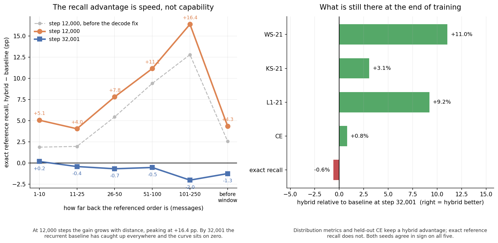

# Hybrid·阶段8：跑满 32,000 步的正牌对照（PE 修复后）（2026-08-12）

**这是目标 (1) 要的那张表**：hybrid 与 baseline pure-mamba3 在 message-level perplexity、LOB-Bench、引用订单成功率上的对照。

**设置**：两臂均 step 32001（baseline j5877859、hybrid j5980745），同一份冻结的 3,136 条 GOOG Jan-2026 索引，cond250 / gen250，同一份评测代码。hybrid 侧两个生成 seed（2026 / 2027）。
**全部 hybrid 数字来自 [阶段7 的 NoPE 解码修复](STAGE_7_ROOT_CAUSE_NOPE_LEAK.md) 之后的重跑。**



---

## 1. ⭐ 四项对照

| 指标 | baseline@32001 | hybrid s2026 | hybrid s2027 | 相对（s2026） | 谁好 |
|---|---:|---:|---:|---:|:---:|
| **(7.1) CE** ↓ nats/token | 0.532610 | **0.528384** | 同左 | **−0.79%** | **hybrid** |
| (7.1) nats/message ×26 ↓ | 13.848 | **13.738** | 同左 | −0.79% | **hybrid** |
| **(7.3) WS-21** ↓ | 0.20714 | **0.18428** | **0.18878** | **−11.0%** | **hybrid** |
| (7.3) KS-21 ↓ | 0.10458 | **0.10139** | **0.10435** | −3.1% | **hybrid** |
| (7.3) L1-21 ↓ | 0.16451 | **0.14937** | **0.15158** | −9.2% | **hybrid** |
| **(7.4) L1 精确** ↑ | **74.8939%** | 74.4415% | 74.1217% | −0.60% | baseline |
| (7.4) 未解析 ↓ | 4.0564% | **3.9787%** | **3.9543%** | −1.9% | hybrid |
| (7.2) IC h=250 ↑ | 0.1639 | 0.1974 | 0.2122 | +20.4% | 见 §4 |
| (7.2) DirAcc h=250 ↑ | 0.5040 | 0.5131 | 0.5061 | +1.8% | 弱 |

### 配对差（hybrid − baseline），两 seed 全部同号

| 指标 | s2026 | s2027 | 均值 | 同号 |
|---|---:|---:|---:|:---:|
| WS-21 ↓ | −0.02286 | −0.01836 | **−0.02061** | ✅ |
| KS-21 ↓ | −0.00319 | −0.00023 | −0.00171 | ✅ |
| L1-21 ↓ | −0.01513 | −0.01293 | **−0.01403** | ✅ |
| **L1 精确 pp** ↑ | −0.4524 | −0.7722 | **−0.6123** | ✅（一致**变差**） |
| IC h=250 ↑ | +0.0335 | +0.0482 | +0.0409 | ✅（但见 §4） |

---

## 2. ⭐⭐ 主结论：引用回指的优势是**收敛速度**，不是**能力**

这是本任务信息量最大的一张表。同一个机制判据 P2，在两个步长上给出相反的答案：

| 引用年龄 | @12000 差 (pp) | @32001 差 (pp) |
|---|---:|---:|
| 1–10 | +5.05 | +0.17 |
| 11–25 | +4.04 | −0.43 |
| 26–50 | +7.80 | −0.69 |
| 51–100 | +11.15 | −0.54 |
| **101–250** | **+16.38** | **−2.03** |
| before-window | +4.35 | −1.26 |

```
 Δ (pp)
  16 ┤                                  ●  step 12,000：随距离单调放大
  12 ┤                        ●
   8 ┤              ●
   4 ┤  ●     ●                              ●
   0 ┼──■─────■──────■─────────■──────────────■──── step 32,001：贴着零线
  -2 ┤                              ■
     1-10  11-25  26-50  51-100  101-250   before-window
```

**读法**：在 12,000 步，attention 层带来的精确回指优势**随引用距离单调放大**，远端高达 **+16.38 pp**——机制判据 P2 完全命中，而且比 bug 状态下的 +12.79 pp 还要强。到 32,000 步，**递归主干把这个差距全部追平**，曲线贴着零线，远端甚至反超 2.03 pp。

> **少数全局 attention 层做的事，是让模型更快学会内容寻址，而不是让它学会一件递归学不会的事。**

这个结论比「hybrid 更好」或「hybrid 更差」都更有信息量，而且它**只有在两个步长上都测了才能得到**。单看任何一个步长都会得出错误的结论：只看 12,000 会宣称一个不存在的能力差，只看 32,000 会错过一个真实的收敛速度差。

### 与「多训几步」的对照，现在可以直接做

阶段3 里我说「hybrid 是不是只等价于多训几千步」需要等 32k 数据。现在有了：

| | baseline | hybrid |
|---|---:|---:|
| L1 精确 @12000 | 63.46% | **68.91%** |
| L1 精确 @32001 | 74.89% | 74.44% |

hybrid@12000 的 68.91% 落在 baseline 的 12k→32k 之间。**所以在引用回指这一项上，hybrid 确实约等于「baseline 多训若干步」**——一个纯粹的速度效应。

---

## 3. 但 LOB-Bench 与 CE 的优势**保持到终点**

| 指标 | @12000 | @32001 |
|---|---:|---:|
| WS-21 | −11.7% | **−11.0%** |
| KS-21 | −2.0% | −3.1% |
| L1-21 | −6.0% | **−9.2%** |
| CE | −0.87% | **−0.79%** |

**这四项没有随训练收敛。** WS-21 与 CE 几乎原地不动，L1-21 还略微扩大。

于是两类指标分道扬镳：**逐条消息的精确回指会被追平，整体分布的贴合度不会。** 一个自洽的解释是这两件事依赖不同的东西——精确回指是「能不能把某个具体的 order id 找回来」，递归状态给够步数能学会压缩；分布贴合是「生成的事件与量价混合是否像真实市场」，attention 提供的全局视野在这里持续有用。

**但这只是解释，不是证据。** 要区分它需要 LOB-Bench 的逐特征分解（见 §6 待办）。

---

## 4. (7.2) return IC：两 seed 同号，但仍不足以宣称

s2026 +0.0335、s2027 +0.0482，**同号**，看起来比阶段5 强。但阶段5 用**三个** seed 测过同一件事，得到 +0.0195 / −0.0455 / −0.0201——**不同号**，且散布是均值的 4.2 倍。

> **两个 seed 同号在一个已知散布 0.065 的指标上不构成证据。** 阶段5 的三 seed 结果里，任取两个都有 1/3 的概率同号。

**维持阶段5 的判定：现有证据不支持 hybrid 改善 return IC。** 要翻案需要在 32001 上补到至少三个 seed，且散布显著小于均值。

---

## 5. 这一阶段可以说什么、不能说什么

| 结论 | 强度 |
|---|---|
| hybrid 的 **LOB-Bench WS-21/KS-21/L1-21 全面更好**，且保持到 32,000 步 | **强**。两 seed 配对同号，WS 幅度 11% |
| hybrid 的 **留出集 CE 更好**，全程稳定领先约 0.8% | **强**。八个 checkpoint 无一例外 |
| hybrid 的**精确回指优势是收敛速度效应**，32k 时被追平 | **强**。两个步长、六个分箱、两 seed |
| hybrid 的 **L1 精确率在 32k 时略差**（−0.61 pp） | 中。两 seed 同号但幅度小 |
| hybrid 改善 **return IC** | **不成立**。见 §4 |

**不能说的**：
- 「hybrid 全面优于 baseline」——引用精确率这一项它输了。
- 「attention 对长程回指有本质优势」——32k 的数据直接否掉了这个说法。
- 任何基于**单个** seed 或**单个**步长的因果解释。

---

## 6. 待办

| # | 事项 | 状态 |
|---|---|---|
| 1 | LOB-Bench 逐特征分解：分布优势来自哪几个特征 | 待做，是 §3 解释的直接检验 |
| 2 | 事件类型占比 vs 真实数据 | 待做 |
| 3 | 32001 补到三 seed（尤其为 IC） | 待做 |
| 4 | 参数配平臂 `HYBRID_ATTN_D_FF=1135` | 视资源 |
| 5 | 块自举配对 CI（P1 预注册形式） | 目前由 seed 配对代替 |

---

## 7. 变更记录

| 时间 UTC | 事件 |
|---|---|
| 12:24:44Z | hybrid@32001（bug 状态）完成，四项全线变差 |
| 12:29Z | CE 诊断推翻「续训没生效」 |
| 12:40Z | 定位 NoPE 解码泄漏，修复 + 回归测试 |
| 12:59:45Z | 三个重跑被宿主 walltime 连坐，全部作废 |
| 13:07Z | 换长时分配按卡重挂，加时间闸门 |
| 13:42Z | 三个 bench 完成，本报告数据到齐 |
