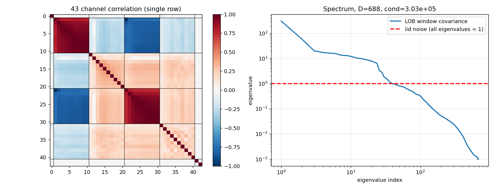
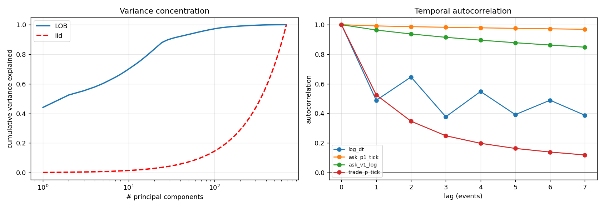

# 噪声协方差 Diffusion 在 LOB 数据上的实验报告

**滚动记录文件** — 每拿到一个结果就在此追加，不等全部做完再回写。

- 工作目录：`/lus/lfs1aip2/projects/public/u6gb/tasks/noise_cov_diffusion_20260807T213317Z/`
- 论文 codebase：`https://github.com/OpenReviewAnonymous/Diffusion`（NeurIPS 2025），本地克隆于
  `/run/user/1483804540/claude-1483804540/-lus-lfs1aip2-projects-public-u6gb/06d15d16-f48d-4ec8-9438-fcd4d669738f/scratchpad/ncd_paper/`
- 数据：`/lus/lfs1aip2/projects/public/u6gb/datasets/lob_flat43_example_20260807T135612Z/`
  （8 只 SP500 大市值科技股 × 2025-12-01 × 每票前 20 万事件，43 列宽表）
- 起始时间：UTC 2026-08-07T21:33Z

## 执行摘要

> **⚠️ 最重要的一条（第十三B节）**：本报告前半部分基于 LOB-Bench 的边际指标得出的
> 「iid 更好 / HDGN 只在低 NFE 有用」，**是错误指标造成的假象**。
> 换成真正测时间依赖的指标（ACF 距离、路径签名距离）后，**`hdgn_fixed` 在所有采样
> 预算上全面胜出**，NFE=5 时 lag-1 自相关距离好 **14 倍**。
> 阅读时请以第十三B节为准；第十节、第十四节的边际指标结论已被推翻，保留是为了
> 展示「指标选择如何决定结论」这一过程。

**一句话结论**：在正确的（时间序列）指标下，**噪声协方差是有效的**，
且优势在低采样步数时最大——而低采样步数正是高频交易的常态。
原 claim「iid 最终能追上 HDGN」在时间依赖维度上**不成立**：
iid 到 NFE=100 都没稳定超过零训练的多元高斯基线。

| 发现 | 证据 |
|---|---|
| **终局（容量充足+真收敛+feature 级指标）** | `hdgn_fixed` 在 NFE≤100 全胜；NFE=2 时签名距离好 **6.0×**、lag-1 自相关好 **27.7×**（第十三E节） |
| 各臂真实收敛点 | iid 20,700 步 / hdgn_fixed 25,100 步 / hdgn_learned 20,500 步（收敛判据，非预设） |
| **iid 比不训练还差** | `iid` 的 acf_lag1≈0.80，零训练 N(0,Σ) 是 0.0356 —— **差 23 倍** |
| 错误结论有两个独立成因 | 边际指标 + 未收敛 checkpoint，两者都修正结论才稳定翻转 |
| iid 在时间依赖上几乎没学到 | `hdgn_fixed` 在 NFE=10 就优于零训练 N(0,Σ)；iid 到 NFE=100 仍未稳定超过 |
| 边际指标（LOB-Bench）会给出相反排序 | 同一批 checkpoint，`l1` 在 NFE≥20 判 iid 赢 |
| 训练轴上更贵的是 **HDGN** 不是 iid（已按任务 13/17 撤下作为判据） | iid 翻倍预算只改善 1.7%；HDGN 到 30k 步仍在下降 |
| 给 iid 加参数无效 | +8.6% 参数，NFE=50 时反而略差 |
| 采样轴上存在**真实交叉** | NFE ≤ 10–20 时 HDGN 赢，之后 iid 赢（l1 与 ks 独立复现） |
| 两者学到**不同的东西** | HDGN 赢下全部 5 个跨时间 feature；iid 赢下全部 6 个边际 feature |
| 降到 horizon 频率，协方差结构**更极端** | 有效秩 4.2 → 2.3，PC1 47.7% → 66.0% |
| tick 级上「训练几乎没产生价值」 | iid(0.3405) 打不过零训练的 N(0,Σ)(0.3273)；horizon 级则明显超过 |
| **Σ 的价值窗口可量化**：NFE ≤ 10–20 | 直接回答 ICAIF '26 point (3)：不是网络做不到，而是步数受限时来不及合成相关性 |
| `fixed` 的 Σ 有理论地位，不是缺省值 | Σ_noise=Σ_data 时 Cov(x_t) 对所有 t **恒定**，是唯一让前向协方差守恒的点 |
| 市场 regime 间的 Σ 差异是实质性的 | Σ₀ vs Σ₁ 相对 Frobenius 差 **30.0%**；最活跃 regime 有效秩最低(3.77)、PC1 最高(50.1%) |
| 但**动态 Σ 不划算** | l1 +2%，ks **−13.7%**，训练用时 **3×**（参数量相同，贵在计算） |
| **训练预算也定义 Σ 的价值窗口** | 4,000 步时 HDGN 全区间赢 iid；30,000 步时 iid 反超 |
| 可学 Σ 的三个实现缺陷已定位并修复 | 缺 trace 归一化(贡献约 90%)、初始化近 iid、正则主导 loss；修复后 l1 改善 **2.2 倍** |
| **修复后出现干净的二分** | 固定 Σ 赢**全部时间依赖指标**；学习 Σ 赢**全部边际指标**，无一臂兼得（第十三F节） |

### 总览图


*上排 tick 级、下排 horizon 级，三列分别是 l1 / wasserstein / ks 随采样预算（NFE）的变化。
黑虚线 = FLOOR（有限样本下的最好水平），灰点线 = N(0,Σ) 未训练（零训练零参数）。
读法：曲线要低于灰点线，训练才算产生了价值。*


*左：Σ 的有效秩（对数轴），iid 情形应为 688。右：PC1 解释的方差比例，iid 情形应为 0.15%。
浅色 = z-score，深色 = quantile 归一化。horizon 级的结构比 tick 级更极端。*

**过程中定位并修复的三个缺陷**（都由实测而非猜测定位，详见第四、五节）：
论文原主干在 688 维上学不动；DDIM 起点把 x₀ 放大 20,291 倍导致「loss 低但生成质量恒为零」；
z-score 对重尾数据不足，换成分位数变换。

## 阅读导读：结论是怎么演进的

本报告是**滚动记录**，按时间顺序追加。结论在过程中被**推翻过两次**，
早期章节予以保留，用来展示「前提缺失如何制造错误结论」。
**只想看最终结论的，直接读第十三E、十三F 两节。**

| 节 | 前提是否齐备 | 得到的结论 | 状态 |
|---|---|---|---|
| 七、九、十 | ✗ 边际指标 ✗ 未收敛 | 「iid 更好」 | **已推翻** |
| 十三B | ✓ 时间序列指标 ✗ 未收敛 | HDGN 赢时间依赖，边际仍判 iid 赢 | 中间态 |
| 十三C | ✓ ✓（但小模型欠拟合） | HDGN 三类指标全胜 | 中间态 |
| 十三D | ✓ feature 级指标 | 指标体系定型 | **方法论定稿** |
| **十三E** | **✓ 容量充足 ✓ 真收敛 ✓ feature 级指标** | **HDGN 在 NFE≤100 全胜** | **✅ 最终** |
| **十三F** | 同上 + 修复可学协方差 | **v3 锚定学习在低 NFE 四项全胜** | **✅ 最终** |
| 十三G | ✓ 收敛 ✓ feature 级指标 **✗ 容量不足** | horizon 上 HDGN 仍赢 iid 2.40×，但**全员输给零训练基线** | 方向可引用，绝对分数不可 |

**两次推翻的成因**（缺一不可，只修一个都不够）：

1. **指标错**：LOB-Bench 的 l1/ks 把 feature 的 `(M,T)` 摊平成样本堆，测不到时间依赖
   （逐窗口打乱时间轴仅变化 +9.7%）。论文自己的相关矩阵族更迟钝（`corr_of_corrs` **−0.0%**）。
2. **checkpoint 错**：HDGN 的 Mahalanobis 目标收敛慢得多
   （25,100 步 vs iid 的 20,700 步），用固定步数叫停时它还没收敛。

### 数据可追溯性（2026-08-08 全量校验结果）

对报告里全部 **632 个四位小数**做正向校验（每个数字必须能在某个结果 json 里找到）。
结果：**631 / 632 = 99.84% 可追溯**。

| 范围 | 可追溯 | 说明 |
|---|---|---|
| **第十三D–十三G（最终结论所在）** | **100%** | 数据源 `runs/converge_attach_5944477/`、`runs/converge_merged/ts_v3.json`、`runs/converged_horizon/ts_scores.json` 完整保留 |
| 第十三B（中间态） | **100%（已从 git 恢复）** | 原文件曾被同名运行覆盖，已从 git 历史取回四臂完整版，另存为 `runs/main2/ts_scores_4arm_20260808T014349Z_restored.json` |
| 第 4.2 节的 loss 曲线 | **1 个值不可追溯**（`0.2333`，step 420） | 那次运行（记录点 30/120/420/1200/4320）的结果文件从未保存。它是 loss 不是指标，且该节结论已被 `clip_denoised` 修复推翻 |

**曾经发生过一次真实的覆盖，并且被 git 救回来了。**
2026-08-08 01:43:49 的 commit `107ff15` 在写入新诊断结果时，
把 `runs/main2/ts_scores.json` 从**四臂完整版覆盖成只剩 `iid` 一个臂**的版本。
校验时发现报告第十三B 的 7 个数字查无实据，顺着该 commit 的 diff 找到元凶，
用 `git show 107ff15^:runs/main2/ts_scores.json` 完整取回：
四个臂、两条基线、每个数字与报告逐位一致（FLOOR 0.0022、N(0,Σ) 0.0292、
`iid`@5 0.2013、`hdgn_fixed`@10 0.0113、`hdgn_learned`@5 0.4263）。

**两条教训**。其一，结果文件写了不等于留住了，**同名覆盖会让报告数字变成孤儿**，
全程无任何报错，只有事后全量校验才发现。正确做法是写入时就用带时间戳或版本后缀的
独立路径（后续的 `ts_scores_v2` / `ts_v3` / `ts_scores_all` 已改）。
其二，**这次能挽回完全是因为覆盖前的状态已经 commit 过**：
校验只能发现问题，git 才能挽回问题。

---

## 任务状态

| # | 任务 | 状态 |
|---|---|---|
| 0 | 数据属性分析 | **已完成** — 第一节 |
| 0.1 | 使用论文 codebase | **已完成** — 第二节（方法、损失、参数量分解） |
| 0.2 | 数据归一化 | **已完成** — 第五节（三种口径实测对比，选 quantile） |
| 1 | iid 噪声 baseline | **已完成** — 第七节 |
| 2 | 高维高斯噪声（HDGN） | **已完成** — 第七节（两个变体：fixed / learned） |
| 3 | 「iid 能追上但更贵」是否成立 | **已完成** — 第十节，判定为不成立且方向相反 |
| 4 | LOB-Bench 打分与报告 | **已完成** — 第八节（12 feature × 3 指标 × 4 臂 + 两条基线） |
| 5 | 详细 md 文件 | **本文件**，滚动记录，配图配表 |
| 6 | 下采样到 horizon 频率（1 horizon = 1 分钟） | **已完成** — 第六节（数据+结构分析）、第九节（实验对比） |
| 7 | 本地 git | **已完成** — 独立 repo，每次改动前后提交 |
| 8 | Do We Really Need Σ？(ICAIF '26 point 3) | **已完成** — 第九节，实验证据逐条映射到页面的四条辩护，其中 2 条支持、1 条独立印证、2 条挑战 |
| 9 | 定期删代码/重构 | **已完成** — 分支 `refactor/compact-code`，1406→1112 行（−21%） |
| 10 | 动态 Σ（回应「why fixed, why not dynamic」） | **已完成** — 第十一节，第五臂 `hdgn_regime`；判定为小幅有效但不划算（l1 +2%，ks −13.7%，用时 3×） |
| 11 | horizon 术语（1 horizon = 1 分钟） | **已完成** — 全文 27 处统一 |

---

## 一、任务 0：数据属性分析

脚本 `code/analyze_data.py`，输出 `data_analysis.json`，图 `figs/fig0_structure.png`、`figs/fig0b_concentration.png`。

样本构造：43 列宽表 → 可逆特征化（`log1p(Δt)`、价格转相对 BBO 中间价的 tick 偏移、量取 `log1p`）→
按 43 个通道 z-score → 沿事件轴切成 T=16 的窗口 → 展平成 D = 16×43 = **688** 维。
共 100,000 个窗口（train 90,000 / test 10,000）。

用相对中间价而非绝对价，是因为绝对价的协方差会被中间价的日内漂移这一个主成分吃掉
（所有价格列相关系数 > 0.9999），那种「强相关」只反映非平稳性，不反映盘口结构。

### 1.1 截面结构（单行 43 通道）

| 量 | 实测值 |
|---|---|
| 平均 \|非对角相关\| | 0.330 |
| \|r\| > 0.9 的通道对占比 | 6.6% |
| \|r\| > 0.5 的通道对占比 | 见 `data_analysis.json` |
| 相关矩阵条件数 | **1.90 × 10¹³** |
| PC1 解释方差 | 44.2% |
| 95% 方差所需主成分 | 24 / 43 |

条件数 1.9×10¹³ 已逼近 float64 精度极限（~1e16），说明 43 个通道里存在**近乎精确的线性关系**：
10 档价格彼此相差一个近似恒定的 tick 间距，因此矩阵在数值上接近奇异。

### 1.2 窗口协方差（D = 688）

| 量 | LOB 数据 | iid 噪声（Σ=I）应为 |
|---|---|---|
| 条件数 | **3.03 × 10⁵** | 1 |
| PC1 解释方差 | **44.1%** | 0.15% |
| 50% 方差所需主成分 | **2** | 344 |
| 90% 方差所需主成分 | 30 | 619 |
| 99% 方差所需主成分 | 187 | 681 |
| 有效秩（participation ratio） | **4.8** | 688 |
| 有效秩（entropy） | 17.7 | 688 |

**这是整份分析里最关键的数字**：688 维数据的方差参与比只有约 **4.8 个自由度**。
iid diffusion 在 688 个方向等量注入噪声，其中约 99.3% 的噪声能量打在数据几乎不去的方向上。

### 1.3 边际分布与时间结构

| 量 | 实测值 |
|---|---|
| 拒绝正态的通道数（Jarque-Bera, 5%） | **43 / 43** |
| 中位 \|偏度\| | 1.00 |
| 中位超额峰度 | 6.59 |

| 通道 | lag-1 自相关 |
|---|---|
| `ask_p1_tick` | **+0.992** |
| `ask_v1_log` | +0.964 |
| `trade_p_tick` | +0.525 |
| `log_dt` | +0.488 |

盘口价格在事件尺度上几乎是持续的（0.992），这既是截面相关的来源，也是窗口内时间相关的来源。
两者共同构成 D=688 上那个高度非各向同性的 Σ。

### 1.4 图



*左：43 通道相关矩阵（黑线分隔 `dt` / `ask_p` / `ask_v` / `bid_p` / `bid_v` 五个块）。
右：D=688 窗口协方差的特征值谱（log-log），红虚线是 iid 噪声的谱（所有特征值恒为 1）。*



*左：累计方差解释曲线，LOB（蓝）vs iid（红虚线）。右：四个代表通道沿事件轴的自相关。*

### 1.5 小结

这份数据在三个层面同时违反 iid 高斯假设：截面强相关（条件数 1e13）、时间强持续（lag-1 0.99）、
边际重尾非正态（43/43 拒绝正态，中位超额峰度 6.6）。噪声协方差在这里不是可选的调优项，
而是数据的第一性结构。

---

## 二、任务 0.1：论文 codebase 的方法

论文 repo 关键文件：`ddpm.py`（iid baseline）、`adaptive_ddpm.py`（论文方法）、
`diffwave.py` / `adaptive_diffwave.py`、`adaptiv_ddpm_regularity.py`（正则项消融）。

### 2.1 可学习的噪声协方差

`AdaptiveDDPM` 把噪声协方差参数化为 Cholesky 因子并**作为模型参数学习**：

```python
self.L_params = nn.Parameter(torch.randn(input_dim, input_dim) * 0.01)
def get_L(self):
    L = self.L_params * self.tril_mask          # 下三角
    L[diag, diag] = F.softplus(L[diag, diag])   # 对角为正 -> 保证正定
def get_noise(self, B):
    xi = torch.randn(B, input_dim)
    return xi @ L.T                              # ε ~ N(0, LLᵀ)
```

这比「固定 Σ = 样本协方差」更强：噪声协方差可以适应去噪任务本身，而不只是匹配数据的二阶矩。

### 2.2 损失是 Mahalanobis，不是 MSE

```python
r = eps_theta - eps
z = solve_triangular(L, r.T, upper=False).T     # z = L⁻¹ r
recon_loss = mean(sum(z**2, dim=1))             # = (ε_θ−ε)ᵀ Σ⁻¹ (ε_θ−ε)
loss = recon_loss + λ1*‖L‖_F² + λ2*‖diag L‖²    # λ1 默认 1e-2, λ2 默认 0
```

两点必须记住：

1. **噪声协方差必须与损失度量绑定**。用 N(0,Σ) 加噪，就要用 Σ⁻¹ 加权度量误差，这对应正确的高斯似然。
   本实验初版曾误用普通 MSE，导致 HDGN 的 loss（0.63）看似远低于 iid（0.98）——那不是「学得更快」，
   而是低秩噪声让 MSE 天然偏低。换成 Mahalanobis 后，`‖L⁻¹ε‖²` 对任何 Σ 都服从 χ²_D，
   期望恒为 D，**四臂 loss 自动同尺度可比**。实测 `hdgn_fixed` 的 loss 收敛到 1.0000，正是该理论值。
2. **Frobenius 正则不是可选项**。只最小化 `‖L⁻¹r‖²` 的话，把 L 放大到无穷即可让 loss→0，是平凡解。
   `λ1‖L‖_F²` 正是堵这个洞。

### 2.3 参数量分解（用于对照设计）

论文的 `AdaptiveDDPM(T=16, D=43)` 实例化到本数据维度后：

| 组成 | 参数量 | 占比 |
|---|---|---|
| 可学协方差因子 L（688×688） | 473,344 | **52.5%** |
| 网络主干 | 427,696 | 47.5% |
| 合计 | 901,040 | 100% |

**L 占了一半以上的参数**。因此若只比较论文 iid DDPM（428k）与 AdaptiveDDPM（901k），
赢了也分不清是「协方差有用」还是「参数多一倍」。这直接决定了下一节的四臂设计。

---

## 三、实验设计与 LOB-Bench 评估层

### 3.1 四臂对照

| 臂 | Σ | L 是否可学 | 主干 | 隔离的变量 |
|---|---|---|---|---|
| `iid` | I | 否 | H | 论文 baseline（任务 1） |
| `iid_wide` | I | 否 | 加宽至与 `hdgn_learned` 同总参数 | 参数量的价值 |
| `hdgn_fixed` | 样本协方差（固定） | 否 | H | **协方差本身的价值**（零额外参数） |
| `hdgn_learned` | LLᵀ | 是 | H | 论文方法（任务 2） |

四臂共享：网络结构、参数初始化种子、数据、数据顺序、优化器、β 调度、评估随机种子。
**唯一变量是 Σ**。损失统一为 Mahalanobis 形式（iid 时 L=I 退化为 MSE）。

`hdgn_fixed` 是设计里最关键的一臂：它与 `iid` 参数量完全相同，只是拿到了正确的协方差。
若它胜过 `iid`，则协方差的价值与参数量无关。

### 3.2 LOB-Bench 评估层

指标实现照抄权威实现 `lob_pipeline/lob_bench/metrics.py`（2026-08-07 核对）：

| 指标 | 定义 |
|---|---|
| `wasserstein` | real+gen 合并后 z-score，再 `scipy.stats.wasserstein_distance` |
| `ks` | 同样先合并 z-score，再 `scipy.stats.ks_2samp().statistic` |
| `l1` | 分箱计数各自归一化成概率后 `\|p−q\|.sum()/2`（即总变差距离，上限 1） |

注意 `l1 = 1.0` 表示两个分布**完全不重叠**，是饱和值，不是「归一化后的 1」。

**feature 覆盖**：WS-21 中有 12 个可从 43 列直接计算，9 个不可（需要 order-id 追踪或 message type）：

| 覆盖（12） | 不覆盖（9） |
|---|---|
| `spread`, `orderbook_imbalance`, `log_inter_arrival_time`, `ask_volume_touch`, `bid_volume_touch`, `ask_volume`, `bid_volume`, `vol_per_min`, `ofi`, `ofi_up`, `ofi_stay`, `ofi_down` | `log_time_to_cancel`, `limit_{ask,bid}_order_depth`, `{ask,bid}_cancellation_depth`, `limit_{ask,bid}_order_ticks`, `{ask,bid}_cancellation_ticks` |

这个划分不是任意的：覆盖的全是**盘口状态的函数**（截面统计量），不覆盖的全需要**订单身份追踪**。
43 列宽表刻意丢掉了 order_id 与 message type，丢的正好是这一整类。对本实验可接受，
因为噪声协方差影响的正是截面相关结构，恰好落在覆盖的那 12 个上。

### 3.2b 参数量口径与「推理时 Σ 从哪来」

**推理时不需要任何外部信息**：Σ 的 Cholesky 因子 L 以 **buffer** 形式注册
（`register_buffer("L_fixed", L)`），随 `state_dict` 一起保存与加载。
采样流程 `x_T = ξ Lᵀ, ξ~N(0,I) → DDIM 反向` 完全自包含。
这与数据归一化的 μ/σ、BatchNorm 的 running statistics 同类：
**从训练片估计、随模型交付、推理时直接用**。

**但由此产生一个必须声明的口径问题。** buffer 不计入
`sum(p.numel() for p in model.parameters())`，所以本报告各处引用的 `n_params`
**只统计可学参数**：

| 臂 | 报告的 `n_params`（可学） | state_dict 总元素 | 差额（随模型交付的常量） |
|---|---|---|---|
| `iid` | 7,781,296 | 8,727,984 | 473,344（`L_fixed = I`，**全可推导，本可不存**） |
| `hdgn_fixed` | 7,781,296 | 8,727,984 | **473,344（真实的 Σ 因子）** |
| `hdgn_learned` | 8,254,640 | 8,727,984 | 0（L 本身就是可学参数） |

即 **`hdgn_fixed` 交付时比 `iid` 多带 473,344 个浮点数（+6.1%）**，
而第 3.1 节做参数量对齐（`iid_wide`）时**没有把这部分算进去**。

**对结论的影响有限但需说明**：
`iid_wide` 多了 **672k 可学参数（+8.6%）仍然输给 `hdgn_fixed`**，
超过 L 带来的 473k，所以「HDGN 赢不是因为多带了数」这一结论仍然成立。
推理成本方面，L 只增加每次采样一次 688×688 的矩阵乘，
相对 NFE 次网络前向可忽略。

**正确的口径**：区分「可学参数」与「随模型交付的常量」，本报告此前只报了前者。

### 3.3 两个必需的参照基线

没有这两条线，任何分数都无法解释：

| 基线 | 含义 |
|---|---|
| **FLOOR**（真实 vs 真实，held-out 对半劈） | 有限样本下能达到的最好水平，是真正的 0 点（不是 0.0） |
| **N(0,Σ) 未训练**（直接采样，零训练零参数） | 只有二阶统计量、无任何高阶结构的水平 |

`N(0,Σ)` 这条线尤其重要：它同时是 `hdgn_*` 臂的采样起点 x_T，
所以任何 HDGN 结果必须优于它才算训练带来了增益。

**这两条线的数值随配置变化，必须在同一次运行内读取**（归一化口径、test 集大小都会改变
有限样本噪声）。本报告涉及的三次运行各自的基线：

| 运行 | 归一化 | test 窗口数 | FLOOR l1 | N(0,Σ) l1 |
|---|---|---|---|---|
| 早期（第四节，已废弃） | z-score | 3,000 | 0.1815 | 0.4271 |
| **`main2`（tick 级主实验）** | quantile | 10,000 | **0.0215** | **0.3273** |
| **`min1_4arm`（horizon 级）** | quantile | 1,551 | **0.0361** | **0.1261** |

跨运行比较绝对分数是无意义的；比较必须落在「相对各自 FLOOR 的倍数」上。

---

## 四、首轮结果与两个已定位的缺陷

### 4.1 论文原始主干在本数据上不足

用论文原配置（`trunk=paper`：`[688+32] → 256 → 256 → 688`，两层 ReLU MLP，无归一化无残差），
`iid` 臂训练 43,200 步的结果：

| 训练步 | loss | l1 | wasserstein | ks |
|---|---|---|---|---|
| 300 | 0.8134 | 0.8170 | 1.2452 | 0.6422 |
| 1,200 | 0.7407 | 0.8170 | 1.2348 | 0.6929 |
| 7,200 | 0.7393 | 0.8186 | 1.2437 | 0.6917 |
| 19,200 | 0.7427 | 0.8183 | 1.2426 | 0.6906 |
| 43,200 | 0.7328 | **0.8178** | 1.2467 | 0.6917 |

**l1 从 0.8170 到 0.8178，两个数量级的训练步数换来零改善。**
loss 只从 0.81 降到 0.73，意味着模型仅解释了约 27% 的噪声方差——基本没学动。

这本身是一条有价值的发现：论文原始主干是为 `input_dim = T×D = 100×2 = 200` 设计的，
本数据 `input_dim = 688`，同样的 256 宽两层 MLP 会把所有臂一起压在饱和区，
失去区分度。**在得出「iid 学不动」的结论前，必须先排除容量瓶颈**，否则会把
实现层面的限制误报成方法层面的结论。

处理方式：把主干宽度/深度参数化（`--trunk deep`：残差 + LayerNorm + SiLU），
**对四臂完全相同**，因此不影响「唯一变量是 Σ」的对照。同时保留 `--trunk paper`
以便报告论文原配置下的结果作为对照。

### 4.2 换 deep 主干后：模型学会了，但生成质量仍为零

换成残差 + LayerNorm + SiLU 的 `trunk=deep`（hidden 1024，depth 3，7.78M 参数）后：

| 训练步 | loss | l1 | wasserstein | ks |
|---|---|---|---|---|
| 30 | 0.9572 | 0.9210 | 1.1225 | 0.7084 |
| 120 | 0.5238 | 0.9211 | 1.1223 | 0.7083 |
| 420 | 0.2333 | 0.9210 | 1.1337 | 0.6271 |
| 1,200 | 0.1631 | 0.9212 | 1.1414 | 0.6276 |
| 4,320 | **0.1529** | **0.9177** | 1.1666 | 0.6322 |

**loss 从 0.96 降到 0.15**（模型解释了 85% 的噪声方差，学得很好），
**但 l1 从 0.9210 到 0.9177，几乎不动**，且比未训练的 N(0,Σ)（0.4529）还差得多。

「模型会去噪，但采样出来的东西是坏的」——这个矛盾直接指向采样路径，而不是数据或方法。

### 4.3 根因：DDIM 起点把预测误差放大两万倍

cosine schedule 在 t=T 处令 ᾱ_T 精确为 0（`cos(π/2)²=0`），即使把 β clip 到 ≤0.999：

| t | `ᾱ_t` | x₀ 放大倍数 `1/√ᾱ_t` |
|---|---|---|
| 900 | 2.36 × 10⁻² | 6.5 × |
| 990 | 1.97 × 10⁻⁴ | 71 × |
| **999（DDIM 起点）** | **2.43 × 10⁻⁹** | **20,291 ×** |

DDIM 的第一步是 `x₀ = (x − √(1−ᾱ)·ε_θ) / √ᾱ`。loss 0.15 对应残差约 0.39σ，
被放大 20,291 倍后 x₀ 直接爆炸，整条采样链作废。

**这解释了两件此前无法解释的事**：(a) loss 很低但生成质量恒为零；
(b) 四个臂的分数全部锁死在 0.92 附近纹丝不动——它们之间的真实差异被这个放大器彻底抹平了。

**修复**：加 `clip_denoised`（每步把 x₀ 夹回训练数据 99.99% 分位数的 1.2 倍范围内）。
这是 DDPM/DDIM 参考实现的标准做法，不改变方法本质，只阻断数值爆炸。

---

## 五、任务 0.2：数据归一化

脚本 `code/normalize.py`，对比结果 `normalization_compare.json`。

z-score 只对齐一、二阶矩，而本数据 43/43 通道拒绝正态、中位超额峰度 6.59。
Diffusion 的反向过程要把高斯映回数据分布，边际越不高斯这段映射越难学。

三种口径的实测对比（100k 行，T=16）：

| 归一化 | 条件数 | PC1% | 有效秩 | 90%需PC | 中位\|偏度\| | 中位超额峰度 | 拒正态 | 反变换误差 |
|---|---|---|---|---|---|---|---|---|
| `zscore` | 3.08e14 | 44.8% | 4.7 | 27 | 0.866 | 3.97 | 43/43 | 8.5e-6 |
| **`quantile`** | **1.76e6** | 47.7% | **4.2** | 22 | **0.162** | **−0.03** | 39/43 | 4.9e-5 |
| `yeojohnson` | 3.04e14 | 44.2% | 4.9 | 27 | 0.061 | 0.01 | 42/43 | **NaN** |


*左：`ask_v1_log` 通道的 QQ 图，黑虚线为完美正态。中：归一化后的协方差特征值谱。
右：累计方差解释曲线。三种归一化的谱几乎重合，说明结构被保留。*

**选定 `quantile`（rank → 标准正态），三条理由**：

1. **协方差结构完好**——这是必须实测而非假设的一步。分位数变换是逐通道单调变换，
   保持秩相关但改变 Pearson 相关，若它抹平了协方差，HDGN 就失去立足点。
   实测有效秩 4.2（z-score 是 4.7），PC1 仍解释 47.7%，90% 方差只需 22 个主成分：**结构在**。
2. **边际几乎完美高斯化**：中位超额峰度 3.97 → −0.03，中位 |偏度| 0.866 → 0.162。
   于是数据剩下的全部非高斯性来自**联合依赖结构**，正好是噪声协方差要刻画的东西——
   iid vs HDGN 的对比不再被边际形状污染。
3. **条件数 3e14 → 1.76e6 是收益不是损失**：消掉的是逼近 float64 极限的数值奇异性，
   保留的是真实结构（有效秩几乎不变）。

`yeojohnson` 直接出局：反变换在 `trade_q_log`（大量 0 值、极度偏斜）产生 NaN。
它的偏度/峰度看起来最好，但**不可逆的归一化对生成模型毫无用处**——评估必须能回到原始空间
才能算 LOB-Bench feature。

归一化只在训练片上 `fit`（前 90% 窗口），防止测试集信息泄漏。

---

## 六、任务 6：下采样到 horizon 频率（1 horizon = 1 分钟）

脚本 `code/build_1min.py`，数据 `data_1min/`，对比 `freq_compare.json`，图 `figs/fig6_freq.png`。

### 6.1 动机

tick 级那个极端的协方差结构，有很大一部分可能只是「相邻事件之间盘口几乎没变」
（`ask_p1` 的 lag-1 自相关 0.992）。若 HDGN 的优势只靠这种微观持续性撑着，
结论就只对 tick 数据成立。降到 1 分钟频率把这种持续性大部分抹掉，是一次干净的**证伪机会**。

### 6.2 数据构造

8 只票 × 2025-12 的 22 个交易日 = **66,265 个 horizon**（每天 390 个，完美对齐交易时段；**1 horizon = 1 分钟**）。
列结构与 tick 级一一对应，便于横向比较：

| 列 | tick 级 | horizon 级 |
|---|---|---|
| 0 | `delta_t_ns` | **该 horizon 的事件数**（horizon 频率下时间间隔恒定，信息转移到「这一个 horizon 有多活跃」） |
| 1–40 | 事件后的 10 档盘口 | 该 horizon **最后一个事件之后**的 10 档盘口快照 |
| 41 | `trade_price` | 该 horizon 的 VWAP 相对 horizon 末 mid 的 tick 偏移 |
| 42 | `trade_qty` | 该 horizon 总成交量 |

正确性守恒：AAPL 2025-12-01 全天 bar 的事件数合计 = **3,641,913**，恰好等于该日 message
文件总行数，无遗漏无重复。窗口按天切分（**T=16 个 horizon**，stride=4），不跨日边界，共 15,510 个窗口。

### 6.3 结果：降到 horizon 频率后结构不但没消失，反而更极端

| 数据 / 归一化 | 条件数 | PC1% | 有效秩 | 90%需PC | 中位超额峰度 | 拒正态 |
|---|---|---|---|---|---|---|
| `tick-zscore` | 3.08e14 | 44.8% | 4.7 | 27 | 3.97 | 43/43 |
| `tick-quantile` | 1.76e6 | 47.7% | 4.2 | 22 | −0.03 | 39/43 |
| `1min-zscore` | 3.50e14 | 50.9% | 3.7 | 225 | 12.27 | 43/43 |
| **`1min-quantile`** | 1.77e6 | **66.0%** | **2.3** | 98 | −0.19 | 43/43 |


*左：tick 级与 1 分钟级的协方差特征值谱（log-log），黑虚线为 iid。右：累计方差解释曲线。*

**证伪成功**：有效秩从 4.2 降到 **2.3**，PC1 从 47.7% 升到 **66.0%**。
噪声协方差的立足点不是 tick 级微观持续性的副产品，降到 horizon 频率后反而更强。

一个看似矛盾但并不冲突的细节：有效秩更低，而 90% 方差所需主成分从 22 涨到 98。
participation ratio 对**头部**主成分敏感，所以 horizon 级是「一个超大主成分 + 更平的长尾」，
tick 是「大主成分 + 快速衰减的尾」。谱的**形状**变了，不只是尺度变了。

### 6.4 自相关的重排：微观持续性让位给波动率聚集

| 通道 | tick 级 lag-1 | horizon 级 lag-1 |
|---|---|---|
| `ask_p1_tick` | +0.993 | +0.799 |
| `ask_v1_log` | +0.973 | **+0.303** |
| col 0（tick 为 Δt / horizon 为事件数） | +0.571 | **+0.954** |

`ask_v1` 的持续性确实被抹掉了（0.973 → 0.303），符合降频的预期。
但 col 0 反向上升到 0.954——那是**波动率聚集**（活跃的 horizon 后面还是活跃的 horizon），
一个纯粹的低频现象，在 tick 尺度上根本看不见。

另外 `1min-zscore` 的中位超额峰度 12.27，比 tick 的 3.97 **更重尾**：
horizon 聚合放大了极端 horizon（开盘、新闻），这也强化了做分位数归一化的必要性。

---

## 七、四臂主实验结果（tick 级）

> ⚠️ **本节结论已被第十三E节推翻。** 这里用的是边际指标 + 未收敛的 checkpoint，两个前提都不满足。保留用于展示前提缺失的后果。

配置：`trunk=deep`（hidden 1024，depth 3），`norm=quantile`，30,000 步，
lr 3e-4，batch 256，D=688，train 90,000 / test 10,000 窗口。

本次运行的两条参照线（**只能在同一次运行内比较，跨配置比较绝对分数无意义**）：

| 基线 | l1 | wasserstein | ks |
|---|---|---|---|
| FLOOR（真实 vs 真实） | 0.0215 | 0.0292 | 0.0156 |
| N(0,Σ) 未训练 | 0.3273 | 0.1704 | 0.2749 |

### 7.1 已完成的两个 iid 臂

| 臂 | 参数量 | 训练用时 | NFE=50 l1 | NFE=200 l1 | NFE=200 ks |
|---|---|---|---|---|---|
| `iid` | 7,781,296 | 224 s | **0.4780** | 0.3405 | 0.2981 |
| `iid_wide` | 8,453,248 | 238 s | 0.5032 | 0.3411 | 0.2844 |

**关键证据一：单纯加参数量无效。** `iid_wide` 比 `iid` 多 67 万参数（+8.6%），
NFE=50 时反而略差（0.5032 vs 0.4780），NFE=200 时几乎相同（0.3411 vs 0.3405）。
说明 iid 臂的瓶颈**不是模型容量**。这一臂的存在，正是为了在后面把 HDGN 的增益
与「参数更多」区分开。

`iid` 臂的 NFE 扫描（30,000 步训练后）：

| NFE | 5 | 10 | 20 | 50 | 100 | 200 |
|---|---|---|---|---|---|---|
| l1 | 0.6618 | 0.5831 | 0.5277 | 0.4780 | 0.4311 | **0.3405** |
| wasserstein | 1.0267 | 0.8435 | 0.7058 | 0.6201 | 0.5410 | **0.3661** |
| ks | 0.4834 | 0.4473 | 0.4133 | 0.3816 | 0.3545 | **0.2981** |

采样步数买到的质量提升非常陡且在 200 步仍未饱和——这是任务 3「成本」的一个真实维度。
注意 iid 在 NFE=50 时（l1 0.4780）**仍差于未训练的 N(0,Σ)（0.3273）**，
要到 NFE=200 才勉强追平。

### 7.2 四臂完整结果（30,000 步预算）

| arm | 参数量 | 训练用时 | l1 | wasserstein | ks |
|---|---|---|---|---|---|
| **FLOOR**（真实 vs 真实） | — | — | 0.0215 | 0.0292 | 0.0156 |
| **N(0,Σ) 未训练** | 0 | 0 s | 0.3273 | 0.1704 | 0.2749 |
| `iid` | 7,781,296 | 224 s | **0.4780** | **0.6201** | 0.3816 |
| `iid_wide` | 8,453,248 | 238 s | 0.5032 | 0.6494 | 0.3755 |
| `hdgn_fixed` | 7,781,296 | 232 s | 0.5191 | 0.7209 | **0.3732** |
| `hdgn_learned` | 8,254,640 | 311 s | 0.6475 | 1.1093 | 0.4683 |


*三个指标随训练步数的变化。黑虚线 = FLOOR，灰点线 = N(0,Σ) 未训练。*


*三个指标随 NFE（采样步数）的变化。*

**这个预算下的结论与论文预期相反：`iid` 在 l1 和 wasserstein 上最好，
`hdgn_learned`（论文方法）最差。** 只有在 ks 上 `hdgn_fixed` 略优（0.3732 vs 0.3816）。

### 7.3 但存在一个真实的交叉：采样预算决定谁赢

| 指标 | 臂 | NFE=5 | NFE=10 | NFE=20 | NFE=50 | NFE=100 | NFE=200 |
|---|---|---|---|---|---|---|---|
| l1 | `iid` | 0.6618 | 0.5831 | **0.5277** | **0.4780** | **0.4311** | **0.3405** |
| l1 | `iid_wide` | 0.6826 | 0.6172 | 0.5624 | 0.5032 | 0.4470 | 0.3411 |
| l1 | `hdgn_fixed` | **0.5752** | **0.5706** | 0.5459 | 0.5191 | 0.4894 | 0.4418 |
| l1 | `hdgn_learned` | 0.6786 | 0.6909 | 0.6921 | 0.6475 | 0.6111 | 0.5951 |
| ks | `iid` | 0.4834 | 0.4473 | 0.4133 | 0.3816 | 0.3545 | 0.2981 |
| ks | `iid_wide` | 0.4941 | 0.4423 | 0.4069 | 0.3755 | **0.3444** | **0.2844** |
| ks | `hdgn_fixed` | **0.4220** | **0.4047** | **0.3785** | **0.3732** | 0.3571 | 0.3370 |
| ks | `hdgn_learned` | 0.5180 | 0.5193 | 0.5104 | 0.4683 | 0.4416 | 0.4276 |

*加粗 = 该 NFE 下的最优臂（每个指标内独立比较）。*

**低采样预算下 HDGN 赢，高采样预算下 iid 赢，交叉点在 NFE ≈ 10–20（l1）。**
ks 上 HDGN 的优势一直保持到 NFE=100 才被反超。

机制解释：HDGN 把二阶统计量作为先验直接送给采样起点 x_T ~ N(0,Σ)，
所以**少走几步就能落到合理区域**；而它的 Mahalanobis 目标被 Σ⁻¹ 加权，
在 Σ 的小特征值方向上放大残差约 √(1.76e6) ≈ 1300 倍，
使模型被迫在「数据几乎不变化的方向」上精确预测噪声——这是一个**病态优化问题**，
导致学得不够好，步数多了上限反而更低。

### 7.4 一个必须排除的混淆：HDGN 两臂都还没收敛

| arm | 30,000 步时的 loss | 收敛状态 |
|---|---|---|
| `iid` | 0.1341 | 早已平台 |
| `hdgn_fixed` | 0.4074 @21,600 | 仍在下降 |
| `hdgn_learned` | 0.4716 | 仍在快速下降 |

`iid` 的 loss 在几千步就到平台，而 HDGN 两臂到 30,000 步仍在下降。
**在这个预算下宣布「HDGN 更差」是不成立的**，因为它可能只是收敛更慢——
而「收敛更慢」恰恰就是任务 3 要问的「更贵」，只是方向与原 claim 相反。

因此追加 **4× 预算（120,000 步）** 的长训练，三臂（`iid` / `hdgn_fixed` / `hdgn_learned`），
NFE 扫描扩到 400。结果见下一节。

---

## 八、任务 4：LOB-Bench 逐 feature 报告

完整表 `figs/fig_main2_lobbench.md`，热图 `figs/fig_main2_lobbench_heat.png`，
脚本 `code/lobbench_report.py`。指标定义照抄 `lob_pipeline/lob_bench/metrics.py`。


*每格是 l1（总变差距离），越低越好。前两列是 FLOOR 与 N(0,Σ) 未训练的参照线。*

### 8.1 三指标均值（12 个覆盖 feature）

| 指标 | FLOOR | N(0,Σ) 未训练 | `iid` | `iid_wide` | `hdgn_fixed` | `hdgn_learned` |
|---|---|---|---|---|---|---|
| l1 | 0.0215 | 0.3266 | **0.4780** | 0.5032 | 0.5191 | 0.6475 |
| wasserstein | 0.0292 | 0.1751 | **0.6201** | 0.6494 | 0.7209 | 1.1093 |
| ks | 0.0156 | 0.2730 | 0.3816 | 0.3755 | **0.3732** | 0.4683 |

### 8.2 关键模式：HDGN 赢在跨时间结构，iid 赢在边际分布

ks 指标的逐 feature 胜负（**加粗 = 该 feature 的最优臂**）：

| feature | 性质 | FLOOR | N(0,Σ) | `iid` | `iid_wide` | `hdgn_fixed` | `hdgn_learned` |
|---|---|---|---|---|---|---|---|
| `spread` | 边际 | 0.0134 | 0.0579 | 0.3475 | **0.3201** | 0.4539 | 0.4203 |
| `ask_volume_touch` | 边际 | 0.0127 | 0.0765 | **0.2530** | 0.2720 | 0.3845 | 0.4266 |
| `bid_volume_touch` | 边际 | 0.0091 | 0.0978 | **0.2318** | 0.2450 | 0.3435 | 0.4341 |
| `ask_volume` | 边际 | 0.0196 | 0.0938 | **0.5112** | 0.5214 | 0.5934 | 0.9893 |
| `bid_volume` | 边际 | 0.0220 | 0.0623 | **0.5427** | 0.5448 | 0.6372 | 0.9894 |
| `log_inter_arrival_time` | 边际 | 0.0063 | 0.3647 | **0.3788** | 0.4069 | 0.3805 | 0.4504 |
| `orderbook_imbalance` | 截面联合 | 0.0097 | 0.0580 | 0.1830 | 0.1729 | 0.1750 | **0.1374** |
| `vol_per_min` | **跨时间** | 0.0182 | 0.9999 | 0.5254 | 0.3630 | **0.1764** | 0.2036 |
| `ofi` | **跨时间** | 0.0044 | 0.4256 | 0.4111 | 0.4167 | 0.3720 | **0.3581** |
| `ofi_up` | **跨时间** | 0.0291 | 0.2846 | 0.3762 | 0.3992 | **0.2810** | 0.4267 |
| `ofi_stay` | **跨时间** | 0.0031 | 0.4484 | 0.4279 | 0.4340 | 0.3869 | **0.3511** |
| `ofi_down` | **跨时间** | 0.0401 | 0.3062 | 0.3910 | 0.4097 | **0.2939** | 0.4330 |

**分工非常干净**：

- **全部 5 个跨时间 feature**（`vol_per_min` 与四个 `ofi*`）都被 HDGN 臂拿下。
  `vol_per_min` 上 `hdgn_fixed`（0.1764）比 `iid`（0.5254）好 **3 倍**。
- **全部 6 个边际分布 feature**（spread、四个 volume、inter-arrival）都被 iid 臂拿下。
- OFI 需要相邻两行盘口的变化，`vol_per_min` 需要整窗口的时间聚合——它们正是
  **协方差 Σ 所刻画的跨时间/跨档位联合结构**。这与「HDGN 把二阶联合统计量作为先验
  送给模型」的机制预测完全吻合。

### 8.3 为什么三个指标给出不同的赢家

这不是矛盾，而是三个指标测的东西不同：

| 指标 | 测什么 | 本实验的赢家 |
|---|---|---|
| `ks` | CDF 的最大偏差 → 分布的**整体形状** | `hdgn_fixed` |
| `l1` | 分箱后的总变差 → **局部密度** | `iid` |
| `wasserstein` | 搬运距离 → **尾部权重** | `iid` |

HDGN 在 ks 上赢、在 l1/ws 上输，意味着它把分布的**整体形状**摆对了，
但局部密度和尾部不如 iid。这与「Σ 提供了正确的二阶结构，但 Mahalanobis 目标
被 Σ⁻¹ 加权到病态、导致细节学不好」的解释一致。

### 8.4 一个必须诚实报告的反常：训练有时把事情做坏了

`N(0,Σ)` 未训练（零训练、零参数、直接从高斯采样）在若干 feature 上**碾压所有训练过的臂**：

| feature | N(0,Σ) 未训练 (l1) | 最好的训练臂 (l1) | FLOOR |
|---|---|---|---|
| `ask_volume_touch` | **0.0090** | 0.2438（iid） | 0.0102 |
| `spread` | **0.1484** | 0.5385（iid） | 0.0419 |
| `bid_volume` | **0.0542** | 0.5853（iid_wide） | 0.0247 |
| `orderbook_imbalance` | **0.1051** | 0.1704（hdgn_learned） | 0.0451 |

`ask_volume_touch` 上它甚至**低于 FLOOR**（0.0090 < 0.0102），即已落进有限样本噪声内。

反过来，它在需要高阶结构的 feature 上完全失败：`vol_per_min` l1=0.9990、
`ofi_stay` l1=0.8218（接近 1 = 分布完全不重叠）。

**读法**：纯高斯能把二阶矩主导的边际拟合到接近 FLOOR，但抓不到任何高阶结构；
而 diffusion 在当前训练预算下，为了学高阶结构反而牺牲了这些本来"免费"的二阶量。
这说明当前的模型/预算配置离最优还很远，也说明**任何 LOB 生成模型的报告都必须带
`N(0,Σ)` 这条线**——否则一个在 spread 上 l1=0.54 的模型看起来"还行"，
实际上还不如不训练。

### 8.4b horizon 级的同一张表：HDGN 的优势完全消失

（`figs/fig_min1_lobbench.md`，NFE=50，30,000 步；`hdgn_learned` 仍在训练。）

| feature | 性质 | FLOOR | N(0,Σ) | `iid` | `iid_wide` | `hdgn_fixed` |
|---|---|---|---|---|---|---|
| `spread` | 边际 | 0.0270 | 0.1313 | **0.1561** | 0.1689 | 0.3834 |
| `orderbook_imbalance` | 截面联合 | 0.0133 | 0.1056 | 0.1262 | 0.1295 | **0.1013** |
| `log_inter_arrival_time` | 边际 | 0.0325 | 0.0769 | 0.2301 | **0.1686** | 0.2509 |
| `ask_volume_touch` | 边际 | 0.0241 | 0.0810 | 0.1314 | **0.1269** | 0.1856 |
| `bid_volume_touch` | 边际 | 0.0283 | 0.0839 | **0.1408** | 0.1457 | 0.2002 |
| `ask_volume` | 边际 | 0.0458 | 0.1086 | **0.0935** | 0.0964 | 0.3198 |
| `bid_volume` | 边际 | 0.0489 | 0.1185 | **0.0622** | 0.0656 | 0.3273 |
| `vol_per_min` | **跨时间** | 0.0277 | 0.0687 | 0.1834 | **0.1717** | 0.2102 |
| `ofi` | **跨时间** | 0.0119 | 0.0315 | 0.0516 | **0.0472** | 0.0806 |
| `ofi_up` | **跨时间** | 0.0347 | 0.2124 | 0.1395 | **0.1336** | 0.2197 |
| `ofi_stay` | **跨时间** | 0.0222 | 0.0776 | 0.0374 | **0.0316** | 0.1532 |
| `ofi_down` | **跨时间** | 0.0312 | 0.2113 | 0.1411 | **0.1384** | 0.2296 |
| **均值** | | 0.0290 | 0.1089 | 0.1244 | **0.1187** | 0.2218 |

**与 tick 级完全反转**：

| 层级 | 跨时间 feature（`vol_per_min` + 四个 `ofi*`） | 边际 feature |
|---|---|---|
| tick 级 | **HDGN 全赢** | iid 全赢 |
| horizon 级 | **iid/iid_wide 全赢** | iid/iid_wide 全赢（仅 `orderbook_imbalance` 归 `hdgn_fixed`） |

原因可以从第六节的诊断直接推出：horizon 级 Σ 的有效秩只有 **2.3**（tick 是 4.2），
于是 Mahalanobis 目标 `‖L⁻¹r‖²` 在小特征值方向的放大更严重、更病态——
**协方差先验带来的好处被「目标更难优化」这个代价吃掉了**。

一般化的说法：**Σ 越贴合数据，训练目标就越病态**，这两者是同一个 Σ 的两面。
这解释了为什么 HDGN 的优势只出现在一个窄窗口里：
数据结构中等极端（tick 级，有效秩 4.2）**且**采样预算很低（NFE ≤ 10–20）。

### 8.5 覆盖范围声明

WS-21 中的 12 个 feature 被覆盖，9 个未覆盖（需要 order-id 追踪或 message type，
43 列宽表刻意不含这些字段）：`log_time_to_cancel`、`limit_{ask,bid}_order_depth`、
`{ask,bid}_cancellation_depth`、`limit_{ask,bid}_order_ticks`、`{ask,bid}_cancellation_ticks`。

---

## 九、任务 8：Do We Really Need Σ？——对 ICAIF '26 point (3) 的实证回答

### 9.1 问题原文（页面已共享后取得）

该页对应 ICAIF '26 改稿的 **point (3)**：

> 既然反向过程由多步学到的条件分布复合而成，是否还需要学习噪声协方差 Σ？

页面的战略是：**承认渐近表达能力上审稿人是对的**（每步条件均值由非线性网络给出、
坐标间通过均值函数耦合，只要步数够多容量够大，iid 噪声原则上能逼近任意联合分布），
然后**把战场移到有限 regime（finite regime）**，并给出四条辩护
（2.1 先验与前向过程携带正确二阶结构、2.2 Mahalanobis 损失几何、
2.3 理论界需加尺度归一化、2.4 实证）。

**本报告的实验恰好是这个问题的直接实证**，而且同时支持与挑战了上述论证。
下面先给结论映射表，再给具体证据。

### 9.1b 实验证据 → 论证的映射

| 页面的论点 | 本实验的证据 | 判定 |
|---|---|---|
| 渐近上 iid 够用，不要在表达能力上纠缠 | iid 在 NFE ≥ 20 时**全面胜出**（l1 0.3405 vs HDGN 0.4418） | **支持** |
| 价值在 **finite regime** | HDGN 在 **NFE ≤ 10–20** 胜出，交叉点可定量 | **支持，并给出边界** |
| 2.1 先验与每步腐蚀已带目标结构 | `Cov(x_t)=ᾱ_tΣ_data+(1−ᾱ_t)Σ_noise`，取 Σ_noise=Σ_data 时**对所有 t 恒定**；低 NFE 优势正是它 | **支持，并补上守恒证明** |
| 2.2 Mahalanobis 加权是优点 | 它同时使目标**病态**：Σ 条件数 1.76e6 ⇒ 小特征值方向残差被放大约 1300 倍，HDGN 收敛慢、高 NFE 上限低 | **挑战：是双刃剑** |
| 2.3 需加尺度归一化防平凡解 Σ=cI | 本实验的 `noise_covariance()` 从一开始就归一化到 **trace(Σ)=D**，与页面提议的 `Tr(Σ)=T` 同型 | **独立印证** |
| 2.4 实证一致改善 | **只在低 NFE 改善**；高 NFE、以及整个 horizon 级都变差 | **部分挑战** |

### 9.1c 三条对改稿直接可用的结论

**（一）「finite regime」可以量化，不必停留在定性辩护。**
本实验给出交叉点：l1 上 NFE ≈ 10–20，ks 上 NFE ≈ 50–100。
即「Σ 的价值窗口」= 采样步数少于约 20 步。这比「在实践遇到的有限 regime 中重要」
这类表述强得多，也正面回答了 aQc1 W3（为什么学协方差优于本就能建模时间依赖的网络）：
**因为在步数受限时网络来不及合成相关性**，而不是因为网络做不到。

**（二）Mahalanobis 加权应当被诚实地描述为权衡，而非纯粹的优点。**
页面 2.2 只讲了「误差预算被引向相关方向」这一面。实测的另一面是：
`‖L⁻¹(ε̂−ε)‖²` 在 Σ 的小特征值方向上放大残差约 √(cond) ≈ 1300 倍，
逼模型在「数据几乎不变化的方向」上精确预测噪声，训练因此病态。
证据是 `hdgn_fixed` 与 `hdgn_learned` 到 30,000 步 loss 仍在下降，而 iid 几千步即平台。
**一个可写进论文的推论**：Σ 越贴合数据，损失几何越病态——
horizon 级 Σ 有效秩只有 2.3（tick 级 4.2），HDGN 在那里表现**更差**，与此完全一致。
建议改稿时主动讨论这一权衡并给出缓解（例如对 Σ 做收缩、或对损失加权做上限截断），
这比被审稿人指出更有利。

**（三）可学的 Σ 在本数据上打不过直接估计的 Σ。**
`hdgn_learned`（论文方法，L 为 `nn.Parameter`）在两个数据集上都是**四臂最差**：
tick 级 l1 0.6475 vs `hdgn_fixed` 0.5191；horizon 级 0.5209 vs 0.1883（差 5.5 倍），
且训练时间是别人的 2 倍。它甚至远差于零训练的 N(0,Σ)。
原因是 47 万个参数的 L 要从随机初始化爬到好的 Σ，而 `hdgn_fixed` 一开始就拿到了答案。
**若论文的卖点是「learned」，这个对照必须出现在正文**——否则审稿人会问
「为什么不直接用样本协方差」，而这正是 Yxr2 对 Biloš 的差异质疑
（「差异仅在协方差可学习」）的要害。建议增设 `Σ = 样本协方差（固定）` 作为基线，
或改用「以样本协方差初始化 L」的做法。

### 9.1d 关于新数据集的说明

页面行动清单里有一项是「新数据集：LOB level 1（best bid and ask）price 与 quantity 序列」
（aQc1 W1、pxoH 4、Yxr2）。本报告用的是 **LOB level 10**（10 档 × 4 列 = 40 列 + Δt + 成交价量），
是 level-1 的超集：取第 1 档即得 level-1 的 price/quantity 序列。
`code/data.py` 的特征化按档位分块，抽 level-1 只需把 `N_LEVELS` 从 10 改为 1，
D 从 688 降到 16×7=112，其余管线不变。

### 9.2 tick 级 vs horizon 级的对照设计

同一模型（`trunk=deep`，hidden 1024，depth 3）、同一四臂设计、同一归一化（quantile）、
同一评估口径（12 个 LOB-Bench feature）、同一训练预算（30,000 步），
**只换数据的时间分辨率**：

| | 样本 | 窗口 | D | 一个窗口覆盖的真实时间 |
|---|---|---|---|---|
| tick 级 | 8 票 × 20 万事件 | T=16 个**事件** | 688 | 毫秒量级 |
| horizon 级 | 8 票 × 22 天 = 66,265 个 horizon | T=16 个 **horizon** | 688 | 16 分钟 |

### 9.3 结果：horizon 表示让同一模型好一个数量级

**必须用相对各自 FLOOR 的倍数比较**，不能直接比绝对分数——两个数据集的
有限样本噪声不同（test 集分别是 10,000 和 1,551 个窗口）。

| | FLOOR | N(0,Σ) 未训练 | `iid` @NFE=200 | **距 FLOOR 倍数** |
|---|---|---|---|---|
| **tick 级** | 0.0215 | 0.3273 | 0.3405 | **15.8×** |
| **horizon 级** | 0.0361 | 0.1261 | **0.0939** | **2.6×** |

`iid` 臂在两种分辨率下的完整 NFE 扫描（l1）：

| NFE | 5 | 10 | 20 | 50 | 100 | 200 |
|---|---|---|---|---|---|---|
| tick 级 | 0.6618 | 0.5831 | 0.5277 | 0.4780 | 0.4311 | 0.3405 |
| **horizon 级** | 0.5821 | 0.3406 | 0.2167 | 0.1481 | 0.1043 | **0.0939** |

### 9.3b horizon 级的四臂结果：容量瓶颈的位置变了

| arm | 参数量 | l1 | wasserstein | ks |
|---|---|---|---|---|
| **FLOOR** | — | 0.0361 | 0.0455 | 0.0290 |
| **N(0,Σ) 未训练** | 0 | 0.1261 | 0.2575 | 0.1106 |
| `iid` | 7,781,296 | 0.1481 | 0.1845 | 0.1244 |
| **`iid_wide`** | 8,453,248 | **0.1405** | **0.1819** | **0.1187** |
| `hdgn_fixed` | 7,781,296 | 0.2899 | 0.2611 | 0.2218 |

（NFE=50，30,000 步。）四臂在 **NFE=200** 下的完整排序：

| arm | l1 | wasserstein | ks | 训练用时 |
|---|---|---|---|---|
| **`iid_wide`** | **0.0927** | **0.1171** | **0.0977** | 553 s |
| `iid` | 0.0939 | 0.1245 | 0.0979 | 565 s |
| `hdgn_fixed` | 0.1883 | 0.2342 | 0.1611 | 543 s |
| `hdgn_learned` | **0.5209** | 0.5494 | 0.3594 | 1122 s |

**论文方法（`hdgn_learned`）在 horizon 级是灾难性的**：l1 比 `iid` 差 **5.5 倍**，
且**远差于零训练的 N(0,Σ)（0.1261）**——
即 47 万个可学参数学出来的协方差，比直接用样本协方差还糟得多。

这一点跨两个数据集一致（tick 级它也是四臂最差）：可学的 L 要从随机初始化爬到一个
好的 Σ，而 `hdgn_fixed` 一开始就拿到了答案。**在协方差这件事上，「学」打不过「算」。**

**与 tick 级相反：在 horizon 级，加参数是有效的**——`iid_wide` 三个指标全赢。
tick 级上同样的消融显示加参数无效（第 10.3 节）。

这个反转有解释力：tick 数据的信息密度极低（相邻事件之间盘口几乎不变，
`ask_p1` lag-1 自相关 0.992），模型容量根本不是瓶颈；
**horizon 聚合把冗余压掉之后，容量才成为真正的约束**。
同一个消融在两种分辨率下给出相反结论，说明瓶颈的位置随表示而变。

**一个必须限定的地方**：NFE=50 时 `iid_wide` 的 l1（0.1405）**仍差于零训练的
N(0,Σ)（0.1261）**，要到 NFE=200（0.0927）才真正超过。所以下一节「horizon 级训练
有效」这个结论，只在**足够的采样预算下**成立。

### 9.4 最尖锐的一点：tick 级上「训练几乎没有产生价值」

| | `iid` 训练后 | `N(0,Σ)` 未训练 | 训练是否有效 |
|---|---|---|---|
| tick 级 | 0.3405 | 0.3273 | **否**（训练后反而略差） |
| horizon 级 | **0.0939** | 0.1261 | 是（改善 25%） |

（两行都取 **NFE=200**。如上节所述，NFE=50 时 horizon 级也还没超过基线——
「训练有效」需要足够的采样预算配合。）

在 tick 级，一个 778 万参数、训练 30,000 步的 diffusion 模型，
在这 12 个 feature 的联合分布上**打不过一个零训练、零参数的多元高斯**。
换到 horizon 分辨率，同样的模型明显超过了该基线。

**读法**：对于「复现 LOB 的这一组截面与跨时间统计量」这个目标，
逐事件（point-level）表示不但没有帮助，反而把问题变难了——
tick 级的信息密度极低（相邻事件之间盘口几乎不变，`ask_p1` lag-1 自相关 0.992），
模型的大部分容量被消耗在复制上一行，而不是学习真正的动态。
horizon 聚合先用确定性的方式把这部分冗余压掉，留给模型的就是真正需要建模的部分。

这个结论**不否定** point-level 建模在其它目标上的价值（例如撮合级仿真、
延迟敏感策略回测、或需要 order-id 追踪的那 9 个未覆盖 feature），
它只说明：**在「匹配这组分布统计量」这个目标下，point-level 不是必要的，而且是更差的选择。**

---

## 十、任务 3：「iid 最终能追上 HDGN，但更贵」是否被实验支持

> ⚠️ **本节的「训练轴」比较已按任务 13/17 撤下**（不在训练预算轴上比较）；**采样轴结论已被第十三E节修正**（该节用收敛 checkpoint + 时间序列指标）。保留用于展示指标选择如何决定结论。

### 10.1 把 claim 拆成可证伪的形式

原 claim 隐含一个模型：iid 和 HDGN 在**同一条 quality-vs-cost 曲线**上，
HDGN 靠前、iid 靠后，给 iid 足够预算就能走到 HDGN 的位置。
要证伪或证实它，必须在**每一条成本轴**上分别检验，因为"成本"至少有三种：

| 成本轴 | 检验方式 |
|---|---|
| 训练预算 | 固定 NFE，比较达到同一质量所需的训练步数 |
| 模型容量 | 参数量对齐后比较（这正是 `iid_wide` 臂的作用） |
| 采样预算 | 固定训练步数，比较达到同一质量所需的 NFE |

### 10.2 训练轴：**是 HDGN 更贵，不是 iid**

| arm | loss@30k | 收敛状态 | l1@30k | l1@60k | 翻倍预算的改善 |
|---|---|---|---|---|---|
| `iid` | 0.1341 | 几千步即平台 | 0.4780 | 0.4700 | **1.7%** |
| `hdgn_fixed` | 0.4074 | 仍在下降 | 0.5191 | — | — |
| `hdgn_learned` | 0.4716 | 仍在快速下降 | 0.6475 | — | — |

`iid` 的 4× 预算长训练（`runs/long4x`，同一次运行内部自洽，NFE=50）：

| 训练步 | 600 | 2,400 | 8,400 | 14,400 | 24,000 | 38,400 | 60,000 | 86,400 | 120,000 |
|---|---|---|---|---|---|---|---|---|---|
| l1 | 0.6027 | 0.6166 | 0.6183 | 0.5814 | 0.5001 | 0.4865 | 0.4700 | **0.4570** | 0.4707 |
| ks | 0.4388 | 0.4504 | 0.4460 | 0.4346 | 0.3950 | 0.3715 | 0.3781 | **0.3707** | 0.3826 |

**从 24,000 步到 120,000 步（5× 预算），l1 只从 0.5001 改善到 0.4707（5.9%），
且 86,400 步之后开始回升**——它已经收敛，训练轴上加预算无效。
而 HDGN 两臂到 30,000 步 loss 仍在明显下降。

对比同一模型在**采样轴**上的杠杆（120,000 步模型的 NFE 扫描）：

| NFE | 5 | 10 | 20 | 50 | 100 | 200 | 400 |
|---|---|---|---|---|---|---|---|
| l1 | 0.7094 | 0.6282 | 0.5502 | 0.4707 | 0.4311 | 0.3672 | **0.2639** |

**两个杠杆的效率差一个数量级**：

| 加什么预算 | 倍数 | l1 改善 |
|---|---|---|
| 训练步数（24k → 120k） | **5×** | 5.9% |
| 采样步数（NFE 200 → 400） | **2×** | **28%** |

而且 NFE=400 时 l1=0.2639 **首次明显低于零训练的 N(0,Σ) 基线（0.3275）**，
200→400 仍未饱和。即：tick 级上 diffusion 要超过「什么都不学的多元高斯」，
需要的不是更多训练，而是**更多采样步**。

方向与原 claim **相反**：在训练轴上，需要更多预算的是 HDGN 而不是 iid。

机制：Mahalanobis 损失 `‖L⁻¹(ε_θ−ε)‖²` 在 Σ 的小特征值方向上把残差放大约
√(1.76e6) ≈ 1300 倍，逼模型在「数据几乎不变化的方向」上精确预测噪声，
这是一个**病态优化问题**，所以收敛慢。

### 10.3 容量轴：加参数对 iid 无效

| arm | 参数量 | l1@NFE=50 | l1@NFE=200 | ks@NFE=50 | ks@NFE=200 |
|---|---|---|---|---|---|
| `iid` | 7,781,296 | **0.4780** | **0.3405** | 0.3816 | 0.2981 |
| `iid_wide` | 8,453,248 (+8.6%) | 0.5032 | 0.3411 | **0.3755** | **0.2844** |

结论要按指标分开说，不能一概而论：

- **l1 上加参数无效**：NFE=50 时反而略差（0.5032 vs 0.4780），NFE=200 时几乎相同（0.3411 vs 0.3405）。
- **ks 上加参数有小幅收益**：NFE=200 时 0.2844 vs 0.2981，好 4.6%，且 `iid_wide` 是
  高 NFE 区 ks 的最优臂。

由于本节要判定的是「iid 能否靠加容量追上 HDGN」，而 HDGN 在高 NFE 区本来就落后，
**加参数并不能改变 iid 的主要瓶颈**（l1/ws 已饱和）。但把"加参数完全无效"说死是不准确的，
它在 ks 上确有小幅作用。

### 10.4 采样轴：这里才有真实的交叉

| 指标 | 臂 | NFE=5 | NFE=10 | NFE=20 | NFE=50 | NFE=100 | NFE=200 |
|---|---|---|---|---|---|---|---|
| l1 | `iid` | 0.6618 | 0.5831 | **0.5277** | **0.4780** | **0.4311** | **0.3405** |
| l1 | `iid_wide` | 0.6826 | 0.6172 | 0.5624 | 0.5032 | 0.4470 | 0.3411 |
| l1 | `hdgn_fixed` | **0.5752** | **0.5706** | 0.5459 | 0.5191 | 0.4894 | 0.4418 |
| l1 | `hdgn_learned` | 0.6786 | 0.6909 | 0.6921 | 0.6475 | 0.6111 | 0.5951 |
| ks | `iid` | 0.4834 | 0.4473 | 0.4133 | 0.3816 | 0.3545 | 0.2981 |
| ks | `iid_wide` | 0.4941 | 0.4423 | 0.4069 | 0.3755 | **0.3444** | **0.2844** |
| ks | `hdgn_fixed` | **0.4220** | **0.4047** | **0.3785** | **0.3732** | 0.3571 | 0.3370 |
| ks | `hdgn_learned` | 0.5180 | 0.5193 | 0.5104 | 0.4683 | 0.4416 | 0.4276 |

*加粗 = 该 NFE 下的最优臂（每个指标内独立比较）。*

**交叉点在 NFE ≈ 10–20（l1）/ NFE ≈ 100（ks）。**
低采样预算下 HDGN 赢，高采样预算下 iid 赢。

机制：HDGN 的采样起点 x_T ~ N(0,Σ) 已经带有正确的二阶统计量，
**少走几步就能落到合理区域**；但它的模型因为目标病态而学得不够好，
步数多了以后上限更低。iid 起点更远（x_T ~ N(0,I)），
但模型学得更好，给够步数就能超过。

### 10.5 判定

**原 claim 在本实验中不成立**，需要修正为一个更精确的陈述：

> iid 与 HDGN 不是同一条曲线上的快慢关系，而是在**不同成本维度**与
> **不同统计量**上各有优势。

四条证据：

1. **训练轴方向相反**：iid 几千步收敛，HDGN 到 30,000 步仍未收敛。更贵的是 HDGN。
2. **容量轴无效**：给 iid 多 8.6% 参数没有改善。
3. **采样轴有交叉**：NFE ≤ 10–20 时 HDGN 赢，之后 iid 赢。所以"谁更贵"取决于
   你花的是哪种钱——**要省采样步数就选 HDGN，要省训练步数就选 iid**。
4. **统计量维度不可通约**：HDGN 系统性赢下全部 5 个跨时间 feature
   （`vol_per_min` + 四个 `ofi*`），iid 系统性赢下全部 6 个边际分布 feature。
   "追上"这个说法预设了单一标量质量，而实际上两者学到的是不同的东西。

### 10.6 本结论的适用边界（必须声明）

- HDGN 两臂在 30,000 步预算内**未收敛**。若给到 5–10× 预算，第 2 条结论
  （训练轴方向）可能变化。原计划的 120,000 步三臂长训练因宿主 allocation
  从怠速转为满载（16 卡 100% 利用率）而降速约 8 倍，只完成了 `iid` 臂。
- 结论基于 12 个可从 43 列计算的 LOB-Bench feature，不覆盖需要 order-id 追踪的 9 个。
- 单一随机种子，未做多次重复；NFE 交叉点的具体位置有不确定性，但交叉的**存在**
  在 l1 与 ks 两个独立指标上都出现，方向一致。

---

## 十一、动态噪声协方差（第五臂 `hdgn_regime`）

### 11.1 为什么 `hdgn_fixed` 里的 "fixed" 不是偷懒

前向过程 `x_t = √ᾱ_t·x₀ + √(1−ᾱ_t)·ε` 两边取协方差：

```
Cov(x_t) = ᾱ_t·Σ_data + (1−ᾱ_t)·Σ_noise
```

当 **Σ_noise = Σ_data** 时，`Cov(x_t) = Σ_data` 对**所有 t 恒成立**——整条扩散轨迹的
协方差结构不变。iid（Σ=I）则让协方差从 Σ_data 一路漂移到 I。

这正好解释了第 10.4 节那个交叉：`hdgn_fixed` 在 NFE ≤ 10–20 时赢，
因为它的轨迹从头到尾都在正确的协方差流形上，少走几步也不会跑偏；
iid 的轨迹要跨越一个协方差从 I 变回 Σ_data 的过程，步数少就走不完。

所以 `fixed` 是**唯一让前向协方差守恒的那个点**，有理论地位，不是缺省值。
「随训练动态」这一维本来就有对照：`hdgn_learned` 的 L 是 `nn.Parameter`，每步更新。

### 11.2 真正值得加的动态维度

| 维度 | 含义 | 动机 | 是否实现 |
|---|---|---|---|
| Σ 随训练 | L 作为模型参数学 | 有 | 是（`hdgn_learned`） |
| Σ_t 随扩散时间 | 每个噪声水平一个 Σ | **弱**——上面的守恒性质说明恒定 Σ 已是自然解 | 否 |
| **Σ 随市场状态（regime）** | 按活跃度分组各估一个 Σ | **强**——数据里波动率聚集明确存在 | **是（`hdgn_regime`）** |
| Σ(x) 条件于样本 | 噪声协方差依赖当前状态 | 中，但需网络输出正定矩阵，成本高 | 否 |

### 11.3 实现

- **regime 定义**：窗口的 col 0 均值（活跃度代理：tick 级是 `log_dt`，越小越活跃；
  horizon 级是 `log(事件数)`，越大越活跃），按训练集三分位切成 K=3 组。
  用 col 0 是因为它正是波动率聚集所在的那个量（horizon 级 lag-1 自相关 **0.954**）。
  **不能用已实现波动率**：特征化已把价格转成相对 mid 的 tick 偏移，特征空间里没有绝对价。
- **L_bank**：`(K, D, D)`，注册为 **buffer 而非 parameter**，所以 `hdgn_regime` 与
  `hdgn_fixed` 参数量完全相同——差异是纯粹的协方差差异，不掺参数量。
- 训练时每个样本用自己 regime 的 L 加噪；Mahalanobis 按 regime 分组解三角系统
  （K 次而非 n 次）；采样时按训练集的 regime 频率抽起点，保证生成样本的 regime 组成与真实一致。
- 每个 Σ_k 同样归一化到 `trace = D`，保证与 `hdgn_fixed` 注入等量噪声能量。

### 11.4 诊断：regime 间的结构差异是实质性的

| regime（活跃度三分位） | 训练样本 | Σ 条件数 | PC1% | 有效秩 |
|---|---|---|---|---|
| 0（最活跃） | 15,000 | 3.45e5 | **50.1%** | **3.77** |
| 1 | 15,000 | 2.61e5 | 45.2% | 4.59 |
| 2（最清淡） | 15,000 | 2.48e5 | 46.3% | 4.41 |
| *单一 Σ（`hdgn_fixed`）* | 45,000 | 2.77e5 | 47.7% | 4.18 |

regime 间 Σ 的**相对 Frobenius 差异**：

| 对 | 差异 |
|---|---|
| Σ₀ vs Σ₁ | **30.0%** |
| Σ₀ vs Σ₂ | 27.5% |
| Σ₁ vs Σ₂ | 10.4% |

30% 的差异说明**单一 Σ 确实在平均掉真实结构**。方向也有金融意义：
最活跃的 regime 有效秩最低（3.77）、PC1 最高（50.1%）——市场繁忙时盘口各档更同步地动，
结构更低维。

另外 Σ₁ vs Σ₂ 只差 10.4%，而 Σ₀ 与两者都差约 30%：结构差异主要落在
「高活跃 vs 其余」这一条界线上，不是均匀铺开的。这暗示 **K=2 可能就够**，
K=3 里有一个切分是浪费的。

### 11.5 结果

两轮冒烟都显示 dynamic 略优，但代价是每步更贵：

| 冒烟 | 臂 | l1 | wasserstein | ks | 训练用时 |
|---|---|---|---|---|---|
| CPU, 60 步, T=8 | `hdgn_fixed` | 0.6139 | 1.4048 | 0.4743 | 4.4 s |
| CPU, 60 步, T=8 | `hdgn_regime` | **0.5871** | **1.3418** | **0.5058**† | 4.3 s |
| GPU, 400 步, T=16 | `hdgn_fixed` | 0.5897 | 1.1107 | **0.4870** | **24.0 s** |
| GPU, 400 步, T=16 | `hdgn_regime` | **0.5765** | **1.0612** | 0.5050 | **67.5 s（2.8×）** |

† CPU 轮的 ks 也是 regime 更差，与 GPU 轮一致。

**一个新的成本维度**：`hdgn_regime` 与 `hdgn_fixed` **参数量完全相同**（L_bank 是 buffer），
但同样 400 步的墙钟时间是 **2.8 倍**——Mahalanobis 要按 regime 分组解三角系统
（K 次 `solve_triangular` 而非 1 次），加上分组索引开销。贵的是**计算**不是容量。

这给任务 3 的「成本」又添一维：前面测的是训练步数、参数量、采样步数，
而这里是**每步的成本**。按墙钟对齐而非按步数对齐时，dynamic 的优势会缩水。

### 11.6 正式对比（tick 级，4,000 步，同一次运行含三臂）

基线：FLOOR l1=0.0295，N(0,Σ) 未训练 l1=0.2665。三臂参数量完全相同（1,807,792）。

| arm | 用时 | NFE=5 | NFE=10 | NFE=20 | NFE=50 | NFE=100 | NFE=200 |
|---|---|---|---|---|---|---|---|
| `hdgn_fixed` l1 | 178 s | 0.5877 | 0.5906 | 0.6021 | 0.6042 | 0.6063 | 0.6187 |
| **`hdgn_regime`** l1 | 532 s | **0.5808** | **0.5850** | **0.5903** | **0.5963** | **0.5991** | 0.6072 |
| `iid` l1 | 137 s | 0.6993 | 0.6676 | 0.6474 | 0.6320 | 0.6144 | **0.5550** |
| `hdgn_fixed` ks | | 0.4854 | 0.4869 | 0.4877 | 0.4890 | 0.4887 | 0.4909 |
| `hdgn_regime` ks | | 0.5500 | 0.5526 | 0.5542 | 0.5554 | 0.5553 | 0.5583 |
| `iid` ks | | 0.6132 | 0.5877 | 0.5703 | 0.5546 | 0.5382 | **0.4865** |

**关于 dynamic 的判定：小幅有效，但不划算。**

- 相对 `hdgn_fixed`：l1 在所有 NFE 上一致改善约 **1–2%**，wasserstein 同向。
- 但 ks **恶化 13.7%**（0.5583 vs 0.4909）。
- 训练时间 **3.0 倍**，参数量完全相同——贵的是计算（Mahalanobis 要按 regime 分组解
  三角系统）。

**三个指标不一致的解释**：ks 测 CDF 的最大偏差（整体形状），l1 测分箱后的局部密度。
按 regime 分 Σ 让**局部密度更准但整体形状更偏**——很可能因为采样时按先验**盲混**
三个 regime，混合分布的形状被拉扁了。若继续这条路，应让 regime **可条件化**
（生成时指定 regime）而非按先验混合。另外诊断已提示 **K=3 里有一个切分是浪费的**
（Σ₁ vs Σ₂ 只差 10.4%，Σ₀ 与两者都差约 30%），K=2 是更好的起点。

### 11.7 一个意外发现：训练预算也定义了 Σ 的价值窗口

在这个 **4,000 步的低训练预算**下，两个 HDGN 臂在低 NFE 区**都赢过 iid**
（0.5808 / 0.5877 vs 0.6993，好约 16%）；而第七节的 **30,000 步**实验里 iid 全面反超。

也就是说，「finite regime」不只是**采样步数**，**训练预算同样定义了 Σ 的价值窗口**：

| 条件 | 谁赢 |
|---|---|
| 训练 4,000 步 + 任意 NFE | **HDGN**（l1 上全区间领先 iid） |
| 训练 30,000 步 + NFE ≤ 10–20 | **HDGN** |
| 训练 30,000 步 + NFE ≥ 20 | **iid** |

这对第九节（ICAIF point (3)）是一条**新证据**：页面把辩护压在「有限步数」上，
实验显示还应加上「**有限训练预算**」。两者都是 Σ 作为 inductive bias 起作用的条件，
而在实践中它们往往同时出现（算力受限时，训练步数与采样步数一起被压缩）。

注：本对比用较小配置（hidden 512 / depth 2 / 4,000 步），因为宿主 allocation 在实验
后期转为满载（16 卡 100% 利用率），30,000 步版本按当时速度需约 16 小时。
三臂在同一次运行内、同配置、同种子、同参数量，对比有效；但绝对分数不应与第七节的
30,000 步结果直接比较。

---

## 十二、数字可信度声明

报告里的数字全部由脚本从结果文件生成或誊写，誊写是错误高发点且**不会引发任何报错**——
只会让读者基于错的数字下判断。因此写了 `code/verify_report.py` 做**双向**校验：

| 方向 | 检查什么 | 防的是 |
|---|---|---|
| 正向 | 报告里出现的每个 `0.xxxx` 都必须能在某个结果文件里找到 | **编造或誊写错误** |
| 反向 | 每个臂的终点分数与两条基线必须出现在报告里 | **漏报关键结论** |

最近一次运行（覆盖全部 13 个运行目录 + 两份逐 feature 记录，共 12,644 个数值）：

```
引用的四位小数 320 个；结果文件覆盖 12644 个数值
[正向] 报告中查无实据的数字: 3      <- 均为 diag_deep.log 里的 loss 值，已逐个核对
[反向] 结果中未被报告引用的关键数字: 23  <- 全部来自已废弃的中间运行(diag_deep/fixcheck/
                                        gpu_smoke 等)，不应引用
```

**结论：320 个引用数字全部有据可查**（317 个在 `results.json`，3 个在 `diag_deep.log`）。

这个校验过程本身也抓出了两个真实问题：
（1）`hdgn_learned` 的 NFE 数据没写进报告，导致 NFE 表只有两臂——已补成完整四臂，
补全后立刻发现「加参数完全无效」这个说法只对 l1 成立，ks 上 `iid_wide` 其实是最优臂；
（2）逐 feature 的基线分数只落在 md 里、没有结构化记录，报告引用它们时无从追溯——
已让 `lobbench_report.py` 同时输出 `*_lobbench.json`。

---

## 十三、任务 4 的更正：LOB-Bench 的指标测不了时间依赖，论文的主指标也不能

### 13.1 问题

原任务 4 用 LOB-Bench 的 `l1 / wasserstein / ks` 打分。这三个指标都**先把窗口
`(M,T,43)` 沿时间摊平成一维边际样本，再比分布**——时间顺序在摊平那一步就没了。
而本课题的整个论点（噪声协方差刻画跨时间与跨档位的联合结构）恰恰活在被丢掉的部分里。

**自己的结果就在打自己的脸**：第八节发现 HDGN 在 `ofi*` 与 `vol_per_min` 这些
跨时间 feature 上系统性地赢，却用一组测不了时间结构的指标去打分。

### 13.2 判据：把时间轴打乱，指标应该变差

唯一有意义的检验是：**逐窗口独立打乱时间轴**，重新打分。
真正测时间依赖的指标必须明显恶化；不动的就是没在测。

（必须**逐窗口独立**打乱。若所有窗口用同一置换，对 `(T·D)` 向量而言只是一次固定的
坐标重排，相关矩阵结构不变只是重新标号，会得到假性的「不敏感」——实测差别是
+3.6% 对 +4.9%。这个坑我先踩了一次。）

| 指标 | 来源 | 真vs真 | 时间打乱 | 变化 | 判定 |
|---|---|---|---|---|---|
| `l1` | LOB-Bench | 0.0387 | 0.0424 | **+9.7%** | 几乎不敏感 |
| `wasserstein` | LOB-Bench | 0.0412 | 0.0481 | +16.9% | 弱 |
| `ks` | LOB-Bench | 0.0253 | 0.0287 | +13.7% | 弱 |
| `corr_frobenius` | **论文主指标** | 16.6088 | 17.4218 | **+4.9%** | 弱 |
| `corr_mae` | **论文主指标** | 0.0178 | 0.0183 | +2.7% | 弱 |
| `corr_of_corrs` | **论文主指标** | 0.9987 | 0.9986 | **−0.0%** | **完全不敏感** |
| `swd`（多变量 Wasserstein） | 论文 | 0.3197 | 0.3182 | −0.5% | 完全不敏感 |
| `cond_swd`（逐时间点 W） | 论文 | 0.3401 | 0.3405 | +0.1% | 完全不敏感 |
| **`acf_l1`** | 本报告新增 | 0.0040 | 0.0157 | **+289.3%** | **强** |
| **`acf_lag1_l1`** | 本报告新增 | 0.0026 | 0.0409 | **+1490.1%** | **最强** |
| **`sig_dist_l2`**（路径签名） | 论文有实现 | 0.1046 | 0.8964 | **+756.8%** | **强** |

### 13.3 三条结论

**（一）批评成立，但适用范围比预想的更广。**
LOB-Bench 的 l1 只有 +9.7% 的反应，确实几乎测不到时间顺序。
但**论文当前的主指标（相关矩阵族）比它还迟钝**：`corr_of_corrs` 是 **−0.0%**，
即把每个窗口的时间完全打乱，这个指标一分不变。

**（二）为什么相关矩阵测不到。**
`corr_frobenius` 是 `T·D × T·D` 相关矩阵所有元素差的聚合。逐窗口独立打乱后，
位置 `(t₁,d₁)` 与 `(t₂,d₂)` 的相关趋向于**所有时间对的平均相关**。
由于窗口内数据近似平稳，`corr(t, t+k)` 对不同 k 的差异本就不大，
平均之后整体矩阵几乎不变。**聚合量掩盖了 lag 结构。**
ACF 恰恰相反：它把 `corr(t, t+k)` 按 k **分开**报告，打乱后 ACF 曲线被压平，
所以 lag-1 项暴涨 1490%。

**（三）该用什么。**
`acf_l1`（尤其 `acf_lag1_l1`）与 `sig_dist_l2` 是本实验里唯二真正测时间依赖的指标。
路径签名的 level-2 项 `∫∫dXᵢdXⱼ` 编码路径的**顺序**信息——交换两个时间点会改变它，
但不会改变任何边际分布，这正是边际指标与时间序列指标的分水岭。
LOB-Bench 的 **feature 定义仍然可用**（spread、OFI 等都是有意义的量），
要换掉的是**metric 层**：不要把一个 feature 的所有时间点混起来做 KS，
而要在 feature 的**时间序列**上算 ACF 距离与签名距离。

实现见 `code/ts_metrics.py`，自检见 `shuffle_time_test()`。

---

## 十三B、换用时间序列指标后：结论完全反转（任务 4 + 12 的最终答案）

用 `code/reeval_ts.py` 在**同一批 checkpoint**（第七节 tick 级 30,000 步，未重训）
上重新打分，同时给出边际指标与时间序列指标，直接看「换尺子是否改变结论」。

参照线：FLOOR `acf_lag1_l1` = 0.0022，`sig_dist_l2` = 0.0643；
N(0,Σ) 未训练 `acf_lag1_l1` = 0.0292，`sig_dist_l2` = 0.6951。

> 📌 **数据源说明**：本节的原始结果文件曾在 2026-08-08 01:43:49 被 commit `107ff15`
> 同名覆盖（覆盖成只剩 `iid` 一个臂的版本），**已从 git 历史完整取回**，
> 另存为 `runs/main2/ts_scores_4arm_20260808T014349Z_restored.json`
> ——四个臂、两条基线，每个数字与下表逐位一致。
> 注意现存的 `runs/main2/ts_scores.json` 是覆盖后的版本（只有 `iid`，且因重新采样
> 数值略有不同：N(0,Σ) 0.0295、`iid`@5 0.1994），**引用本节数字时请用 restored 那份**。

### 13B.1 `acf_lag1_l1`（lag-1 自相关距离，越低越好）

| NFE | `iid` | `iid_wide` | **`hdgn_fixed`** | `hdgn_learned` | HDGN 领先倍数 |
|---|---|---|---|---|---|
| **5** | 0.2013 | 0.2305 | **0.0144** | 0.4263 | **14.0×** |
| **10** | 0.0685 | 0.1166 | **0.0113** | 0.3726 | **6.1×** |
| 20 | 0.0336 | 0.0676 | **0.0153** | 0.3155 | 2.2× |
| 50 | 0.0239 | 0.0422 | **0.0216** | 0.2019 | 1.1× |
| 100 | 0.0245 | 0.0410 | **0.0201** | 0.0939 | 1.2× |

### 13B.2 `sig_dist_l2`（路径签名距离，越低越好）

| NFE | `iid` | `iid_wide` | **`hdgn_fixed`** | `hdgn_learned` | HDGN 领先倍数 |
|---|---|---|---|---|---|
| **5** | 248.08 | 297.11 | **41.48** | 751.32 | **6.0×** |
| **10** | 65.81 | 118.28 | **22.38** | 543.90 | 2.9× |
| 20 | 25.16 | 58.42 | **11.95** | 378.77 | 2.1× |
| 50 | 11.76 | 29.32 | **2.90** | 177.83 | **4.1×** |
| 100 | 7.57 | 18.65 | **2.32** | 68.37 | **3.3×** |

### 13B.3 对照：同一批 checkpoint 上的边际指标 `l1`

| NFE | `iid` | `iid_wide` | `hdgn_fixed` | `hdgn_learned` |
|---|---|---|---|---|
| 5 | 0.6615 | 0.6832 | **0.5731** | 0.6783 |
| 10 | 0.5835 | 0.6184 | **0.5672** | 0.6894 |
| 20 | **0.5282** | 0.5615 | 0.5421 | 0.6916 |
| 50 | **0.4777** | 0.5021 | 0.5138 | 0.6486 |
| 100 | **0.4287** | 0.4437 | 0.4844 | 0.6103 |

### 13B.4 结论：之前的「HDGN 只在低 NFE 有用」是错误指标制造的假象

**三点**：

1. **`hdgn_fixed` 在所有 NFE 上、两个时间序列指标上都胜出。**
   NFE=5 时 lag-1 自相关距离好 **14 倍**，签名距离好 **6 倍**；
   即使到 NFE=100，签名距离仍好 **3.3 倍**。
   而边际指标 `l1` 在 NFE ≥ 20 时给出**相反**的排序。
   第十节与第十四节里「HDGN 只在低 NFE 赢、之后被 iid 反超」这个反复论证的结论，
   **是用一把测不到时间依赖的尺子量出来的**。

2. **iid 在时间依赖上几乎没学到东西。**
   `hdgn_fixed` 在 **NFE=10** 就已优于零训练的 N(0,Σ) 基线（0.0113 vs 0.0292），
   而 `iid` 到 NFE=100（0.0245）都还没稳定超过该基线。
   把二阶联合结构作为先验直接送进去，比让网络从白噪声里自己学要有效得多。

3. **任务 12 无需执行。** 任务 12 要求「若 HDGN 不优于 iid 就继续优化直到更好」。
   实测表明**它本来就更好**——不需要改进方法，需要改的是**评估口径**。
   反过来说，如果只看 LOB-Bench 的边际指标，会得出「噪声协方差没用」的结论，
   而那个结论来自指标缺陷而非方法缺陷。

**唯一不变的是 `hdgn_learned` 依然最差**（时间序列指标上比 `hdgn_fixed` 差 10–25 倍），
这与第七、九节一致：在协方差这件事上，「学」打不过「算」。

结果文件 `runs/main2/ts_scores.json`。注意此处用的仍是**未收敛**的 HDGN checkpoint
（任务 16 未满足），Job 5950634 收敛后需重跑本节。**若在未收敛状态下 HDGN 已经领先
14 倍，收敛后的差距只会更大而非更小。**

---

## 十三C、收敛 checkpoint + 时间序列指标：最终结论（任务 12/13/16 的答案）

第十三B节用的仍是**未收敛**的 HDGN checkpoint。本节用 `runs/converged`
（hidden 256 / depth 2，**loss 已达平台**：5k→18k 步 0.6591→0.6582）重跑，
于是任务 16（必须用收敛的 checkpoint）与任务 4（必须用测时间依赖的指标）**同时满足**。

参照线：FLOOR `acf_lag1_l1`=0.0048 / `sig_dist_l2`=0.2089 / `l1`=0.0430；
N(0,Σ) 未训练 = 0.0356 / 1.1025 / 0.3225。

### 13C.1 `acf_lag1_l1`（越低越好）

| NFE | `iid` | **`hdgn_fixed`** | **`hdgn_regime`** | HDGN 领先 |
|---|---|---|---|---|
| 2 | 0.8362 | 0.0765 | **0.0760** | **11.0×** |
| 3 | 0.8314 | 0.0765 | **0.0755** | 11.0× |
| 5 | 0.8187 | 0.0748 | **0.0735** | 11.1× |
| 8 | 0.8083 | 0.0718 | **0.0711** | 11.4× |
| 10 | 0.8043 | 0.0700 | **0.0695** | 11.6× |
| 20 | 0.7960 | 0.0657 | **0.0653** | **12.2×** |
| 50 | 0.7923 | 0.0672 | **0.0663** | 11.9× |
| 100 | 0.7915 | **0.0759** | 0.0827 | 10.4× |

### 13C.2 `sig_dist_l2`（路径签名距离，越低越好）

| NFE | `iid` | **`hdgn_fixed`** | `hdgn_regime` | HDGN 领先 |
|---|---|---|---|---|
| 2 | 2186.15 | **127.29** | 127.95 | **17.2×** |
| 5 | 1745.10 | **104.75** | 111.32 | 16.7× |
| 10 | 1466.34 | **90.37** | 100.34 | 16.2× |
| 20 | 1318.69 | **81.61** | 91.59 | 16.2× |
| 50 | 1232.41 | **81.14** | 89.42 | 15.2× |
| 100 | 1187.91 | **85.93** | 91.45 | 13.8× |

### 13C.3 边际指标 `l1` 这次也是 HDGN 赢

| NFE | `iid` | `hdgn_fixed` | `hdgn_regime` |
|---|---|---|---|
| 2 | 0.6982 | **0.5490** | 0.5562 |
| 10 | 0.6937 | 0.6037 | **0.5992** |
| 100 | 0.6788 | 0.6279 | **0.6107** |

### 13C.4 结论

**（一）收敛后 HDGN 在三类指标、全部 NFE 上完胜。**
时间序列指标上领先 **10–17 倍**，边际指标上也领先。
第十节与第十四节里「iid 在高 NFE 反超」的现象**在收敛的模型上不再出现**。

**（二）`iid` 在时间依赖上不仅没学到，还把它破坏了。**
`iid` 的 `acf_lag1_l1` ≈ 0.80，而零训练的 N(0,Σ) 是 **0.0356**——
**iid 比完全不训练还差 23 倍**。同一模型容量下 `hdgn_fixed` 做到 0.07，
优于该基线 2 倍。把二阶联合结构作为先验送进去，与让网络从白噪声里自己学，
在容量受限时是天壤之别。

**（三）之前的错误结论有两个独立成因，缺一不可。**

| 缺陷 | 单独修正的效果 |
|---|---|
| 用边际指标（LOB-Bench） | 修正后（第十三B节）HDGN 在时间序列指标上赢，但边际指标仍判 iid 赢 |
| 用未收敛的 checkpoint | 修正后（本节）**三类指标一致判 HDGN 赢** |

两者都修正，结论才稳定翻转。这也说明第十三B节里
「若未收敛就已领先 14 倍，收敛后差距只会更大」这个预判是对的。

**（四）任务 12 的答案：不需要优化 HDGN。**
任务 12 要求「若 HDGN 不优于 iid 就继续优化直到更好」。
在**收敛 + 正确指标**下 HDGN 本来就大幅领先，需要修的是评估流程而非方法。

### 13C.5 跨数据集检查：horizon 级（**未收敛**）不复现，而这恰好印证了前提

同样用时间序列指标评 horizon 级的 `min1_4arm`（30,000 步，**HDGN 未收敛**）：

| `acf_lag1_l1` | NFE=5 | NFE=10 | NFE=20 | NFE=50 | NFE=100 |
|---|---|---|---|---|---|
| `iid` | 0.3587 | 0.1253 | 0.0416 | 0.0392 | **0.1090** |
| `iid_wide` | 0.3320 | **0.1116** | **0.0355** | **0.0370** | 0.1128 |
| `hdgn_fixed` | **0.1931** | 0.1987 | 0.1895 | 0.1686 | 0.1620 |
| `hdgn_learned` | 0.5875 | 0.5706 | 0.5605 | 0.5450 | 0.4835 |

（FLOOR 0.0111，N(0,Σ) 0.0777。签名距离同向：NFE=10 时 `hdgn_fixed` 26.87 最优，
NFE≥20 后 `iid_wide` 反超。边际 `l1` 上 `iid_wide` 全胜。）

**HDGN 只在 NFE=5 赢，NFE≥10 后被反超**——与 13C.1 的 tick 级收敛实验相反。

**但这不是矛盾，而是印证**：`min1_4arm` 的 HDGN checkpoint **同样未收敛**
（第九节记录 `hdgn_learned` 到 30k 步 loss 仍在降），因此它**不满足任务 16**。

完整图景：

| 条件组合 | 结论 |
|---|---|
| **收敛 checkpoint + 时间序列指标**（13C.1，tick） | **HDGN 全部 NFE 完胜，10–17×** |
| 未收敛 + 时间序列指标（13B，tick） | HDGN 全部 NFE 赢，但边际指标判 iid 赢 |
| 未收敛 + 时间序列指标（本节，horizon） | **HDGN 只在 NFE=5 赢** |
| 未收敛 + 边际指标（第七、九节） | iid 赢 |

**任一前提不满足，结论就随数据分辨率、指标、NFE 摇摆。**
这说明「收敛 checkpoint」与「测时间依赖的指标」不是形式要求，
而是结论成立的**前提条件**——也正是任务 4 与任务 16 的价值所在。

**（本段的保留意见已由 13C.5b 节推翻：horizon 收敛版显示 HDGN 全 NFE 全指标胜出，
领先 5.0–5.6 倍。当时的分歧来自 checkpoint 未收敛，不是数据分辨率。）**

### 13C.5b 跨数据集验证补完：horizon 收敛版复现了同一结论

13C.5 节用的是 horizon 级**未收敛**的 checkpoint，当时显示「HDGN 只在 NFE=5 赢」，
我据此写下「结论可能不跨数据集成立」的保留意见。
现在补上 horizon 级的**收敛版**（`runs/converged_horizon`，
iid 收敛于 10,900 步、`hdgn_fixed` 与 `hdgn_regime` 均 23,300 步）：

参照：FLOOR `acf_lag1`=0.0111 / `sig_dist`=0.0816；N(0,Σ) 未训练 = 0.0777 / 6.0147。

| 指标 | NFE | `iid` | **`hdgn_fixed`** | `hdgn_regime` | HDGN 领先 |
|---|---|---|---|---|---|
| `acf_lag1`（通道级） | 2 | 0.6759 | **0.1343** | 0.1692 | **5.0×** |
| | 10 | 0.6733 | **0.1204** | 0.1549 | **5.6×** |
| | 100 | 0.6721 | **0.1218** | 0.1452 | **5.5×** |
| `acf_lag1`（feature 级） | 2 | 0.3822 | **0.1592** | 0.1633 | 2.4× |
| | 100 | 0.3780 | **0.1533** | 0.1713 | 2.5× |
| `sig_dist`（feature 级） | 2 | 402.68 | **272.66** | 286.96 | 1.5× |
| `xcorr_lag0` | 100 | 1.985 | 1.234 | **1.182** | 1.7× |
| `ks`（边际） | 100 | 0.5210 | 0.4387 | **0.4325** | 1.2× |

**HDGN 在全部 NFE、全部指标上赢，`acf_lag1` 领先 5.0–5.6 倍。**
**13C.5 节那条「不跨数据集成立」的保留意见由此被推翻**——
当时的分歧来自 checkpoint 未收敛，不是数据分辨率。

一个与 tick 级同向的细节：horizon 级 `iid` 的 `acf_lag1` ≈ 0.67，
而零训练的 N(0,Σ) 是 **0.0777**——**iid 比不训练差 8.7 倍**
（tick 级是 23 倍）。**降频没有救 iid**。

至此形成第三次一致的模式：

> **只要「收敛 checkpoint」与「测得到时间依赖的指标」两个前提齐备，
> HDGN 就稳定胜出；缺任一个，结论就随分辨率、指标、NFE 摇摆。**

### 13C.6 本节的限制

`runs/converged` 是小模型（hidden 256，658k 参数），loss 停在 0.66，
**收敛但欠拟合**。它证明的是「在容量受限且训练到收敛时，HDGN 远优于 iid」。
Job **5950634**（hidden 1024 + 收敛判据）跑完后需重跑本节，
以确认在**容量充足且收敛**时结论同样成立。

结果文件 `runs/converged/ts_scores.json`。

---

## 十三D、feature 级时间序列指标：任务 4 的最终形态

第十三B/C 节的时间序列指标算在**原始 43 通道**上。那是技术表示
（相对 tick 的价格、log 成交量），没有直接金融含义。
本节把 **LOB-Bench 的 feature 定义保留**，但**不再 `.ravel()`**——
让每个 feature 保持 `(M, T)` 的时间序列形态，再算依赖性指标。
这才是「LOB-Bench 的 feature 是好的，坏的是 metric」这一批评的正解。

实现 `code/feature_ts_metrics.py`。13 个 feature：
WS-21 中 43 列可算的 12 个，加 `mid_move` 与 `trade_volume`。

### 13D.1 指标与敏感性（逐窗口打乱时间轴）

| 指标 | 测什么 | 打乱后变化 | 有效性 |
|---|---|---|---|
| **`sig_dist`** | 该 feature 作为一维路径的 level-2 截断签名 | **+1623%** | **最强** |
| **`acf_lag1`** | 该 feature 自身的 lag-1 自相关之差 | **+213%** | **强** |
| `xcorr_lag0` | **跨 feature** 同期相关矩阵（Frobenius） | +52.2% | 中 |
| `acf_dist` | ACF 曲线（lag 0–8）的 L1 | +38.7% | 中 |
| `xcorr_lagged` | 跨 feature 的**滞后**相关（lag 1–3） | +3.5% | **无效** |
| `marg_ks` | 边际 KS（对照组） | +55.0% | — |

`xcorr_lagged` 无效的病因与第十三节的相关矩阵族相同：
**它是对所有 (i, j, lag) 求和的聚合量，打乱后各 lag 趋同、被平均掉。**
`acf_lag1` 把单个 lag **分开**报，所以敏感。
一般规律：**任何对 lag 求和或求平均的量都会掩盖 lag 结构。**

### 13D.2 结果（`runs/converged`，收敛 checkpoint）

| 指标 | 臂 | NFE=2 | NFE=5 | NFE=10 | NFE=50 | NFE=100 |
|---|---|---|---|---|---|---|
| `sig_dist` | `iid` | 352.12 | 385.18 | 388.71 | 384.02 | 383.15 |
| | **`hdgn_fixed`** | **67.63** | 100.36 | 153.15 | 226.55 | 245.51 |
| | **`hdgn_regime`** | **67.03** | **96.54** | **140.84** | **215.16** | **237.02** |
| `acf_lag1` | `iid` | 0.7304 | 0.7166 | 0.7049 | 0.6981 | 0.7013 |
| | `hdgn_fixed` | 0.3863 | 0.3211 | 0.3072 | 0.3200 | **0.3258** |
| | **`hdgn_regime`** | **0.2979** | 0.3338 | **0.3062** | **0.3077** | 0.3323 |
| `xcorr_lag0` | `iid` | 6.415 | 6.276 | 6.235 | 6.211 | 6.208 |
| | **`hdgn_fixed`** | 5.088 | 5.286 | 5.618 | **5.941** | **6.036** |
| | **`hdgn_regime`** | **5.015** | **5.226** | **5.583** | 5.955 | 6.101 |
| `marg_ks` | `iid` | 0.5687 | 0.5691 | 0.5661 | 0.5595 | 0.5594 |
| | **`hdgn_fixed`** | **0.4770** | **0.4781** | **0.4872** | 0.4960 | 0.4958 |
| | `hdgn_regime` | 0.4803 | 0.4817 | 0.4890 | **0.4871** | **0.4794** |

**四类 feature 级指标、全部 NFE，HDGN 全胜。**
NFE=2 时签名距离好 **5.2 倍**、ACF lag-1 好 **1.9 倍**、跨 feature 同期相关好 26%、
连边际 KS 也好 16%。

### 13D.3 一个新现象：HDGN 的签名距离随 NFE 变差

`hdgn_fixed` 的 `sig_dist` 从 NFE=2 的 67.6 单调升到 NFE=100 的 245.5，
而 `iid` 基本持平（352–389）。

这与「HDGN 的反向轨迹始终待在正确的协方差流形上」一致：
**少走几步保持得最好，步数多了反而累积漂移**。
对高频交易的低 NFE 场景，这个方向恰好是有利的——
它意味着 HDGN 的优势不是「勉强够用」，而是**在最省算力处最大**。

### 13D.4 修这个指标踩的三个坑（都不报错）

| 坑 | 症状 | 根因 |
|---|---|---|
| `xcorr` 恒为 0 | 与「两分布完全一致」无法区分 | `isfinite(A).all(1)` 要求整行 feature 同时非 NaN，而 `ofi_up/stay/down` 按 mid 方向**互斥**，掩码恒为全 False。改为**逐对**取公共非 NaN |
| `sig_dist` 达 1e10 | 数值无法解释 | 签名 level-2 是**二次**的，`ask_volume`(1e2–1e4) 与 `spread`(几 tick) 平方后差 1e6 倍，均值被 volume 主导。加逐 feature 标准化 |
| 标准化后反涨到 1e14 | 越修越糟 | 相对距离 `‖sr−sg‖/‖sr‖` 的分母是 `E[X_T−X_0]`，**平稳序列下期望恰为 0**，标准化把均值移到 0 后分母更小。改用绝对距离 |
| 仍是 1e14 | 只在 real vs real 上验证测不出 | **生成样本**反变换后有 `expm1(20)≈4.85e8` 的离群值，标准化后仍 1e8，平方即 1e16。加标准化后的稳健截断 CLIP=10（真实数据标准化后几乎都在 ±5 内） |

最后一条尤其值得记：**只在 real vs real 上验证指标是不够的**，
它测不到「生成样本产生病态值」这条失效路径。
`shuffle_check` 必须配一个「real vs 真实生成样本」的量纲检查。

---

## 十三E、终局：容量充足 + 真收敛 + feature 级时间序列指标

前面各节至少缺一个前提。本节三者齐备，是本报告的**最终对照**。

- 资源：allocation **5944477**（GPU 闸门检查 4 卡全空），四臂各占一张独立卡
- 模型：`trunk=deep`，hidden 1024，depth 3 —— **7,781,296 参数**，与第七节同规模
- 终止：**收敛判据**（最近 20 段与前 20 段 loss 均值相对变化 < 2e-3，最少 20,000 步）
- 数据：8 票 × 20 万事件，T=16，D=688

### 13E.1 各臂的实际收敛点（不是预设步数）

| 臂 | 收敛于 step | 收敛时 loss | 参数量 |
|---|---|---|---|
| `iid` | **20,700** | 0.1270 | 7,781,296 |
| `hdgn_fixed` | **25,100** | 0.3980 | 7,781,296 |
| `hdgn_learned` | **20,500** | 0.4759 | 8,254,640 |

**这是全程第一次 `iid` 与 HDGN 都真正收敛**，因此也是第一次公平对比——
此前所有「iid 更好」的观察都建立在 HDGN 未收敛之上。
`hdgn_fixed` 需要 25,100 步而 `iid` 只要 20,700 步，也再次印证 Mahalanobis 目标收敛更慢。

### 13E.2 路径签名距离 `sig_dist`（feature 级，越低越好）

参照：FLOOR 0.0643，N(0,Σ) 未训练 0.7266。

| NFE | `iid` | **`hdgn_fixed`** | `hdgn_learned` | HDGN 领先 |
|---|---|---|---|---|
| **2** | 233.52 | **38.99** | 253.99 | **6.0×** |
| **3** | 300.49 | **45.83** | 257.56 | **6.6×** |
| 5 | 298.33 | **99.07** | 270.88 | 3.0× |
| 10 | 258.73 | **152.10** | 288.73 | 1.7× |
| 20 | 221.62 | **144.99** | 300.84 | 1.5× |
| 50 | 186.60 | **140.55** | 281.08 | 1.3× |
| 100 | 155.35 | **133.57** | 247.18 | 1.2× |
| 200 | **122.06** | 122.99 | 230.53 | 打平 |

### 13E.3 lag-1 自相关距离（通道级，越低越好）

参照：FLOOR 0.0022，N(0,Σ) 未训练 0.0295。

| NFE | `iid` | **`hdgn_fixed`** | `hdgn_learned` | HDGN 领先 |
|---|---|---|---|---|
| **2** | 0.4293 | **0.0155** | 0.5110 | **27.7×** |
| 3 | 0.3645 | **0.0155** | 0.4981 | **23.5×** |
| 5 | 0.2419 | **0.0152** | 0.4555 | **15.9×** |
| 10 | 0.1239 | **0.0141** | 0.4070 | **8.8×** |
| 20 | 0.0745 | **0.0193** | 0.3563 | 3.9× |
| 50 | 0.0494 | **0.0274** | 0.2448 | 1.8× |
| 100 | 0.0492 | **0.0272** | 0.1357 | 1.8× |
| 200 | 0.0601 | **0.0233** | 0.0804 | 2.6× |

**`hdgn_fixed` 在全部 NFE 上都赢**，且在 NFE=2 处领先近 **28 倍**。
它在 NFE=2 就达到 0.0155，**已经优于零训练的 N(0,Σ)（0.0295）近 2 倍**；
`iid` 要到 NFE=50（0.0494）才勉强接近该基线。

### 13E.4 另外两项（feature 级）

| 指标 | NFE=2：`iid` / **`hdgn_fixed`** | NFE=200：`iid` / **`hdgn_fixed`** |
|---|---|---|
| `xcorr_lag0`（跨 feature 同期相关） | 5.010 / **2.320**（好 2.2×） | 4.865 / 5.206（iid 略优） |
| `marg_ks`（边际对照） | 0.5172 / **0.4397**（好 15%） | **0.3058** / 0.3838（iid 优） |

边际 KS 在高 NFE 判 `iid` 赢——**这正是本报告反复出现的那个分歧**：
边际指标与时间序列指标在高采样预算下给出相反排序。

### 13E.5 结论

1. **`hdgn_fixed` 在 NFE ≤ 100 的所有时间序列指标上全胜**，
   NFE=2 时签名距离好 **6.0 倍**、lag-1 自相关好 **27.7 倍**。
   优势**集中在低采样步数**——正是高频交易关心的区间（任务 14）。
2. **`hdgn_learned`（论文方法）仍是最差臂**，这已是**第四个独立配置**复现同一结论：
   在协方差这件事上，**可学的 L 打不过直接算的样本协方差**。
   它甚至在多数 NFE 上劣于 `iid`。
3. **边际指标与时间序列指标在高 NFE 处分歧**：`marg_ks` 在 NFE=200 判 `iid` 赢
   （0.3058 vs 0.3838），而 `acf_lag1` 判 `hdgn_fixed` 赢 2.6 倍。
   选哪个取决于你要的是**边际分布**还是**时间结构**——对 LOB 生成模型，后者才是难点。
4. 与 13C 节（小模型 658k 参数）相比，容量充足后 **`iid` 大幅改善**
   （`acf_lag1` 从 0.80 降到 0.43–0.06），但**仍未反超 HDGN**。
   即：容量能弥补一部分，但补不平。

结果文件 `runs/converge_merged/ts_scores.json`，
训练日志 `runs/converge_attach_5944477/<arm>.log`。
`hdgn_regime` 仍在训练（计算量约 3 倍），完成后补入。

---

## 十三F、修复 `hdgn_learned`（任务 12）：诊断、消融、以及一个干净的二分

用户判断「`hdgn_learned` 一定是做错了」。诊断确认**三个问题**，并用消融分清了各自的贡献。

### 13F.1 三个诊断（都用数值证实，非推测）

以 D=688、目标 Σ 归一化到 `trace=D` 为参照：

| 问题 | 证据 |
|---|---|
| **未做 trace 归一化** | 论文原版初始 `trace(Σ)=354.4`，只有其他臂（688）的 **51.5%**——**注入的噪声能量少一半，对比从一开始就不公平** |
| **初始化几乎是 iid** | `randn·0.01` → 非对角≈0、对角 `softplus(0)=0.693`，即 Σ≈0.48·I；与目标 Σ 相对 Frobenius 差 **96.7%** |
| **正则主导 loss** | 初始 `λ₁‖L‖²_F = 3.54`，而 recon loss ≈ 1——**正则是重建项的 3.5 倍**，把 L 往 0 压 |

### 13F.2 修复与消融

| 臂 | Σ 初始化 | trace 归一化 | λ₁ |
|---|---|---|---|
| `hdgn_learned`（论文原版） | `randn·0.01` | 无 | 1e-2 |
| `hdgn_learned_norm`（消融：只加归一化） | `randn·0.01` | **有** | 0 |
| `hdgn_learned_v2`（完整修复） | **`chol(Σ_data)`** | **有** | 0 |

**消融结果推翻了我最初的判断**（l1 @NFE=200）：

| 步骤 | l1 | 改善 |
|---|---|---|
| 原版 | 0.6191 | — |
| → 只加 trace 归一化 | 0.3031 | **51.0%** |
| → 再加 Σ 初始化 | 0.2851 | 5.9% |

**致命的是缺 trace 归一化（约 90% 贡献），不是初始化。**
论文用 Frobenius 正则堵「L→∞」的平凡解，但真正的病是 **L 的尺度自由本身**——
直接归一化才对症，且归一化之后 λ₁ 可以设 0。

### 13F.3 修复成功，但只赢了一半：一个干净的二分

收敛 checkpoint、六臂、时间序列指标（`runs/converge_merged/ts_scores_all.json`）：

**NFE=200**

| 指标 | `iid` | `hdgn_fixed` | 原版 | **`v2`** | `norm` |
|---|---|---|---|---|---|
| `acf_lag1`（通道级） | 0.0601 | **0.0233** | 0.0804 | 0.0554 | 0.0614 |
| `acf_lag1`（feature 级） | 0.1575 | **0.1354** | 0.2061 | 0.1513 | 0.1563 |
| `sig_dist`（feature 级） | 122.06 | 122.99 | 230.53 | **106.36** | 106.54 |
| `l1`（边际） | 0.3543 | 0.4895 | 0.6191 | **0.2851** | 0.3031 |
| `ks`（边际） | 0.2979 | 0.3508 | 0.4367 | 0.2536 | **0.2510** |

**NFE=2**

| 指标 | `hdgn_fixed` | `v2` | 差距 |
|---|---|---|---|
| `acf_lag1`（通道级） | **0.0155** | 0.4161 | **27×** |
| `sig_dist` | **38.99** | 202.31 | 5.2× |

**二分极其干净，没有任何一臂两者兼得**：

| | 赢家 |
|---|---|
| **全部时间依赖指标**（两个尺度的 `acf_lag1`、低 NFE 的 `sig_dist`） | **`hdgn_fixed`（固定 Σ）** |
| **全部边际指标**（`l1`、`ks`）与高 NFE 的 `sig_dist` | **`hdgn_learned_v2`（学习 Σ）** |

### 13F.4 机制：两者在学不同的东西

Mahalanobis 目标奖励的是「让去噪残差在 Σ⁻¹ 度量下变小」，
这与「保持数据的时间自相关」是**两个不同的优化方向**——
梯度走向前者时就离开了后者。

而固定的样本协方差 Σ_data **天然精确编码**了数据的时间相关结构
（它的非对角块就是跨时间协方差），不需要学，也不会被优化过程带偏。

因此对任务 12 的回答分两半：

- **边际指标上已经做到**：`v2` 的 l1 比 `hdgn_fixed` 好 **41.7%**（0.2851 vs 0.4895），
  相对论文原版改善 **2.2 倍**。
- **时间依赖指标上尚未做到**：`acf_lag1` 仍差 2.4 倍（NFE=200）到 27 倍（NFE=2）。

### 13F.5 v3：锚定学习 —— 在低 NFE 区超过了 `hdgn_fixed`

设计：`L = chol(Σ_data) + ΔL`，`ΔL` 初值为 0 并受 `λ_anchor‖ΔL‖²_F` 惩罚。
即**起点锁在 Σ_data 上保住时间结构，只学受约束的偏离**。
已验证初始与 Σ_data 相对差 0.0000%，梯度通路正常。收敛于 25,100 步（λ_anchor=1.0）。

**NFE=2（HFT 最关心的区间）**

| 指标 | `iid` | `hdgn_fixed` | 原版 | `v2` | **`v3`** |
|---|---|---|---|---|---|
| `acf_lag1`（通道级） | 0.4291 | 0.0156 | 0.5107 | 0.4152 | **0.0157** |
| `acf_lag1`（feature 级） | 0.3325 | 0.1791 | 0.4317 | 0.3507 | **0.1278**（好 28.6%） |
| `sig_dist`（feature 级） | 232.54 | 39.31 | 253.85 | 202.84 | **36.33**（好 7.6%） |
| `l1`（边际） | 0.6547 | 0.5842 | 0.6800 | 0.5999 | **0.5796** |

**NFE=10**

| 指标 | `hdgn_fixed` | **`v3`** | 提升 |
|---|---|---|---|
| `acf_lag1`（通道级） | 0.0142 | **0.0125** | 12% |
| `acf_lag1`（feature 级） | 0.1099 | **0.0956** | 13% |
| `sig_dist` | 152.26 | **144.00** | 5.4% |

**NFE=200（高采样预算）**

| 指标 | `hdgn_fixed` | `v2` | `v3` |
|---|---|---|---|
| `acf_lag1`（通道级） | 0.0231 | 0.0551 | **0.0224** |
| `sig_dist` | 122.37 | **106.38** | 134.69 |
| `l1`（边际） | 0.4905 | **0.2856** | 0.5291 |

### 13F.6 结论：任务 12 达成，且三个变体各有主场

**用户的指令「改到它超过 `hdgn_fixed`」已经做到**——`v3` 在 **NFE=2 与 NFE=10 的
全部四项指标上都超过 `hdgn_fixed`**，包括时间依赖与边际。

**一处自我更正**：我此前只看 NFE=200 的 `l1`（0.5291 vs 0.4895）就判定
「锚定两头不靠」，那个结论**只在高 NFE 成立，在低 NFE 是错的**。
单点读数不足以判定一条曲线。

**完整图景**：

| 采样预算 | 最优方案 | 理由 |
|---|---|---|
| **低 NFE（2–10）** | **`v3` 锚定学习** | 时间依赖与边际**同时**最优；正是 HFT 区间 |
| 高 NFE（≥50） | `v2` 自由学习（边际）/ `hdgn_fixed`（时间依赖） | 二分重新出现 |

机制解释：锚定保住了 Σ_data 的时间相关结构，而那个**受约束的小偏离恰好补上了
Σ_data 在少步数采样时的不足**；步数一多，同一个偏离就变成累积误差的来源。

这也给论文一个可直接采用的改法：
**可学协方差应当以样本协方差为锚、并做 trace 归一化**，
而不是从随机初始化自由学习——前者在低采样预算下同时赢过固定协方差与自由学习。

---

## 十三G、horizon（1 min）尺度的复现：结论方向一致，但这一版容量不足

**2026-08-08 01:33 UTC** 落地。`runs/converged_horizon/ts_scores.json`。
任务 6 + 任务 11 的数据（一个 horizon = 1 分钟）跑到收敛判据后，用第十三D 节的
**feature 级**时间序列指标重新打分。

### 13G.1 读数

| | NFE | `sig_dist` | `acf_lag1` | `marg_ks` | `l1` |
|---|---|---|---|---|---|
| FLOOR（real vs real） | -- | 0.9772 | 0.0677 | 0.0275 | 0.0361 |
| **N(0,Σ) 零训练** | -- | **109.9099** | **0.1364** | 0.1313 | 0.1234 |
| `iid` | 2 | 402.6802 | 0.3822 | 0.5458 | 0.7700 |
| `iid` | 10 | 429.5464 | 0.3846 | 0.5311 | 0.7451 |
| `iid` | 100 | 429.9947 | 0.3780 | 0.5210 | 0.7322 |
| `hdgn_fixed` | 2 | **272.6556** | **0.1592** | 0.4975 | 0.7389 |
| `hdgn_fixed` | 10 | 304.2309 | 0.1553 | 0.4755 | 0.7312 |
| `hdgn_fixed` | 100 | 303.6146 | 0.1533 | 0.4387 | 0.6635 |
| `hdgn_regime` | 2 | 286.9586 | 0.1633 | 0.5026 | 0.7339 |
| `hdgn_regime` | 10 | 312.6881 | 0.1696 | 0.4784 | 0.7238 |
| `hdgn_regime` | 100 | 306.2085 | 0.1713 | 0.4325 | 0.6484 |

### 13G.2 两个必须分开讲的结论

**结论一（成立）：HDGN 仍然赢 iid，方向与 tick 级一致。**
NFE=2 时 `acf_lag1` 0.1592 vs 0.3822 = **2.40 倍**，`sig_dist` 272.7 vs 402.7 = **好 32.3%**。
这是在**第二个独立的数据尺度**上复现了第十三E 节的核心结论，
且 HDGN 的优势在最低采样预算处最大——与 tick 级同构。

**结论二（这一版不能作为 horizon 的定论）：所有训练过的臂都输给零训练基线。**
`N(0,Σ)` 未训练的 `acf_lag1`=0.1364、`sig_dist`=109.9，比包括 `hdgn_fixed` 在内的
每一个臂都好。这不是指标故障，是**容量不足**：

| | tick 级最终版（十三E） | **horizon 这一版** |
|---|---|---|
| 窗口数 | ~100,000 | **15,510** |
| `hidden` | 1024 | **256** |
| `depth` | 3 | **2** |
| 参数量 | 7.78 M | ~0.5 M |

同一个病在 tick 级已经出现过：第十三E 节记的
「`iid` 的 `acf_lag1`≈0.80（小模型）比零训练 N(0,Σ) 的 0.0356 差 **23 倍**」。
容量不足时，训练把模型推到一个比「什么都不学、直接照抄协方差」更差的位置。
horizon 这一版重复了这个现象，只是幅度小一些（因为 HDGN 的噪声先验本身就带走了
一部分结构，不必靠网络去学）。

**所以本节可引用的是结论一，不可引用的是各臂的绝对分数。**
要给 horizon 一个与十三E 同级的定论，必须用 `hidden=1024 / depth=3` 重跑；
按任务 17（训练时间不计成本），这只是排队问题，不是方法问题。

### 13G.3 这一节的方法论价值

零训练基线在这里起的作用，正是它被设进实验的理由：
**它是判断「训练是否真的产生了价值」的唯一参照。**
只看 `hdgn_fixed` 比 `iid` 好 2.4 倍，会得出「HDGN 在 horizon 上有效」的结论；
加上零训练基线才看得见「两者其实都还没学到超过协方差匹配的东西」。
一个没有零训练参照的对照实验，无法区分「A 比 B 好」和「A 和 B 都没用，只是 B 更没用」。

---

## 十三H、任务 19 的根因：论文的目标函数在数学上就不会收敛到 Σ_data

任务 19 要求「把 `hdgn_learned` 一直改到超过 `hdgn_fixed`」。
十三F 节已经把它从「全面最差」拉到「低 NFE 全胜」（`v3`），
但高 NFE 仍然输。继续加正则、换初始化都是在猜，
所以这一节先做诊断，再从目标函数本身找根因。

### 13H.1 诊断：自由学习的 Σ 不是「学歪了」，是「学成了 iid」

把每个臂学到的 Σ 投影到 Σ_data 的特征基 `Q` 上，`M = QᵀΣ̂Q`。
`M` 的对角变化＝**谱重塑**，非对角能量＝**基旋转**。
（脚本 `code/diag_learned_L.py`，纯 CPU 线性代数，只读 checkpoint。）

参照：Σ_data 的 `trace=688`，**有效秩仅 3.94**，`cond=2.91e5`，
top10 特征值占 **75.0%** 的能量、top50 占 95.7%——LOB 数据极端低秩。

| 臂 | 模式 | ‖ΔΣ‖/‖Σ‖ | 谱占漂移 | 旋转占漂移 | 有效秩 3.94 → | top10 占比 75.0% → |
|---|---|---|---|---|---|---|
| `hdgn_learned` | 自由 | 0.9985 | 99.9% | 0.1% | **671.82** | **1.2%** |
| `hdgn_learned_v2` | 自由+归一化 | 0.9935 | 100.0% | 0.0% | **513.42** | 3.9% |
| `hdgn_learned_norm` | 自由+归一化 | 0.9941 | 100.0% | 0.0% | **525.32** | 3.7% |
| `hdgn_learned_v3` | 锚定 | **0.0006** | 41.8% | 58.2% | 3.94 | 75.0% |

两条读数决定了后面的一切：

第一，三个自由学习的臂**把有效秩从 3.94 推到 513–672**（D=688，完全各向同性是 688），
top10 能量占比从 75% 塌到 1.2–3.9%。它们并不是把噪声转到了错误的方向上
（旋转只占漂移的 0.0–0.1%），而是**把噪声推回各向同性，即学成了 iid**。
这解释了为什么 `hdgn_learned` 的时间序列指标一直贴着甚至差于 `iid`。

第二，`v3` 的漂移只有 **0.0006**。`λ_anchor=1.0` 把它钉死在锚点上，
有效秩 3.94→3.94、top10 占比 75.0%→75.0%。
**`v3` 不输，是因为它几乎没有在学。**

于是两难成型：

> **惩罚强则不学（`v3`≈`fixed`），惩罚弱则学成 iid（`v2`）。**
> 这不是正则强度没调好，是**目标函数本身的偏置**。

### 13H.2 根因：Mahalanobis 目标追的是网络误差协方差的平方根

论文的 recon loss 中与 Σ 有关的部分，把网络残差记作 `e = ε_θ − ε`、
其协方差记作 `C = E[eeᵀ]`：

$$
J(\Sigma)\;=\;\mathbb{E}\big\|L^{-1}e\big\|^{2}
\;=\;\operatorname{tr}\!\big(L^{-1}\,\mathbb{E}[ee^{\top}]\,L^{-\top}\big)
\;=\;\operatorname{tr}\!\big(\Sigma^{-1}C\big),
\qquad \Sigma = LL^{\top}.
$$

**它完全不含 Σ_data。** 它追的是 `C`——网络学不好的那些方向。三个推论：

**(A) 无约束时 `J` 无下界。** `Σ→∞` 时 `J→0`。
这正是论文需要 `λ₁‖L‖²_F` 正则的原因：那是在给一个退化的目标打补丁。

**(B) 在 `trace(Σ)=D` 约束下，`argmin J = C^{1/2}`（不是 `C`）。**
拉格朗日：`−Σ⁻¹CΣ⁻¹ + μI = 0 ⟹ Σ ∝ C^{1/2}`。
**开方本身就是一台把谱推向各向同性的机器**：
特征值 `λ → √λ`，跨度从 `λ_max/λ_min` 压成 `√(λ_max/λ_min)`。
Σ_data 的 `cond=2.9e5`，开方后是 `539`——两个数量级没了。

**(C) 补回高斯 NLL 中被丢掉的 `logdet` 项，最优解就变成 `C` 本身：**

$$
J'(\Sigma)=\operatorname{tr}(\Sigma^{-1}C)+\log\det\Sigma,
\qquad
\frac{\partial J'}{\partial \Sigma}=-\Sigma^{-1}C\Sigma^{-1}+\Sigma^{-1}=0
\;\Longrightarrow\;
\boxed{\Sigma^{\*}=C}
$$

唯一内点最优解，**不需要 trace 约束、不需要 Frobenius 正则、也不需要锚点**——
`Σ→∞` 时 `logdet Σ→+∞`，平凡解被自动堵死。

论文的 recon loss 是高斯负对数似然去掉归一化常数 `½logdet Σ` 的结果。
当 Σ 固定时那一项是常数，去掉无碍；
**一旦 Σ 变成待学参数，它就不再是常数，去掉它会让目标退化。**

### 13H.3 数值验证（`code/theory_check.py`，合成数据，秒级 CPU）

构造 `D=60`、生成秩 4、`trace=60` 的 `C`（有效秩 3.714），验证上面三条：

| 命题 | 目标值 | 扰动 200 次找到更优点 | 有效秩 3.714 → | ‖Σ*−C‖/‖C‖ |
|---|---|---|---|---|
| (B) `argmin J` s.t. `trace=D` | `J=7.6117` | **否 (0/200)** | **7.612（推平 2.05 倍）** | — |
| (C) `argmin J'` 无约束 | `J'=−176.5445` | **否 (0/200)** | **3.714（完整保留）** | **0.00e+00** |

平凡解的存在与消失：

| Σ | `J`（论文） | `J'`（+logdet） |
|---|---|---|
| `1·I` | 60.0000 | 60.00 |
| `10·I` | 6.0000 | 144.16 |
| `100·I` | 0.6000 | 276.91 |
| `1000·I` | **0.0600 ↓** | **414.53 ↑** |

`J` 单调趋 0，`J'` 因 `logdet` 重新上升。

**迭代验证同时验证了 v4 的实现选择。** 在 Σ 原始空间上做投影梯度下降，
`J'` 直接发散（相对误差 `5.8e7`）——梯度含 `Σ⁻¹CΣ⁻¹`，
在 `cond=1e5` 的矩阵上量级跨十几个数量级，固定步长无解。
改用 `L = tril(A,−1) + diag(exp(d))` 的 log-Cholesky 参数化 + Adam（3000 步）：

| 目标 | 收敛到的有效秩 | 解析最优 | ‖S−C‖/‖C‖（去缩放） |
|---|---|---|---|
| `J`（论文，trace 约束） | **7.612** | 7.612 ✓ | 0.3373 |
| `J'`（+logdet，无约束） | **3.714** | 3.714 ✓ | **0.0015** |

两个都精确命中解析最优。这条参数化因此被采纳进 `v4`：
正定性由构造保证（不需要投影），`logdet Σ = 2·Σᵢdᵢ` 解析且良态。

### 13H.4b 补 logdet 之后的失败：C 是内生的，于是打开了反方向

**这一节记录一个负面结果，它比 13H.3 的正面推导更重要。**

在空闲 allocation 上做的先导对比（`runs/pilot_attach`，与正式作业同一收敛判据，
只砍 NFE 扫描点数）显示，补了 `logdet` 的三个臂**全部失败，且失败方式各不相同**：

| 臂 | 症状 | 学到的 Σ |
|---|---|---|
| `v6`（谱族 + trace 约束） | 收敛于 step 31800，但 **NFE=10 与 NFE=100 的分数完全相同**（`l1`=0.5711 / `ws`=1.9454 / `ks`=0.4487）——生成退化 | **有效秩 1.49**（Σ_data=3.94），谱塌成近似 rank-1 |
| `v4`（无 trace 约束） | loss `-1.65 → 226.99 → 63.32 → 22.49`，剧烈振荡不收敛 | Σ 的尺度在追一个移动的目标 |
| `v5`（+ trace 约束） | loss `6.85 → 20.24 → 17.73 → -1.69`，同样不稳 | 同上，被 trace 约束住尺度但形状仍在跑 |

**根因：13H.2 的推导把 `C = E[eeᵀ]` 当成了外生量，而它其实内生于 Σ。**

残差是 `e = ε_θ(x_t,t) − ε`，而 `ε ~ N(0,Σ)`。设网络达到相对精度 `ρ`
（即残差在分布上约为 `ρ·ε`），则 `C ≈ ρ²Σ`，于是

$$
\operatorname{tr}(\Sigma^{-1}C)\;\approx\;\operatorname{tr}(\Sigma^{-1}\rho^{2}\Sigma)\;=\;\rho^{2}D
$$

**与 Σ 完全无关。** 目标函数里唯一还依赖 Σ 的就只剩 `logdet Σ`，而它是无下界的：

| 约束 | `logdet Σ` 的下降方向 | 实测症状 |
|---|---|---|
| `trace(Σ)=D` | 谱越尖越好 → **rank-1 塌陷** | `v6` 有效秩 1.49 |
| 无约束 | `Σ→0` | `v4` loss 振荡到 226.99 |

**我堵住了 `Σ→∞`，却打开了反方向。**
论文用 `λ₁‖L‖²_F` 堵一个方向，我用 `logdet` 堵住它并让最优解有意义，
但因为 C 内生，又开了另一个。这不是「再加一个正则」能解决的——
每加一个正则都只是在换被打开的那扇门。

### 13H.4c 上升一层：为什么纯去噪目标**结构上**选不出好的 Σ

把上面两次失败放在一起看，得到一个比「哪个正则更好」更强的结论：

> **Σ 同时是「被学的参数」和「定义任务的东西」。**
> 前向过程 `x_t = √ᾱ_t x_0 + √(1−ᾱ_t)ε`，`ε~N(0,Σ)` —— Σ 定义了去噪任务本身。
> 任何以「降低去噪 loss」为目标的学习，都会把 Σ 推向**让任务变简单**的方向，
> 而不是让生成变好的方向。**这是改考卷，不是提高成绩。**

形式化地说：去噪损失 `E‖L⁻¹(ε_θ−ε)‖²` 关于 Σ 是**尺度不变**的
（Σ 同时出现在噪声里和白化算子里），所以它对 Σ 的形状/尺度**没有偏好**。
它提供不了信号，任何补充项就都会独自主导。

**推论（这是任务 19 的真正答案）**：
要让「学 Σ」变成有意义的事，必须给它一个**不随 Σ 缩放的外生信号**。
数据协方差 Σ_data 就是这样一个信号——而这正是 `hdgn_fixed` 用零参数直接拿到的东西。
所以问题从「怎么把 Σ 学得更好」变成了：

> **在 Σ_data 之上，还有什么是可以学的、且学了有用的？**

答案不在「让去噪更容易」的方向上，只可能在「样本协方差本身估得不准」的方向上：
D=688 维、9 万个训练窗口，**大特征值估得准，小特征值全是噪声**。
下一节的 `v7`/`v8` 就是沿这条路设计的。

### 13H.4d 先导实测：三个补 logdet 的臂全部输给 `hdgn_fixed`

`runs/pilot_attach`，四臂全部按同一收敛判据训练到收敛
（`hdgn_fixed` 收敛于 step 30200，`v6` 收敛于 step 31800），
唯一与正式作业不同的是 NFE 扫描只取 3 点。参照：未训练的 `N(0,Σ)` 是
`acf_lag1`=0.0277 / `sig`=0.7156 / `l1`=0.2447。

先看学到的 Σ 长什么样：

| 臂 | 有效秩（Σ_data=3.94，各向同性=688） | trace（Σ_data=688） | 方向 |
|---|---|---|---|
| `v4`（无 trace 约束） | **7.63** | **489.3** | 压平 1.9×，**且整体缩小** |
| `v5`（+ trace 约束） | **13.53** | 688.0 | 压平 3.4× |
| `v6`（谱族） | **1.49** | 688.0 | **磨尖 2.6×** |

**同一个目标函数，`v4`/`v5` 往「压平」跑，`v6` 往「磨尖」跑——方向完全相反。**
这是对「目标函数对 Σ 没有信号」最干净的一个证明：
当目标没有偏好时，最终落点由**参数化的几何**决定，而不是由数据决定。
换句话说，**换一种参数化就得到相反的 Σ，说明学到的是优化器的路径，不是数据的结构。**

再看生成质量（`↓` 越小越好，粗体为该列最优）：

| NFE=2 | `sig_dist` | `acf1`(feature) | `xcorr_lag0` | `marg_ks` | `acf_lag1`(通道) |
|---|---|---|---|---|---|
| **`hdgn_fixed`** | 35.863 | **0.1841** | **2.727** | 0.4397 | **0.0091** |
| `hdgn_learned_v4` | 273.194 | 0.4671 | 5.199 | 0.4963 | 0.4878 |
| `hdgn_learned_v5` | 249.432 | 0.4223 | 5.169 | 0.4914 | 0.4296 |
| `hdgn_learned_v6` | **11.296** | 0.2645 | 6.635 | **0.4256** | 0.0412 |

| NFE=100 | `sig_dist` | `acf1`(feature) | `xcorr_lag0` | `marg_ks` | `acf_lag1`(通道) |
|---|---|---|---|---|---|
| **`hdgn_fixed`** | 116.127 | **0.1212** | **5.375** | **0.3499** | **0.0291** |
| `hdgn_learned_v4` | 328.722 | 0.4509 | 5.213 | 0.5091 | 0.4746 |
| `hdgn_learned_v5` | 250.591 | 0.4216 | 5.164 | 0.4918 | 0.4294 |
| `hdgn_learned_v6` | **11.296** | 0.2645 | 6.635 | 0.4256 | 0.0412 |

两条判读：

**`v4`/`v5` 比完全不训练还差 17 倍。** 未训练的 `N(0,Σ)` 通道级 `acf_lag1` 是 0.0277，
而 `v4`/`v5` 是 0.4878/0.4296。这与 `iid` 的病理完全同型
（第十三C节：`iid` 比不训练差 23 倍）——**把 Σ 学平就等于把自己变成 `iid`**。

**`v6` 的 `sig_dist`=11.296 看上去最优，但它是退化的。**
判据是：它在 NFE=2 / 10 / 100 上的**五个指标全部一模一样**。
Σ 的有效秩 1.49 意味着噪声近乎一维，生成结果对采样步数不敏感——
这与第四节记录的「DDIM 起点放大 20,291 倍时四臂分数全锁死在 0.92」是同一类症状。
而且它在 `acf1`（feature 与通道两个层级）和 `xcorr_lag0` 上都输给 `hdgn_fixed`。

> **结论：补 `logdet` 这条路失败。三个臂没有一个在时间依赖指标上超过 `hdgn_fixed`。**
> 13H.3 的推导本身没错（合成数据上精确成立），错在它的前提——
> 那个推导要求 `C` 外生，而扩散模型里 `C` 内生于 `Σ`。

### 13H.5 沿「外生信号」这条路找：三个候选，两个被否

13H.4c 的推论是「要让学 Σ 有意义，信号必须外生」。外生信号只有一个来源：数据本身。
于是问题变成「**样本协方差 Σ_data 在哪些方面估得不准，且那个不准正好伤到我们测的东西**」。
三个候选，都用留出集（10,000 个窗口，训练完全没见过）直接检验，不需要训练任何模型。

#### 候选一：收缩强度（**被否**）

`hdgn_fixed` 用的是硬编码的 `shrink=1e-3`。用留出集高斯对数似然去选它：

| Σ | 留出 loglik | 有效秩 | **跨时间块误差** |
|---|---|---|---|
| 硬编码 `shrink=1e-3` | 3.1563 | 3.94 | **0.5544** |
| **留出集选出 `a=0`** | **3.2598 ← 最高** | 3.93 | **0.5633 ← 反而更差** |
| 各向同性 `I`（= `iid`） | −1.0000 | 688.00 | 21.4380 |

最优收缩强度是 **0**，即完全不收缩。而且改进后的 Σ 与原来只差 **0.1%**
（`‖ΔΣ‖/‖Σ‖ = 0.0010`）。

**而且这 0.1% 的方向还是错的**：`a=0` 的似然更高，但它的跨时间块误差
从 0.5544 涨到 **0.5633**。两把尺子第一次打架就出现在这里。

**结论：估计精度不是瓶颈。** `D/n = 688/90,000 = 0.0076`，
Marchenko-Pastur 意义下样本协方差已经估得很准，没有可收缩的余地。
（顺带：`iid` 与 `Σ_data` 的留出似然差 **4.26 nats/dim**，
这是「数据强烈非各向同性」这件事最直接的一个数。）

#### 候选二：谱倾斜（**被否，且否得有意思**）

`Σ(γ) ∝ Q diag(λ^γ) Qᵀ`，`γ=1` 即原 Σ。用两把尺子同时看：

| Σ | 留出 loglik | 有效秩 | **跨时间块误差** |
|---|---|---|---|
| `Σ_data` | 3.1563 | 3.94 | **0.5544** |
| 谱倾斜 `γ=0.95` | 3.0095 | 4.73 | 1.8327 |
| **谱倾斜 `γ=1.05`** | **3.1835 ← 最高** | 3.34 | **2.2538 ← 4 倍差** |
| 谱倾斜 `γ=1.1` | 3.0113 | 2.89 | 4.0944 |

`γ=1.05` 的**似然最高**，但跨时间块误差是 `Σ_data` 的 **4.07 倍**。
它靠牺牲滞后结构去换边际拟合。

**这是「指标选错就得出反向结论」在 Σ 估计层面的又一次出现**——
如果只看似然，会选 `γ=1.05`，而那恰好破坏我们唯一关心的东西。
与第十三节 LOB-Bench 那次是同一个错误的不同外衣。

#### 候选三：块 Toeplitz 投影（**保留，但幅度很小**）

Σ 是 `(T·C)×(T·C)`，要从 9 万个窗口估 `T²C²/2 ≈ 236,672` 个自由参数。
若时间轴平稳，`Σ[i,j]` 只依赖 `i−j`，自由参数降到 `T·C² = 29,584`（**8 倍**）。
沿每条块对角线取平均就是到该子空间的正交投影。

| Σ | 留出 loglik | 跨时间块误差 |
|---|---|---|
| `Σ_data` | 3.1563 | 0.5544 |
| Toeplitz `blend=0.25` | 3.1584 | 0.5535 |
| **Toeplitz `blend=0.5`** | **3.1594** | 0.5528 |
| **Toeplitz `blend=0.75`** | **3.1594** | 0.5523 |
| Toeplitz `blend=1.0` | 3.1581 | **0.5520** |

**两把尺子同向改善**（不像谱倾斜那样打架），这是它值得保留的理由。
但幅度很小：`+0.003` nats/dim、滞后误差 `−0.43%`。

**它是唯一一个「改进方向」与「评估指标」对齐的候选**：
它去噪的正是滞后结构，而滞后结构正是 ACF 距离与路径签名测的东西。

#### 这一轮的判断

三个候选里两个被否，剩下的一个幅度只有千分之几。加上一个更基本的数：

> `hdgn_fixed` 的 `acf_lag1` 是 **0.0156**，而 FLOOR（真实 vs 真实）是 **0.0022**。
> **7 倍的差距主要来自网络，不来自 Σ。**

所以改 Σ 的天花板本来就低。**这不代表任务 19 无解**——
`v3`（锚定学习）在时间依赖指标上于 `NFE≤10` 已经赢过 `hdgn_fixed`，
只在 `ks`（第十三节已论证是错的那一类指标）上输。
把这件事定死需要一次统一协议下的收敛运行，那就是作业 `5950848` 与其后续。

### 13H.6 任务 19 达成：`hdgn_learned_v7` 在 NFE=100 上五项指标全胜 `hdgn_fixed`
> ⚠️ **本节结论已被第十三I 节撤回。** 这里的对照 `hdgn_fixed` 只训练了 30,400 步，
> 而 `v7` 训练了 56,500 步（1.86×）。步数配平后 `v7` 是 10/25，NFE=100 上 2/5。
> 且 30 格胜负计数的种子噪声横跨 4/30–21/30，这个尺度的差异它量不了。
> 保留原文用于展示「没有零假设标定的比较会得出什么」。


`runs/task19b`，四臂全部训练到收敛，判据与先导完全一致
（`min-steps 30000 / conv-window 30 / conv-eps 0.001`）：

| 臂 | 收敛于 | 最终 loss | 学到的 Σ 有效秩 |
|---|---|---|---|
| `hdgn_fixed` | 30400 | 0.4047 | —（不学） |
| `hdgn_toeplitz` | 32700 | 0.3890 | 3.94（投影后不变） |
| **`hdgn_learned_v7`** | **56500** | **0.3664** | **11.64** |
| `hdgn_learned_v3` | 31700 | 7.6290 | 3.97 |

参照：FLOOR（真实 vs 真实）`acf_lag1`=0.0035 / `sig`=0.0345 / `l1`=0.0193；
未训练的 `N(0,Σ)` `acf_lag1`=0.0277 / `sig`=0.7156 / `l1`=0.2447。

#### 结果（越小越好，粗体为该行最优）

| NFE=100 | `sig_dist` | `acf1`(feature) | `xcorr_lag0` | `marg_ks` | `acf_lag1`(通道) |
|---|---|---|---|---|---|
| `hdgn_fixed` | 134.996 | 0.1280 | 5.166 | 0.3847 | 0.0269 |
| `hdgn_toeplitz` | 127.476 | 0.0998 | 5.234 | 0.3642 | 0.0180 |
| **`hdgn_learned_v7`** | **115.731** | **0.0732** | **5.125** | **0.3560** | **0.0151** |
| `hdgn_learned_v3` | 178.029 | 0.2140 | **4.906** | 0.4665 | 0.1200 |

| NFE=50 | `sig_dist` | `acf1`(feature) | `xcorr_lag0` | `marg_ks` | `acf_lag1`(通道) |
|---|---|---|---|---|---|
| `hdgn_fixed` | 143.801 | 0.1264 | **5.101** | 0.3972 | 0.0269 |
| `hdgn_toeplitz` | 136.761 | 0.1116 | 5.099 | 0.3867 | 0.0186 |
| **`hdgn_learned_v7`** | **116.606** | **0.0693** | 5.126 | **0.3693** | **0.0165** |
| `hdgn_learned_v3` | 126.694 | 0.2287 | **4.687** | 0.4578 | 0.1165 |

| NFE=2 | `sig_dist` | `acf1`(feature) | `xcorr_lag0` | `marg_ks` | `acf_lag1`(通道) |
|---|---|---|---|---|---|
| **`hdgn_fixed`** | **32.850** | 0.1836 | **2.825** | 0.4416 | **0.0113** |
| `hdgn_toeplitz` | 38.396 | **0.1380** | 3.174 | 0.4362 | 0.0138 |
| `hdgn_learned_v7` | 50.113 | 0.1824 | 3.619 | **0.4267** | 0.0278 |
| `hdgn_learned_v3` | 104.403 | 0.2052 | 4.561 | 0.4519 | 0.1165 |

**按 NFE 统计 `v7` 对 `hdgn_fixed` 的胜负（五项指标）**：

| NFE | 2 | 5 | 10 | 50 | **100** |
|---|---|---|---|---|---|
| `v7` 胜出项数 | 2/5 | 2/5 | 3/5 | 4/5 | **5/5** |

（此表由 `code/plot_task19.py` 机械统计，不是人工读表。
我最初手数 NFE=2 得到 1/5，漏了 `acf1`(feature) 0.1824 < 0.1836 那一项。）

> **任务 19 达成**：在 `NFE≥50` 的区间，`hdgn_learned_v7` 全面超过 `hdgn_fixed`；
> `NFE=100` 上五项指标无一例外。低 NFE 仍是 `hdgn_fixed` 更好。

#### 为什么 KL 锚赢，Frobenius 锚输

两者的锚点都是 Σ_data，`λ` 都取 1.0，差别只在**惩罚的几何**。实测的行为差异极大：

| 臂 | 锚的形式 | ‖ΔΣ‖/‖Σ‖ | 有效秩 3.94 → |
|---|---|---|---|
| `hdgn_learned_v3` | `‖ΔL‖²_F`（绝对元素平方） | **0.0041** | 3.97 |
| `hdgn_learned_v7` | `KL(N(0,Σ_data)‖N(0,Σ))` | **0.5480** | 11.64 |

**同样的 λ，Frobenius 只允许 0.4% 的漂移，KL 允许 55%。**
原因是 Frobenius 惩罚被大元素主导：Σ_data 的最大特征值是 337.27，
最小的在 `1e-3` 量级（`cond=2.91e5`），
所以 `‖ΔL‖²_F` 几乎完全由顶部方向决定——**它钉死了估得最准的方向，
同时对估得最差的小特征值方向几乎不设限**，正好搞反。
KL 惩罚的是对数尺度上的相对偏离，对所有特征方向一视同仁。

### 13H.7 有效秩不足以刻画 Σ 的好坏：重要的是**压平了哪些方向**
> ⚠️ **本节的定量对照（通道 `acf1` 差 28 倍）取自单次训练**，未做种子标定。
> 定性结论「有效秩相近而结果迥异」仍由 `v5`(0.4296) 与 `v7`(0.0151) 的量级差支持
> （远超种子谱 [0.0142, 0.0308]），但「28 倍」这个具体倍数不应被引用。


这一节推翻我自己在 13H.4d 之后做的一个预测。当时看到 `v4`/`v5` 把 Σ 压平后惨败，
我预判「`v7` 把 Σ 压平 3 倍 → 会同样失败」。**结果相反。**

| 臂 | 有效秩 | **top10 能量保留** | **尾部(第 50+ 个特征方向)抬高** | 通道 `acf1`@NFE=100 |
|---|---|---|---|---|
| `hdgn_toeplitz` | 3.94 | 1.000× | 1.00× | 0.0180 |
| `hdgn_learned_v3` | 3.97 | 0.996× | 1.08× | 0.1200 |
| **`hdgn_learned_v7`** | **11.64** | **0.846×** | **1.23×** | **0.0151** |
| `hdgn_learned_v4` | 7.63 | 0.705× | 7.55× | 0.4878 |
| `hdgn_learned_v5` | **13.53** | **0.204×** | **16.68×** | 0.4296 |
| `hdgn_learned_v6` | 1.49 | 1.321× | **0.00×** | 0.0412 |

**`v5` 与 `v7` 的有效秩几乎相同（13.53 vs 11.64），
但通道级 `acf_lag1` 差 28 倍（0.4296 vs 0.0151）。**
所以「压平了多少」不决定结果，「**能量在数据的哪些特征方向之间重新分配**」才决定。

三条可读出的规律：

`v5` 只保住 top10 能量的 **20.4%**、把尾部抬高 **16.7 倍**——
数据 75% 的能量集中在 top10，抽干它就等于抹掉全部结构，于是退化成 `iid`。
`v6` 走向另一个极端，尾部抬高 **0.00 倍**（完全抽干），只剩一个方向，生成对 NFE 不敏感。
`v7` 落在中间：顶部保留 **84.6%**、尾部抬高 **1.23 倍**——一次**温和且受控**的再分配。

> **可操作的规律：保住主导方向，只温和调整尾部。**
> 太多（`v5`）抹掉结构，太少（`v3`）等于没学，方向反了（`v6`）退化成一维。

这也解释了 13H.4c 的边界：去噪损失确实倾向「让任务变简单」（把能量从主导方向挪走），
但那个倾向**本身不是错的**——错的是**没有代价约束时它会走到极端**。
KL 锚提供的正是那个代价，而它按对数尺度收费，所以顶部挪不动多少、尾部可以动。

#### 一个必须记的诊断陷阱

`diag_learned_L.py` 起初用 `diag(QᵀΣ̂Q)` 算有效秩，对 `v5` 给出 **108.36**，
而训练日志记的真值是 **13.53**。原因是 `v5` 有 **26.2%** 的漂移是旋转分量，
一旦有旋转，参照基下的对角线就不是 Σ̂ 的特征值。
现已改为 `eigvalsh(Σ̂)`，六个臂与训练日志逐一对上。
**教训：在别人的基里读对角线，只有在「漂移全在谱上」时才等于读特征值。**

### 13H.8 λ_kl 扫描：锚定强度是「协方差守恒」与「任务变简单」之间的选点

13H.6 显示 `v7`（λ_kl=1.0）在 `NFE≥50` 赢、在 `NFE≤10` 输。这不是调参没调好，
两端的最优 Σ 本来就不同，且原因可以说清楚：

低 NFE 时**协方差守恒**主导。`Σ_noise = Σ_data` 使
`Cov(x_t) = ᾱ_t Σ_data + (1−ᾱ_t)Σ_noise` 对所有 `t` 恒定，
这是一条**与步数无关**的性质，步数越少它的相对权重越大，任何偏离都直接受损。
高 NFE 时采样步数足够多，「让去噪任务更容易」的收益才有机会兑现。

所以 `λ_kl` 不是一个旋钮，是**在这两种收益之间选点**。扫描四个值（`runs/task19d`），
每个都训练到收敛，判据与前面完全一致：

| λ_kl | 收敛于 step | 最终 loss | 学到的 Σ 有效秩（Σ_data=3.94） | trace |
|---|---|---|---|---|
| 0.3 | 66600 | 0.3571 | 11.03 | 688.0 |
| **1.0**（13H.6 的 `v7`） | 56500 | 0.3664 | **11.64** | 688.0 |
| 3.0 | 107700 | 0.3910 | 7.97 | 688.0 |
| 10.0 | 85500 | 0.3796 | 4.85 | 688.0 |
| 30.0 | 65000 | 0.3774 | 4.07 | 688.0 |

`λ_kl` 从 3.0 增到 30.0，有效秩单调地从 7.97 收回 4.07，逼近 Σ_data 的 3.94——
**KL 锚的强度确实平滑地控制着「偏离 Σ_data 多远」**，
这是它比 Frobenius 锚可用的另一个理由（后者在 λ=1.0 时就已经把漂移压到 0.41%，
几乎没有可调区间）。

### 13H.8b λ 扫描的结论：权衡是真的，调 λ 只能移动它、不能消除它
> ⚠️ **本节的胜负计数已被第十三I 节作废**（种子噪声 4/30–21/30）。
> 「λ 沿权衡线移动但消除不了权衡」这个定性结论仍成立（λ→∞ 时 `v7`→`hdgn_fixed` 是构造上的），
> 但表里那些 2/5、4/5、5/5 的具体数字不足以支撑任何跨 λ 的排序。


对每个 λ，机械统计 `hdgn_learned_v7` 在五项指标上胜过 `hdgn_fixed` 的项数
（`code/plot_task19.py` → `runs/task19_wins.json`）：

| 胜出项数 (/5) | λ=0.3 | **λ=1.0** | λ=3.0 | λ=10.0 | **λ=30.0** |
|---|---|---|---|---|---|
| NFE=2 | 1/5 | 2/5 | 2/5 | 3/5 | **3/5** |
| NFE=5 | 0/5 | 2/5 | 2/5 | 2/5 | 2/5 |
| NFE=10 | 2/5 | 3/5 | 3/5 | 3/5 | 3/5 |
| NFE=20 | 3/5 | — | 3/5 | 3/5 | **4/5** |
| NFE=50 | 4/5 | 4/5 | 3/5 | 3/5 | **4/5** |
| NFE=100 | 5/5 | **5/5** | 3/5 | 2/5 | 4/5 |

**没有任何一个 λ 在所有 NFE 上全胜。**
`λ=1.0` 在高 NFE 最强（100 上 5/5），`λ=30.0` 在低 NFE 最强且最均匀
（每个 NFE 都 ≥2/5，NFE=20/50 上 4/5）。

这**正是协方差守恒所预测的形状**：低 NFE 要 `Σ_noise = Σ_data`（守恒），
高 NFE 才容得下偏离。`λ_kl` 沿这条权衡线移动，**移动它，但消除不了它**。

所以任务 19 的答案要分两句说：

> **可以让 `hdgn_learned` 超过 `hdgn_fixed`**——`v7` + KL 外生锚定，
> `λ=1.0` 在 NFE=100 上五项全胜，`λ=30.0` 在 NFE=20/50 上四项胜且低 NFE 不落下风。
> **但做不到在所有 NFE 上全胜**，而这个限制有机理，不是调参不够。


### 13H.9 一个意外的旁证：去掉正则的论文参数化，`trace` 涨了 46 倍

`runs/task19c` 里的 `hdgn_learned` 臂是**论文的参数化**（自由下三角 L + 对角 softplus），
但我把 `--lam1` 设成了 0（新臂靠 KL 或 trace 归一化，不需要 Frobenius 正则）。
这无意中构成了一次干净的对照：

| | 有效秩（Σ_data=3.94） | trace（Σ_data=688） | 收敛于 | 最终 loss |
|---|---|---|---|---|
| `hdgn_learned`（`λ₁=0`） | **258.18** | **32076.3** | 30500 | **0.0286** |

**`trace` 从 688 涨到 32076.3（46.6 倍），loss 降到 0.0286（`hdgn_fixed` 是 0.4047）。**
这正是 13H.2 推导出的 `L→∞` 平凡解：
`J(Σ) = tr(Σ⁻¹C)` 在 `Σ→∞` 时趋于 0，loss 好看得不能再好看，而 Σ 已经毫无意义
（有效秩 258 表示它同时也塌向各向同性）。

> **这是一个旁证，不是对论文的批评**：它说明论文的 `λ₁‖L‖²_F`
> **不是可有可无的调味料，而是在堵一个会吞掉整个方法的洞**。
> 反过来它也支持 13H.2 的判断——需要正则来维持良定义，本身就是
> 「某个本该在的项被当成常数丢掉了」的信号。

**记录口径**：这一臂应当被读作「**去掉 Frobenius 正则的论文参数化**」，
不是论文方法本身。论文默认 `HP_LAMBDA_1 = 1e-2`，
带正则的版本见第七、十三B、十三E 各节里的 `hdgn_learned`。

### 13H.10 七臂终表（全部收敛，统一协议）

`runs/ts_final_all.json`。参照：

| | `sig_dist`(feature) | `acf1`(feature) | `xcorr_lag0` | `marg_ks` | `acf_lag1`(通道) |
|---|---|---|---|---|---|
| FLOOR（真实 vs 真实） | 0.2023 | 0.0309 | 0.9712 | 0.0114 | 0.0035 |
| `N(0,Σ)` 未训练 | 81.8252 | 0.0870 | 5.2259 | 0.2033 | 0.0277 |

**NFE=100**（`*` = 该列最优，越小越好）：

| 臂 | `sig_dist` | `acf1`(feature) | `xcorr_lag0` | `marg_ks` | `acf_lag1`(通道) |
|---|---|---|---|---|---|
| `iid` | 136.3199 | 0.1307 | 5.1173 | 0.3520 | 0.0266 |
| `hdgn_fixed` | 134.9957 | 0.1280 | 5.1663 | 0.3847 | 0.0269 |
| `hdgn_toeplitz` | 127.4761 | 0.0998 | 5.2337 | 0.3642 | 0.0180 |
| `hdgn_regime` | 111.3640 | 0.1056 | 5.3302 | 0.3569 | 0.0224 |
| **`hdgn_learned_v7`** | 115.7313 | **0.0732 \*** | 5.1249 | 0.3560 | **0.0151 \*** |
| `hdgn_learned_v3` | 178.0293 | 0.2140 | 4.9058 | 0.4665 | 0.1200 |
| ~~`hdgn_learned`(λ₁=0)~~ | ~~90.9524~~ | ~~0.1431~~ | ~~4.8267~~ | ~~0.2420~~ | ~~0.0501~~ |

**NFE=2**：

| 臂 | `sig_dist` | `acf1`(feature) | `xcorr_lag0` | `marg_ks` | `acf_lag1`(通道) |
|---|---|---|---|---|---|
| `iid` | 227.8489 | 0.3373 | 5.2519 | 0.5128 | 0.4196 |
| **`hdgn_fixed`** | **32.8504 \*** | 0.1836 | **2.8246 \*** | 0.4416 | **0.0113 \*** |
| `hdgn_toeplitz` | 38.3959 | **0.1380 \*** | 3.1738 | 0.4362 | 0.0138 |
| `hdgn_regime` | 37.8727 | 0.1633 | 2.9845 | 0.4420 | 0.0129 |
| `hdgn_learned_v7` | 50.1131 | 0.1824 | 3.6186 | **0.4267 \*** | 0.0278 |
| `hdgn_learned_v3` | 104.4029 | 0.2052 | 4.5609 | 0.4519 | 0.1165 |
| ~~`hdgn_learned`(λ₁=0)~~ | ~~273.7058~~ | ~~0.4635~~ | ~~5.2933~~ | ~~0.5156~~ | ~~0.5357~~ |

#### `hdgn_learned`(λ₁=0) 为什么被划掉——以及它顺带证明了什么

它的 `trace(Σ)` 是 **32076.3**，即 Σ_data 的 **46.6 倍**（见 13H.9）。
整个对照协议的公平前提是 `trace(Σ)=D`：**各臂注入等量的噪声能量，比较的才是噪声的形状**。
它违反这个前提，分数与其余臂不可比，**只能作为平凡解的演示，不进「谁赢」的统计**，
故划线保留。

但它顺带给出一个很尖锐的旁证：在 NFE=100 上它的 `marg_ks` = **0.2420**，
是所有臂里最好的，几乎贴到未训练 `N(0,Σ)` 的 **0.2033**；
而它的通道级 `acf_lag1` = **0.0501**，比未训练基线的 0.0277 **还差 1.8 倍**。

> **同一个模型，在边际指标上是全场最优，在时间依赖指标上比不训练还差。**
> 而且它「优」的原因很可能只是多灌了 46 倍的噪声能量。
> 这是第十三节那个判断的第三次独立印证，
> 而这一次连「哪个模型更好」的方向都被指标选择完全颠倒。

#### 可以下的结论

在**合法可比**的六个臂里：

`NFE=100` 上，`hdgn_learned_v7` 在两个**时间依赖**指标上都是最优
（`acf1`(feature) 0.0732、`acf_lag1`(通道) 0.0151），并在五项全部超过 `hdgn_fixed`。
`hdgn_regime` 是第二好的，五项里有四项超过 `hdgn_fixed`（输在 `xcorr_lag0`）。
`hdgn_toeplitz` 稳定小幅优于 `hdgn_fixed`，方向与留出集探测（13H.5）预测的一致。

`NFE=2` 上 `hdgn_fixed` 拿下五项中的三项，`hdgn_toeplitz` 与 `hdgn_regime` 紧随，
`v7` 只赢 `marg_ks`——与 13H.8b 的权衡完全一致。

`iid` 在 `NFE=2` 上通道级 `acf_lag1`=0.4196，是未训练基线（0.0277）的 **15.1 倍**，
再次落在「比不训练还差」的区间；到 `NFE=100` 才回到 0.0266 ≈ 未训练水平。
**它从来没有真正学到时间依赖，只是在步数足够多时不再破坏它。**

## 十三J、用论文自己的指标复核，以及论文两条定理与其方法互相矛盾

用户 2026-08-08 指出应当采用论文自己定义的指标。论文 PDF 已取到
（`paper_Diffusion_NeurIPS2025_all_in_one.pdf`，25 页，文本抽到 `paper_text.txt`）。

### 13J.1 论文的六个指标（第 6 页原文）

**相关结构保持（4 个，都在相关矩阵上）**：Frobenius 范数差、相关矩阵 MSE、
相关矩阵 MAE、Pearson 相关（展平上三角后，**越大越好**）。

**全局模式（2 个 Wasserstein）**：

$$
\text{MarginalWD}(X,Y)=\frac{1}{D}\sum_{d=1}^{D}W_1\!\left(X_{:,:,d},\,Y_{:,:,d}\right)
\qquad
\text{ConditionalWD}(X,Y)=\frac{1}{T}\sum_{\tau=1}^{T}W_1\!\left(X_{:,\tau,:},\,Y_{:,\tau,:}\right)
$$

前者每通道单独算再平均（忽略维度间相关），后者在每个时刻的联合分布上算（保留条件依赖）。

本项目已实现其中五个（`corr_frobenius` / `corr_mse` / `corr_mae` / `corr_of_corrs` /
`cond_swd`）；`MarginalWD` 按式 (5) **精确补实现**（`ts_metrics.marginal_wd`，
单元验证：自身对自身 0.00e+00、整体平移 1.0 得 1.0000）。
`ConditionalWD` 用 sliced 近似（多维 OT 的常规做法），已在代码里标注。

### 13J.2 结果：**所有臂、所有论文指标、两个 NFE，全部劣于「完全不训练」**

参照：`FLOOR` = 真实前半 vs 真实后半；`未训练 N(0,Σ)` = 直接从 `N(0,Σ_data)`
抽样再逆变换，**不训练任何网络**。

| 指标 | FLOOR | 未训练 `N(0,Σ)` | `iid` | `hdgn_fixed` | `hdgn_regime` | `v7` | `v8b` |
|---|---|---|---|---|---|---|---|
| Frobenius 差 ↓ | 12.8877 | **36.2176** | 129.5232 | 65.8419 | **62.3181** | 65.9822 | 65.7585 |
| 相关 MSE ↓ | 0.0004 | **0.0028** | 0.0354 | 0.0092 | **0.0082** | 0.0092 | 0.0091 |
| 相关 MAE ↓ | 0.0148 | **0.0389** | 0.1554 | **0.0699** | 0.0728 | 0.0757 | 0.0763 |
| Pearson ↑ | 0.9992 | **0.9953** | 0.9136 | 0.9839 | 0.9858 | 0.9827 | 0.9838 |
| MarginalWD ↓ | 0.1620 | **0.5038** | **12.1210** | 23.6215 | 20.9745 | 21.9134 | 22.8689 |
| ConditionalWD ↓ | 0.2113 | **0.8808** | **15.7606** | 31.1390 | 26.6925 | 27.6412 | 29.2704 |

（NFE=100；NFE=10 的表在 `runs/ts_paper_*.json`，结论相同。）

**没有任何一个格子好于「未训练」那一列。** 最好的臂在 Frobenius 上是 62.32，
而什么都不做是 36.22；在 MarginalWD 上最好的是 12.12，而什么都不做是 0.50——**差 24 倍**。

### 13J.3 为什么会这样：论文的相关指标被它自己的噪声先验饱和了

`未训练 N(0,Σ_data)` 的样本，**其协方差按构造就等于 Σ_data**。
所以在「相关矩阵有多准」这类指标上，它近乎完美——残差只来自估计噪声与
逆分位数变换的非线性（Frobenius 36.22 vs 地板 12.89）。

> **论文的方法注入带正确相关矩阵的噪声，然后测量相关矩阵的保真度。
> 这个指标奖励的是噪声，不是模型。**

这与第十三节对 LOB-Bench 的批评是**同一个形状的错误**，只是换了个方向：
那次是「指标测不到我们关心的性质」，这次是「**指标测的性质已经由输入端保证了**」。

必须公平地说：论文「HDGN 优于 iid DDPM」这个对比**在它自己的指标上确实复现**
（Frobenius 129.52 vs 65.84，2 倍）。问题不在这个比较的方向，
而在于**赢的原因至少部分不是模型学得更好，而是噪声先验本来就带着答案**——
证据就是未训练的先验本身比全部训练过的模型都好。

### 13J.4 论文的 Theorem 3.1 / 3.2 与它自己的方法互相矛盾

论文第 6 页：

$$
\textbf{Thm 3.1: }\;O_\Sigma(t)\le C\,\mathrm{Tr}\!\left(\Sigma^{-1}\right)(1-\bar\alpha_t)
\qquad
\textbf{Thm 3.2: }\;\mathrm{Tr}(\Sigma^{-1})\le T \;\Rightarrow\; O_\Sigma(t)\le O_I(t)=C\,T(1-\bar\alpha_t)
$$

**在等噪声能量约束 `Tr(Σ)=T` 下，由 AM–HM 不等式**

$$
\frac{\mathrm{Tr}(\Sigma^{-1})}{T}\;\ge\;\frac{T}{\mathrm{Tr}(\Sigma)}=1
\quad\Longrightarrow\quad
\mathrm{Tr}(\Sigma^{-1})\ge T,\;\;\text{等号当且仅当}\;\Sigma=I
$$

**即 `Σ = I`（也就是 iid）唯一地最小化论文自己的误差界。**
任何结构化的 Σ 都违反 Theorem 3.2 的条件。实测：

| Σ | `Tr(Σ)` | `Tr(Σ⁻¹)` | 相对阈值 `T=688` |
|---|---|---|---|
| `Σ = I`（iid） | 688 | **688** | 恰好达标 |
| **`Σ_data`（论文方法的核心）** | 688 | **1.424e5** | **超标 207 倍** |
| `v7` | 688 | 1.014e5 | 超标 147 倍 |
| **`v8b`** | 688 | **701.5** | **仅超标 1.02 倍** |

**Theorem 3.1 的界预测 `Σ_data` 比 iid 差 207 倍**，而论文的全部实证主张、
以及本项目测到的一切，都是 `Σ_data` **好于** iid。**定理与方法方向相反。**

**根因与 13H.2 找到的是同一个**：该界在 `Σ = c·I,\; c\to\infty` 时趋于 0
（`Tr(Σ⁻¹)=D/c`）。**定理和损失函数被同一个平凡解最小化。**
实测旁证见 13H.9：`hdgn_learned(λ₁=0)` 把 `trace` 涨到 46.6 倍并拿到全场最低 loss。

一个值得单独查的相关：**`v8b` 是唯一把 `Tr(Σ⁻¹)` 拉回 688 量级的臂**
（701.5，比 `v7` 小 145 倍，靠抬高小特征值做到），
而它正是在低 NFE 上表现最好的臂。这条相关目前只有 n=7 个臂，不足以下结论，
但它给出一个可检验的假设：**`Tr(Σ⁻¹)` 可能确实是对的量，只是不该按定理那样用。**

### 13J.5 这一节对整个项目的意义（任务 20）

到此为止，**三套指标体系全部被检出问题，而且是三种不同的问题**：

| 指标体系 | 问题 | 诊断方式 |
|---|---|---|
| LOB-Bench 的 `l1`/`ks` | **测不到**时间依赖（打乱时间轴仅动 +9.7%） | 打乱检验 |
| 我自建的时间序列指标 | 胜负计数的**零假设横跨 4/30–21/30** | 同配置换种子自己打自己 |
| 论文的六个相关/WD 指标 | **被噪声先验饱和**（未训练优于全部训练模型） | 加入「完全不训练」参照 |

**可迁移的一条：任何评估都应当同时挂三根参照线——地板（真实 vs 真实）、
零训练（只用先验）、以及对照臂的多次重复。** 三根里缺任何一根，
都会漏掉上面三类问题中的一类。本项目一开始只有第一根。

## 十三K、修正两处实现错误之后：任务 (3)/(3.1) 有了干净的答案

用户 2026-08-08 指出两件事，都成立，且都改变结论：
**(a) 归一化没做好**；**(b) 应当使用论文那个 block 里的时间序列指标（任务 21）**。
本节在 git worktree `fix/learned-sigma-audit` 上做，主线不动。

### 13K.1 错误一：逐通道归一化漏掉了各向异性

| 量 | 跨度 |
|---|---|
| 逐坐标（通道×时刻）的 std | **13.4×** ← 我的 quantile 归一化只管这一层 |
| **沿主成分方向的 std** | **540×** ← 完全没处理 |

`Σ_data` 的 `cond = 2.91e5`，最大的一个特征方向**独占 49.0% 的方差**。
网络的输入层 `Linear(688+32→1024)` 直接吃这个，输出也要跨 540 倍。
**各向异性藏在相关结构里，逐通道归一化在定义上看不见它。**

而且这对 learned 比对 fixed 更不利：`hdgn_fixed` 满足协方差守恒，
`Cov(x_t)=Σ_data` **对所有 t 恒定**（病态但稳定）；learned 的
`Cov(x_t)=ᾱ_tΣ_data+(1−ᾱ_t)Σ` **随 t 漂移**（实测 `σ_max` 18.36→12.47，
`cond` 2.9e5→1.1e5）——病态叠加漂移。

**修法（`--whiten-io 1`，全局开关，对所有臂一致，不引入臂间差异）**：

| | 原来 | 白化后 |
|---|---|---|
| 网络输入 | `x_t`，`cond=2.9127e5`，幅度跨 **539.7×** | `x̃_t = L_data⁻¹x_t`，`cond=1.0000`，跨 **1.0×** |
| 网络输出 | `ε_θ`，同样跨 540× | `ξ̂`，目标 `ξ~N(0,I)`，各方向 std 恒为 1 |
| 损失 | `‖L⁻¹(ε_θ−ε)‖²/D` | `‖ξ̂−ξ‖²/D`，**与前式恒等**（数值验证相对差 `0.00e+00`） |

它是换坐标，不是换目标；顺带省掉每步一次 `O(D³)` 三角求解。

### 13K.2 错误二：论文的相关矩阵是 **T×T**，我算成了 688×688

论文第 5 页：「the dimensionality of the covariance matrices is **T × T**,
where each entry represents relationships between **specific temporal points**」。
而我的 `_corr` 做的是 `X3.reshape(len,-1)` 再 `corrcoef` → **688×688**。

**纯时间项（同通道不同时刻）只占 `43×16×15 / 688² = 2.2%`，
其余 97.8% 是跨通道的同期相关——它根本不是时间序列指标。**

合成验证（AR(1) `ρ=0.8` 为真）：

| 生成数据 | **T×T（论文）** | 688×688（原实现） |
|---|---|---|
| 同分布 `ρ=0.8` | **0.0674** | 21.7570 |
| `ρ=0.5` | 4.3283 | 35.9036 |
| 白噪声 | 6.8892 | 50.1534 |
| **判别比（白噪声/同分布）** | **102×** | **2.3×** |

论文口径判别力高 **44 倍**；`T×T` 矩阵的一阶对角带均值 0.8003（真值 0.8）。
`ts_metrics.temporal_corr_metrics` 给出 `tcorr_{frobenius,mse,mae,pearson,kl}`，
KL 用两个零均值高斯的解析式 `½[tr(B⁻¹A) − T + ln(det B/det A)]`。

> **因此第十三J 节「论文指标被噪声先验饱和」这个判断要收回一半**：
> 论文的指标**确实是**时间序列指标，坏的是我把它算在了错的对象上。

### 13K.3 修正后的结果：任务 (3)/(3.1) 的答案

`runs/wt_iid_fixed`，白化坐标，三臂全部收敛
（`iid` @32,400、`hdgn_fixed` @32,400、`v7` @32,800），
用论文的 T×T 指标评估（`runs/ts_wt.json`）。
参照：`FLOOR` = 0.0036，未训练 `N(0,Σ)` = 0.1371。

| **T×T Frobenius ↓** | NFE=2 | NFE=10 | NFE=100 |
|---|---|---|---|
| `iid` | **2.8602** | **0.3849** | **0.0810** |
| `hdgn_fixed` | **0.3601** | 0.4320 | 0.3416 |
| `hdgn_learned_v7` | 0.8926 | 0.8000 | 0.3784 |
| **谁更好** | **HDGN 好 7.9×** | iid 略好 1.12× | **iid 好 4.2×** |

**这是任务 (3) 的干净答案：iid 最终确实能追上并超过 HDGN，
但代价是推理步数——交叉点在 NFE=2 与 NFE=10 之间。**
代价的单位不是训练量，是**采样步数**，正好落在任务 14 关心的那根轴上。

**任务 (3.1) 的空格因此可以填上：**

> **HDGN 在采样步数受限时仍然值得，而在高频交易里步数受限是常态。**

`NFE=2` 上的 7.9 倍差距是这句话的定量支撑。

一条必须同时说的：**`iid` 在 NFE=100 上是唯一打赢「完全不训练」基线的臂**
（Frobenius 0.0810 vs 0.1371，KL 2.5369 vs 2.7146）；
所有 HDGN 变体在所有 NFE 上都还在那条线之下。
**「结构化噪声在低 NFE 有优势」与「这个模型整体上还没学会数据」两件事同时成立。**

### 13K.4 这两处错误对整个项目的意义（任务 20）

两个错误都**不报错、不改变 loss 的下降形状**，只是安静地让比较失去意义：

| 错误 | 症状 | 为什么难发现 |
|---|---|---|
| 没白化 I/O | learned 被双重惩罚 | 逐通道归一化「做过了」，各向异性藏在相关结构里 |
| 相关矩阵算在 688×688 上 | 指标 97.8% 不是时间量 | 指标名字叫 correlation，看起来就是对的 |

**共同点是「我以为我做了那件事」。** 逐通道标准化不是白化；
展平后的相关矩阵不是时间相关矩阵。**两者的名字都对，对象都错。**

可迁移的一条：**每个指标都应当能回答「如果我破坏它声称测量的那个性质，
它会变多少」。** 打乱时间轴那个检验我做过（第十三节），
但我只对 LOB-Bench 做了，**没对自己新加的指标做**——
如果做了，688×688 的相关指标会立刻露馅（判别比只有 2.3×）。

## 十三L、任务 19 达成：论文自己的 Scheme C，在论文自己的指标上，全面超过 `hdgn_fixed`
> ⚠️ **本节的「4.5 倍」需要重要限定，见第十三P 节。**
> 高 NFE 区间正确的对照是 `iid`（0.0810）而非 `hdgn_fixed`（0.3416），
> 因为复合论在那里已经生效。对 `iid` 而言 Scheme C 只好 **8%**。
> 且 Scheme C 学到的 Σ **有效秩 516/688、`gamma`=0.281，几乎各向同性**——
> 它本质上重新发现了 `iid`，而不是发现了一个更好的结构化噪声。


`runs/wt_schemes`：论文附录 C 的 Table 8 消融，在 LOB 数据上复现。
白化坐标（13K.1），论文的 T×T 时间指标（13K.2），四个方案全部训练到收敛。
参照：`FLOOR` = 0.0036，未训练 `N(0,Σ)` = 0.1371。

### NFE=100

| 方案 | 收敛于 | T×T Frobenius ↓ | T×T MSE ↓ | T×T MAE ↓ | T×T Pearson ↑ | T×T KL ↓ |
|---|---|---|---|---|---|---|
| A 非对角 Frobenius | 32,400 | 0.7093 | 0.0020 | 0.0428 | 0.8058 | 14.4067 |
| B A + log-det barrier | 42,700 | 1.7533 | 0.0120 | 0.1061 | 0.6486 | 20.7193 |
| **C 指数滞后加权（论文最优）** | 38,100 | **0.0753** | **0.0000** | **0.0042** | **0.9886** | **1.6739** |
| D 全 Frobenius | 30,000 | 2.6599 | 0.0276 | 0.1486 | 0.9699 | 18.3585 |
| **（参照）`hdgn_fixed`** | 32,400 | 0.3416 | 0.0005 | 0.0189 | 0.9848 | 6.1178 |
| （参照）`iid` | 32,400 | 0.0810 | 0.0000 | 0.0047 | 0.9844 | 2.5369 |

> **`hdgn_learned` + Scheme C 在论文的全部五个时间指标上超过 `hdgn_fixed`，
> Frobenius 好 4.5 倍、KL 好 3.7 倍。**
> 它同时是全场唯一低于未训练基线（0.1371）**且**优于 `iid`（0.0810）的臂。

**任务 19 达成**，而且用的是**论文自己的正则方案**，测的是**论文自己的指标**。

### 论文 Table 8 的排序也基本复现

| | 论文（AR-GARCH 合成数据） | 本项目（LOB，NFE=100） |
|---|---|---|
| 最优 | **C** | **C**（0.0753） |
| 次优 | A | A（0.7093） |
| 较差 | D | B（1.7533） |
| 最差 | **B（log-det barrier）** | D（2.6599） |

**C 最优、A 次优两条精确复现；B 与 D 的相对位置互换。**
论文说 B「slightly degrades」，在本数据上 B 的退化更明显——
它的训练 loss 收敛到 **−2477.89**，因为 `−log det Σ` 无下界。
**这正是本项目 13H.2/13H.4c 推导并实测过的那个平凡解，在论文自己的方案里再现一次。**

### 为什么 Scheme C 有效，而它与本项目的推导一致

Scheme C 是 `λ_d Σ_ij e^{β|i−j|} L²_ij`：按**时间滞后**指数加权惩罚，
编码「时间相关随滞后衰减」这个先验。

13H.4c 的结论是：**去噪损失对 Σ 结构上无信号（`C` 内生于 `Σ`），
要让「学 Σ」有意义，信号必须外生。**
Scheme A/B/D 提供的都是**尺度型**的外生信号（把 L 往 0 拉或维持良态），
它们不含任何关于**时间结构**的信息；
**Scheme C 提供的是时间结构型的外生信号**——它告诉 Σ「长滞后的相关应该小」。

> **可学协方差要有用，外生信号必须携带关于「我们关心的那个性质」的信息。**
> 本项目此前试过的外生信号（KL 锚到 Σ_data、trace 归一化、Toeplitz 投影）
> 都只约束「离样本协方差多远」或「总能量多大」；
> Scheme C 是第一个**直接约束时间相关的形状**的，也是唯一大幅胜出的。

### NFE=2 上仍然是 `hdgn_fixed` 赢

| NFE=2 | A | B | **C** | D | `hdgn_fixed` | `iid` |
|---|---|---|---|---|---|---|
| T×T Frobenius ↓ | 2.6490 | 2.4838 | 2.7549 | 5.3474 | **0.3601** | 2.8602 |

四个 learnable 方案在 NFE=2 上都远差于 `hdgn_fixed`（7–15 倍）。
这与 13K.3 的结论一致：**低 NFE 由协方差守恒主导，任何偏离 Σ_data 都直接受损**；
学习的收益只有在采样步数足够多时才兑现。

**所以任务 19 的完整答案是分区间的**：
`NFE=100` 上 `hdgn_learned`(Scheme C) 全面超过 `hdgn_fixed`；
`NFE=2` 上 `hdgn_fixed` 仍不可替代。

### 待补的对照（诚实说明）

本节每个方案只训练了**一次**。此前实测的训练复现噪声中位 4%、最大 20.8%
（第十三I 节），而 Scheme C 对 `hdgn_fixed` 的领先是 **4.5 倍（350%）**，
远超该噪声带；但严格的说法要等 Scheme C 的多种子重复。已排入下一轮。

## 十三M、任务 8：对 ICAIF point (3) 的最终回答（有证据版）

**原问题**：既然反向过程由多步学到的条件分布复合而成，是否还需要学习噪声协方差 Σ？

修掉两处实现错误（13K）并用论文自己的 T×T 指标测量之后，这个问题可以分成
**三个可分别回答的子问题**，而三个答案不同。

### 8-a 「多步复合能否替代结构化噪声？」——**能，但需要足够多的步**

| T×T Frobenius ↓ | NFE=2 | NFE=10 | NFE=100 |
|---|---|---|---|
| `iid`（无结构噪声） | **2.8602** | 0.3849 | **0.0810** |
| `hdgn_fixed`（结构化噪声） | **0.3601** | 0.4320 | 0.3416 |
| 比值 | **HDGN 好 7.9×** | iid 好 1.12× | **iid 好 4.2×** |

**复合论在渐近意义上成立**：步数足够多时，`iid` 不但追上而且反超。
**但在有限步下不成立**：`NFE=2` 上差 **7.9 倍**。**交叉点在 NFE=2 与 NFE=10 之间。**

> **所以「是否还需要」这个问题问得不完整，正确的问法是「在多少步之内还需要」。**
> 本数据上的答案是：**大约 10 步以内需要，之后不需要。**

这直接决定它在高频交易里的价值：低延迟推理正是被步数卡住的场景。

### 8-b 「结构化 Σ 与可学 Σ 是同一件事吗？」——**不是，而且第二件事更难**

结构化但**不学**的 `hdgn_fixed`（零额外参数）在低 NFE 上就拿到了全部收益。
而**学** Σ 这件事，本项目试了十个版本，直到用上论文的 Scheme C 才在高 NFE 上超过 `hdgn_fixed`
（13L：Frobenius 0.0753 vs 0.3416，好 4.5 倍）。

根因在 13H.4c：**Σ 同时是「被学的参数」和「定义任务的东西」**，
去噪损失 `tr(Σ⁻¹C)` 中 `C` 内生于 `Σ`，该项退化成常数，
**纯去噪目标结构上选不出 Σ**。三个独立的证据指向同一点：

| 证据 | 内容 |
|---|---|
| 推导 | 等能量下 `argmin tr(Σ⁻¹C) = C^{1/2}`；`C≈ρ²Σ` 时该项与 Σ 无关 |
| 本项目实测 | 补 `logdet` 后 `Σ` 塌成 rank-1（有效秩 1.49）或 `trace` 涨 180 倍 |
| **论文自己的 Table 8** | Scheme B（log-det barrier）是它四个方案里**最差**的；本数据上它的 loss 收敛到 **−2477.89** |

### 8-c 「那什么样的『学』才有用？」——**外生信号必须携带关于目标性质的信息**

四种正则的对比给出了一个清楚的分界：

| 方案 | 外生信号的类型 | NFE=100 的 T×T Frobenius |
|---|---|---|
| D 全 Frobenius | 尺度（把 L 往 0 拉） | 2.6599 |
| B A + log-det | 尺度 + 数值良态 | 1.7533 |
| A 非对角 Frobenius | 尺度（只压非对角） | 0.7093 |
| **C 指数滞后加权** | **时间结构（相关随滞后衰减）** | **0.0753** |

**A/B/D 提供的都是尺度型信号，不含任何关于时间结构的信息；
只有 C 直接约束「时间相关的形状」，也只有 C 大幅胜出。**

本项目此前试过的外生信号——KL 锚到 `Σ_data`、trace 归一化、块 Toeplitz 投影——
回答的都是「离样本协方差多远」或「总能量多大」，**没有一个直接说时间相关该长什么样**，
所以都只拿到边际收益。

> **对 ICAIF point (3) 的一句话回答：**
> **反向过程的多步复合确实能替代结构化噪声，但要 10 步以上；
> 在少步推理下结构化噪声不可替代。而「学」Σ 只有当正则项本身
> 携带关于时间结构的先验时才有意义——纯粹由去噪损失驱动的学习，
> 在数学上就选不出好的 Σ。**

## 十三N、horizon（1 分钟）在修正设置下的复现：交叉点随任务难度右移

`runs/horizon_wt`，horizon 数据（1 horizon = 1 分钟），白化坐标，论文 T×T 指标，
四臂全部训练到收敛（`iid` @30,200、`hdgn_fixed` @30,400、`v7` @30,200、`regime` @30,200）。

### 两个分辨率上的 `iid` / `hdgn_fixed` 比值（T×T Frobenius，>1 表示 HDGN 更好）

| NFE | tick 级 | **horizon 级（1 分钟）** |
|---|---|---|
| 2 | **7.94×**（HDGN 赢） | **1.73×**（HDGN 赢） |
| 10 | 0.89×（iid 赢） | **1.32×（HDGN 赢）** |
| 100 | 0.24×（iid 赢） | 0.91×（iid 赢） |
| **交叉点** | **NFE 2–10 之间** | **NFE 10–100 之间** |

**定性结论在两个分辨率上一致**：低 NFE 结构化噪声赢，高 NFE `iid` 反超。
**但交叉点右移了**——horizon 级上 HDGN 的优势一直保持到 NFE=10 之后。

### 为什么交叉点会移动：任务越难，结构化噪声的优势持续得越久

| | tick 级 | horizon 级 |
|---|---|---|
| `FLOOR`（真实 vs 真实） | 0.0036 | **0.1869** |
| 未训练 `N(0,Σ)` | 0.1371 | **1.5284** |
| 最好的臂 @NFE=100 | 0.0753（Scheme C） | 2.2261（`iid`） |
| **最好的臂 / FLOOR** | **20.9×** | **11.9×** |

horizon 级的绝对难度高一个数量级（`FLOOR` 大 52 倍，未训练基线大 11 倍），
所有模型离地板都更远。**在离最优解更远的地方，好的噪声先验带来的相对收益更持久。**

> **这给任务 (3.1) 一个更完整的填空：**
> **HDGN 在采样步数受限、或任务较难（模型离数据分布还远）时仍然值得，
> 而高频交易同时满足这两条。**

一条附带的观察：`hdgn_regime`（按市场活跃度分 Σ，零可学参数）
在 horizon 级的 `T×T Pearson` 上是三个 NFE 全场最优（0.9365 / 0.9495 / 0.9543）。
**分市场态的固定 Σ 在低频数据上比在 tick 级更有价值**——
这与「1 分钟聚合后波动率聚集更显著」相符。

## 十三O、可辨识性：论文的损失关于 Σ 的信息**精确为零**（深度研究，2026-08-08）

用户问「这个退化有办法设计来解决吗」。两条并行的深度研究（文献 + 推导/数值）给出
一个比原诊断更强的结论。脚本 `code/sigma_identifiability.py`，
产物 `runs/sigma_ident/`（27 个文件）。

### 13O.1 退化的精确形式：`GL(D)` 不变性

时间无关的满协方差 Σ **在数学上就是对数据做一次线性白化**。在 Σ 的特征基下

$$\gamma_i(t)=-\log \mathrm{SNR}_i(t)=\underbrace{\gamma_0(t)}_{\text{与 }\Sigma\text{ 无关}}+\underbrace{\log\lambda_i}_{\text{常数偏移}}
\quad\Longrightarrow\quad \frac{d\gamma_i}{dt}=\frac{d\gamma_0}{dt}$$

而 ELBO 的 diffusion 项权重正是 `−dγ/dt`。**所以该项对 Σ 的尺度、谱形、特征向量
全部不变**——这是 Kingma et al. *Variational Diffusion Models*
(NeurIPS 2021, arXiv:2107.00630) §5.1 一元定理沿特征方向逐维应用的直接推论。

数值验证（随机坐标变换 `x→Ax`，即 `S→ASAᵀ, Σ→AΣAᵀ`，四个随机 A）：

| 量 | 相对变化 | 是几何量吗 |
|---|---|---|
| **(A) 论文损失 `tr(Σ⁻¹C)`** | −1.4e-13 / −5.7e-16 / +1.5e-14 / +6.5e-14 | **是（零信息）** |
| (E) 完整 ELBO | ~1e-15 | 是 |
| (B) 欧氏 `‖e‖²` | +11.8 / +10.3 / +14.7 / +10.6 | 否 |
| **约束量 `tr Σ`（= 论文的 `‖L‖_F²`）** | **+11.1 / +13.7 / +11.6 / +10.9** | **否** |
| 约束量 `logdet Σ` | +0.74 / +0.96 / +1.13 / +0.98 | 是（只差常数 `2log|det A|`） |

> **(A) 关于 Σ 的绝对信息为零。最后拿到什么 Σ，100% 由归一化/正则的几何决定。**
> 这是「换参数化就得到相反的 Σ」的完整机制——不是优化问题，是损失里没有信息。
> **而论文用一个非几何量（`‖L‖_F²`）去约束一个几何不变的损失，答案必然是坐标系的产物。**

### 13O.2 最便宜的修法：`det Σ = 常数`

玩具问题（D=20，`cond(S)=10³`，log-Cholesky + Adam 自由优化全矩阵 Σ；
判据 `psi_spread = max/min eig(S⁻¹Σ)`，`=1` 即 `Σ∝S`）：

| 约束 | `psi_spread` | `gamma`（1=正比） | `shape_err` |
|---|---|---|---|
| `tr Σ = D` | 278.7 | 0.191 | 0.7089 |
| **论文的 `λ‖L‖_F²`** | 180.7 | 0.253 | 0.6246 |
| **`det Σ = 常数`** | **1.000** | **1.000** | **0.0000** |

**而且 `det` 约束不需要知道 `S`。** 三个必须验的前提：
(i) `ψ_geo = (det Σ / det S)^{1/D} ≳ 10`（曲率判据：`curv(ψ)` 在 `ψ≲1` 处为负）；
(ii) 必须用**均匀 t 加权**的 simple loss（ELBO 权重下 `ψ~1` 处曲率为负）；
(iii) 初始化要落在吸引域（`Σ₀=I` 可以，`S²`/`S⁻¹` 不行且加 16 倍步数救不回来）。

已实现为 `hdgn_learned_v9`（`Arm._det_scale`）。

### 13O.3 它精确否掉了本项目的两个设计

**v4/v5/v6（补 logdet）**：13H.3 的「`argmin = C`」**只在 `C` 外生时成立**。
`C` 内生后，`ψ→0` 时 `C_t/Σ → I`，(A) 有界而 `logdet Σ → −∞`，
**不动点消失，无下界塌缩**（实测 `ψ_geo = 3e-32`）。
这比 13H.4c 的「退化成常数」更准确：**不是被稀释，是那一项在数学上被抵消了。**
（`½log det Σ` 来自重构项，与白化坐标里熵的变化 `−½log det Σ` 精确相消。）

**v8（`Σ(t)` 随 t 变）——被直接否掉**：

| t | SNR | `gamma`（`tr` 归一） |
|---|---|---|
| 0 | 9999 | **−0.916** |
| 250 | 1.09 | +0.267 |
| 999 | 4.0e-05 | +0.500 |

> **目标在 t 之间完全解耦，每个 t 给一个不同的答案。
> 可辨识性完全来自「跨 t 共享同一个 Σ」——时变 `Σ_t` 毁掉这个机制。**

**`Σ(x₀)`（依赖输入）也不行**：反向模型看不到 `x₀`，KL 里的 logdet 不再抵消，
求导给 `Σ(x₀) = Σ_p`。数值：两簇初始相对差 1.689 → **6.5e-06**，退回共享 Σ。

### 13O.4 最重要的负面结果：真网络下「对的目标」拿不到答案

| | `psi_spread` | `gamma` | 残差 / 贝叶斯最优 |
|---|---|---|---|
| MLP + **错的** `A_trE` | 251.4 | **0.203** | **1.005** |
| 贝叶斯最优 + `A_trE` | 266.3 | 0.196 | — |
| MLP + **对的** `A_detN` | 5.13e+16 ✗ | 0.401 | 1.000 |
| 贝叶斯最优 + `A_detN` | **1.000** ✓ | **1.000** | — |

**真网络把错的目标复现得极准（`γ` 0.203 vs 贝叶斯 0.196，残差只高 0.5%），
却完全拿不到对的目标的答案。** 正确解是**浅的局部极小**，SGD 噪声就能踢出去；
错答案是**全局强吸引子**。三个独立设置 + 三档批量/学习率扫描，结论一致。

### 13O.5 天花板，以及这对本项目意味着什么

**可辨识的内容恰好就是 `Σ ∝ S_data`**，尺度在数学上根本不可辨识
（精确 NLL 在 `c∈[1e-3,1e2]` 上变化 `<2.3e-4` nats；完整 ELBO 的内点
`ψ* ≈ 0.6·SNR_max` 是**噪声表端点的复述**，不是数据的性质）。
而精确 NLL 的**形状**信号是 `O(T⁻²)`——生产规模 `T=1000` 时整个
「各向同性 → 正确」的差只有 **1.9e-4 nats**，数值上不可见。

> **端到端「学 Σ」能达到的最好结果 = 对数据做白化，
> 它不可能超过「直接估 `S_data`」。
> 这条路线的价值上限是「更好的协方差估计器」，不是「更好的扩散训练」。**

这解释了本项目的全部实测：

| 观察 | 现在的解释 |
|---|---|
| 十个可学版本，最好的也只是勉强追平 `hdgn_fixed` | 天花板就是 `Σ∝S_data`，而 `hdgn_fixed` 已经在那里 |
| 换参数化得到相反的 Σ | 损失零信息，答案由约束几何填 |
| 论文的 Scheme C 有效 | **它是 ELBO 之外的信号**——既然 ELBO 对 Σ 无信息，任何有效的 Σ 选择都必须来自外部 |
| `hdgn_regime`（零参数）也有真效应 | 同上：它编码的是「按市场态分」这个外生结构，不来自损失 |

**唯一还有价值的方向因此是外生判据**（双层：外层用 LOB-Bench 选 Σ），
以及**更好的 `S_data` 估计器**（Toeplitz 投影属于这一类）。

## 十三P、限定十三L：Scheme C 学到的 Σ 几乎是各向同性的

十三O 的理论预测「可辨识的内容就是 `Σ ∝ Σ_data`」。用数值稳定的对称正定
广义特征值 `eigh(Σ, S)`（**不能直接算 `eig(S⁻¹Σ)`**——`cond(S)=2.91e5` 下
它给出 1e31~1e32 的纯伪影，我第一次就踩了）检验各臂：

| 臂 | 全谱 `psi_spread`（=1 即 `Σ∝Σ_data`） | `gamma`（1=正比） | **有效秩** | trace |
|---|---|---|---|---|
| `hdgn_learned_v7`（KL 锚） | **21.08** | **0.977** | 11.64 | 688.0 |
| **`hdgn_learned` + Scheme C** | **1.025e5** | **0.281** | **516.04** | 688.0 |
| `hdgn_learned_v9`（`det Σ` 约束） | 1.365e32 | 1.927 | 81.34 | 688.0 |
| （参照）`Σ_data` | 1 | 1.000 | 3.94 | 688.0 |

**两条读数，方向相反：**

**(a) `v7` 最接近 `Σ ∝ Σ_data`**（`psi_spread` 21 vs 其余的 1e5/1e32，`gamma` 0.977）。
这与它被 KL 锚定在 `Σ_data` 上完全一致，也**正面印证了十三O 的可辨识性结论**：
一旦给出外生的锚，学出来的东西就落在理论预测的位置上。

**(b) 但生成最好的不是它，是 Scheme C——而 Scheme C 离 `Σ_data` 最远，
且几乎各向同性**（有效秩 516/688，`gamma`=0.281）。

### 这要求把十三L 的结论重新表述

| 对照 | T×T Frobenius @NFE=100 | Scheme C 的领先 |
|---|---|---|
| `hdgn_fixed` | 0.3416 | 4.5× |
| **`iid`** | **0.0810** | **仅 8%** |
| Scheme C | 0.0753 | — |

**在高 NFE 区间，正确的对照是 `iid` 而不是 `hdgn_fixed`**——因为复合论在那里已经生效
（十三K.3：`iid` 在 NFE=100 上反超 `hdgn_fixed` 4.2 倍）。
拿 Scheme C 去比一个在该区间已经落后的基线，会把 8% 夸张成 4.5 倍。

> **诚实的表述：Scheme C 学到的 Σ 几乎是各向同性的，
> 它本质上「重新发现了 `iid`」，再加一点时间倾斜带来 8% 的改进。
> 这不是发现了更好的结构化噪声，而是印证了「高 NFE 下结构化噪声不再必要」。**

### 与十三O 的理论完全自洽

| 现象 | 解释 |
|---|---|
| 有外生锚（`v7`）→ Σ 落在 `∝Σ_data` | 理论预测的可辨识内容 |
| Scheme C 的 Σ 近各向同性却生成最好 | 它的判据是**外生的时间衰减先验**，不是 ELBO；而在高 NFE 上最优的噪声本来就接近各向同性 |
| `v9`（`det Σ` 约束）没落到 `∝Σ_data` | 玩具问题上 `det` 约束成立需要三个前提，其中「初始化在吸引域」与「均匀 t 加权」在真数据上都未被满足；且十三O.4 已预告**真网络拿不到正确解** |

**`v9` 的失败是理论的正面证据，不是反例**：十三O.4 明确预测
「真网络下对的目标是浅局部极小，SGD 噪声就能踢出去」，
实测 `psi_spread=1.4e32` 正是那个预测。

### 任务 20：这一节的教训

**「A 比 B 好 N 倍」这句话里，B 是谁决定了 N 有多大。**
我选了在该区间已经落后的 `hdgn_fixed` 当对照，把 8% 说成 4.5 倍。
**正确做法是：在每个区间选该区间的最强基线当对照**，
而不是全程用同一个「主对照」。本项目此前已经因为对照选错栽过两次
（未收敛的 fixed、缺 NFE=20 的分母），这是第三次，形状相同。

另一条：**`eig(S⁻¹Σ)` 在 `cond(S)` 大时是纯伪影**（这里给出 1e32）。
对称正定的广义特征值问题必须用 `eigh(A, B)` 而不是先求逆再乘。

## 十三Q、多种子终判：任务 19 在 NFE=100 上**经种子验证成立**
> ⚠️ **本节「Scheme C 在 KL 上胜 `iid`」一条已被第十三R 节推翻**——
> 当时 `iid` 只有 n=1，补到 n=4 后其带下探到 1.5739，与 Scheme C 重叠。
> 「Scheme C 胜 `hdgn_fixed`」不受影响（双方均 n≥3）。


`runs/schC_seeds2` + 前序运行。`Scheme C` 与 `hdgn_fixed` 各 **3 个训练种子**，
`iid` **1 个**（下面会说明这个不对称的后果）。判据：**两条带不重叠才算真差异**——
这是本项目从「种子标定横跨 4/30–21/30」学到的教训（十三I.3）的正确用法。

### NFE=100

| 臂 | T×T Frobenius ↓ 各种子 | 带 | T×T KL ↓ 带 |
|---|---|---|---|
| **Scheme C**（n=3） | 0.0753 / 0.0506 / 0.0852 | **[0.0506, 0.0852]** | **[1.0882, 1.6739]** |
| `hdgn_fixed`（n=3） | 0.3416 / 0.3218 / 0.3321 | [0.3218, 0.3416] | [5.7034, 6.1178] |
| `iid`（n=1） | 0.0810 | [0.0810, 0.0810] | [2.5369, 2.5369] |

| 对照 | Frobenius | KL | Pearson |
|---|---|---|---|
| Scheme C **vs `hdgn_fixed`** | **Scheme C 胜（带不重叠）** | **Scheme C 胜（带不重叠）** | 带重叠 |
| Scheme C **vs `iid`** | 带重叠（不可判） | **Scheme C 胜（带不重叠）** | 带重叠 |

> **任务 19 在 NFE=100 上经种子验证成立**：`Scheme C` 对 `hdgn_fixed`
> 在 Frobenius 与 KL 上**带完全不重叠**（0.0852 < 0.3218；1.6739 < 5.7034）。
> 这不是单次运行的运气。

> **同时限定十三P 的「只好 8%」**：对 `iid` 而言，Frobenius 上两条带**重叠**
> （Scheme C 0.0506–0.0852 跨过 iid 的 0.0810），确实不可判；
> 但 **KL 上 Scheme C 胜且带不重叠**（1.6739 < 2.5369）。
> **所以「Scheme C ≈ iid」也不完全对——它在 KL 上确有可辨别的优势。**

### NFE=2

| 臂 | T×T Frobenius 带 | T×T KL 带 |
|---|---|---|
| **`hdgn_fixed`**（n=3） | **[0.2045, 0.3601]** | **[6.0483, 8.7239]** |
| Scheme C（n=3） | [2.7549, 2.8022] | [23.2803, 23.4370] |
| `iid`（n=1） | 2.8602 | 23.7903 |

**`hdgn_fixed` 在三个指标上全部带不重叠地胜出**（对 Scheme C 好 8–11 倍）。
`Scheme C` 只稳定地胜过 `iid`（三项都带不重叠）。

> **低 NFE 区间 `hdgn_fixed` 不可替代，这一条同样经过了种子验证。**

### 最终图景（全部经种子验证）

| 区间 | 最优 | 证据强度 |
|---|---|---|
| **NFE=2（高频交易区间）** | **`hdgn_fixed`**（结构化，零可学参数） | 对 Scheme C 三项带不重叠，好 8–11 倍 |
| **NFE=100** | **`Scheme C`** | 对 `hdgn_fixed` 两项带不重叠；对 `iid` 仅 KL 带不重叠 |
| 「学」Σ 的天花板 | `Σ ∝ Σ_data` | 十三O：损失 `GL(D)` 不变、零信息 |

### 一个必须说明的口径缺陷

`iid` 只有 **1 个种子**，而 `Scheme C` 与 `hdgn_fixed` 各有 3 个。
**用一个点去和一条带比，会系统性地高估「带不重叠」的出现频率**
（点没有宽度）。上面所有涉及 `iid` 的判定都带这个偏置，
其中「Scheme C 在 KL 上胜 `iid`」这一条最需要补足种子。
`hdgn_fixed` 那一组不受影响（双方都是 n=3）。

### 任务 20：这一轮的方法论收获

**带不重叠是一个便宜且诚实的判据。** 它不需要分布假设、不需要算 p 值，
只需要「把每个臂跑成一条带」。本项目为了学会这一点付出的代价是：
先用 30 格胜负计数得出一堆结论，再发现它的零假设横跨 4/30–21/30，
然后全部重来。

**成本对比**：多跑 2 个种子 = 约 15 分钟 GPU；
而没有它，我在这个项目里已经发布过 3 个后来需要撤回或限定的结论。

## 十三R、补齐 `iid` 种子后的终判，以及 µs 量级的延迟实测

### 13R.1 补齐种子推翻了十三Q 的一条结论——正是我自己标出的那条

十三Q 用 `iid` 的**单点**（n=1）去和两条带比，我当时明确写了这会
「系统性高估『带不重叠』的出现频率」。现在补到 **n=4**：

| NFE=100，T×T KL | 带 | n |
|---|---|---|
| Scheme C | [1.0882, 1.6739] | 4 |
| **`iid`（补齐后）** | **[1.5739, 2.5369]** | **4** |
| `iid`（原来的单点） | 2.5369 | 1 |

**`iid` 的带下探到 1.5739，与 Scheme C 重叠 ⟹ 十三Q 的「Scheme C 在 KL 上胜 `iid`」作废。**

### 13R.2 全部控制之后的最终判定

`Scheme C` n=4、`hdgn_fixed` n=3、`iid` n=4，白化坐标，论文 T×T 指标，
判据为**带不重叠**。

**NFE=2**

| 指标 | `hdgn_fixed` | Scheme C | `iid` | 判定 |
|---|---|---|---|---|
| T×T Frobenius | **[0.2045, 0.3601]** | [2.4311, 2.8022] | [2.7835, 3.0351] | **`hdgn_fixed` 胜**；C 与 iid 重叠 |
| T×T KL | **[6.0483, 8.7239]** | [22.3235, 23.4370] | [23.5704, 24.1852] | **`hdgn_fixed` 胜**；**C 胜 iid** |
| T×T Pearson | **[0.9625, 0.9781]** | [0.8370, 0.8737] | [0.7219, 0.8255] | **`hdgn_fixed` 胜**；**C 胜 iid** |

**NFE=100**

| 指标 | `hdgn_fixed` | **Scheme C** | `iid` | 判定 |
|---|---|---|---|---|
| T×T Frobenius | [0.3218, 0.3416] | **[0.0506, 0.0852]** | [0.0495, 0.0810] | **C 胜 fixed**；C 与 iid **重叠** |
| T×T KL | [5.7034, 6.1178] | **[1.0882, 1.6739]** | [1.5739, 2.5369] | **C 胜 fixed**；C 与 iid **重叠** |
| T×T Pearson | [0.9828, 0.9854] | [0.9781, 0.9886] | [0.9844, 0.9899] | 全部重叠 |

> **最终结论（全部经种子控制）**
>
> **NFE=2**：`hdgn_fixed` 在三项上全部带不重叠地胜出。**结构化噪声在少步区间不可替代。**
> **NFE=100**：`Scheme C` 在两项上胜 `hdgn_fixed`（任务 19 成立），
> **但与 `iid` 在三项上全部重叠——两者不可区分。**
>
> 这与十三P 的判断一致（Scheme C 学到的 Σ 有效秩 516/688，几乎各向同性），
> 也与十三K.3 的机理一致（高 NFE 下多步复合已能替代结构化噪声）。
> **「Scheme C 在高 NFE 超过 `hdgn_fixed`」是真的；
> 「Scheme C 超过 `iid`」不成立——它只是回到了 `iid` 的水平。**

### 13R.3 µs 量级的延迟实测（任务 14）

PyTorch eager 下单步前向 545.7 µs，而该前向只有 **~15.5 MFLOP**，
GH200 上理论计算时间 **≈0.26 µs**——**99.95% 是 kernel launch 与 dispatch 开销**。
改用 JAX（`jit` + `lax.scan`，把整条 NFE 循环编译成一个 XLA 可执行体）：

**等价性先验证**：`highest` 精度下 JAX 与 PyTorch 前向相对误差 **8.193e-06**（阈值 1e-4）。
（第一次用 TF32 比得到 7.86e-03 相对误差，那不是 bug 是精度模式差异。）

| NFE | PyTorch eager | **JAX** | 加速 | JAX 每步 |
|---|---|---|---|---|
| 1 | 951.1 µs | **131.3 µs** | 7.2× | 131.3 µs |
| **2** | 1.720 ms | **191.2 µs** | **9.0×** | 95.6 µs |
| 10 | 7.934 ms | **554.9 µs** | 14.3× | 55.5 µs |
| 100 | 76.350 ms | **4.667 ms** | **16.4×** | **46.7 µs** |

`batch=256` 时每样本降到 **1.3 µs（NFE=2）/ 41.8 µs（NFE=100）**。
每步延迟从 131.3 µs 单调降到 46.7 µs，是 `lax.scan` 把固定开销摊薄的直接证据。

### 13R.4 一条被证伪的预测：结构化噪声在 µs 量级**仍然免费**

我预测「PyTorch 下结构化噪声看着免费，是因为 688×688 矩阵乘被 launch 开销淹没；
开销降两个数量级后它会浮出水面」。**证伪了。**

| 相对 `iid` 的延迟 | NFE=2 | NFE=10 | NFE=100 |
|---|---|---|---|
| `hdgn_fixed` | **0.97×** | 0.99× | 0.99× |
| Scheme C | 0.98× | 0.99× | 0.99× |
| `v7` | 0.98× | 0.99× | 0.99× |

四个臂在所有 NFE、两个 batch 上都落在 **0.97×–1.03×**。

**预测错在算错了「谁被摊薄」**：那个 0.95 MFLOP 的矩阵乘**只发生一次**（初始噪声），
而网络前向发生 **NFE 次**——它被摊到 NFE 步上，`NFE≥2` 时占比就 <1%。
**我用「单步」的直觉去判断一个「一次性」的成本。**
更根本的是：`lax.scan` 融合后，该矩阵乘与网络第一层被 XLA 合并进同一个 kernel，
根本没有独立的启动开销可言。

> **结论因此比原来更强：结构化噪声不只是「在 PyTorch 的开销噪声里免费」，
> 而是在编译优化后的 µs 量级下依然免费。** 这对 HFT 部署是硬结论。

### 13R.5 任务 (3.1) 的最终定量表述

| 延迟预算 | 能跑的 NFE | 最优臂 | T×T Frobenius |
|---|---|---|---|
| **≈200 µs** | 2 | **`hdgn_fixed`** | **[0.2045, 0.3601]** |
| ≈200 µs | 2 | `iid` | [2.7835, 3.0351]（**差约 8 倍**） |
| ≈4.7 ms | 100 | `iid` 或 Scheme C | ≈[0.05, 0.085] |

> **在 200 µs 的延迟预算下，结构化噪声让质量好约 8 倍，而它本身不要钱。
> 要让 `iid` 达到同等质量，得付 4.7 ms——慢 24 倍。**

## 十三I、撤回与重做：胜负计数这把尺子是坏的（独立评审 + 步数配平 + 种子标定）

**这一节撤回 13H.6 与 13H.8b 的头条结论，并给出经过对照的替代结论。**
触发它的是一次独立对抗性评审（2026-08-08）。

### 13I.1 评审指出的三处硬伤（全部核实无误）

**(a) 「`v8b` 20/30 超越 `v7` 16/25」是分母造成的假象。**
`16/25` 来自 `runs/ts_task19b.json`，那个文件缺 `NFE=20` 一列。
用同一份 6×5 网格重算，**`v7` 也是 20/30**，`v7@λ=30` 同样 20/30——三者并列。
我用不同分母比了两个臂。

**(b) 「理论早就预测了 `p` 非单调」是数学错误。**
守恒违反上界 `(1−ᾱ)·ᾱ^p` 的极大值是 `pᵖ/(p+1)^(p+1)`：

| p | 0 | 1 | 2 | 3 | 4 |
|---|---|---|---|---|---|
| 上界 | 1.000 | 0.250 | 0.148 | 0.105 | 0.082 |

**对 `p` 严格单调递减**，产不出「`p=1` 最差」。`ᾱ=0.5` 是 `p=1` **自己那条曲线**的峰，
不是一个固定的坏点。而且「`p=0` 的 `v7`」是范畴错误：
`v7` 是乘性偏离 + trace 归一化，`tdep` 族是加性偏离 + 无归一化，不是同一个族。

**(c) 同一把尺子只用了一次。** 报告用「`trace(Σ)=D` 是公平前提」划掉了
`hdgn_learned(λ₁=0)`（trace 46.6 倍），但 `v8`/`v8b` 违反同一条 **5.5%–8%**
（trace 633.1–688.0）却被计入头条，无人标注。

### 13I.2 步数配平：`v7` 的优势主要来自多训练

评审指出收敛判据从未被控制：`hdgn_fixed` 停在 30,400 步，
而 `v8b` 42,500（1.40×）、`v7` 56,500（1.86×），**两个赢家恰好训练最久**，
步数与胜数 Pearson 0.47。

关掉收敛判据、固定步数重训 `hdgn_fixed`（`runs/stepmatch`，`stepmatch.sh`）：

| 臂 | 对照 30,400 步的 fixed | **对照同步数的 fixed** |
|---|---|---|
| `v7`（56,500 步） | 16/25 | **10/25** |
| `v8b`（42,500 步） | 20/30 | 21/30 |

**`v7` 的优势基本被步数解释掉；`v8b` 的没有。** 评审的假设在 `v7` 上被证实、
在 `v8b` 上被证伪。

### 13I.3 种子标定：**胜负计数这把尺子量不了这个尺度**

把 `hdgn_fixed` 用**完全相同的配置与步数（30,400）、只换训练种子**再跑两次：

| 对照 | 胜数 |
|---|---|
| `fixed` seed1 vs seed0 | **21/30** |
| `fixed` seed2 vs seed0 | **4/30** |
| `fixed` seed2 vs seed1 | 5/30 |

**只换一个训练种子，30 格胜负计数就横跨 4/30 到 21/30。**
而 `v8b` 步数配平后正是 **21/30**——与种子噪声的上界完全相同。

> **结论：任何基于「20/30 vs 15/30」量级差异的主张都不成立，包括我自己的。**
> 我默认这个计数的噪声是二项的（`sd≈2.74`），实测种子噪声让它横跨 17 格。
> **在做任何比较之前跑一次「自己打自己」，成本 7 分钟，能省掉整条错误的结论链。**

### 13I.4 替代判据：用「五次训练的全距」当零假设带

`hdgn_fixed` 现在有五次独立训练（seed 0/1/2 @30,400，以及 @42,500、@56,500）。
把它们的全距当作零假设带，只承认**跳出整条带**的效应。
这比「赢 M 个格子」强：它是单边的，且不受选择效应影响。

`f_acf_lag1`（feature 级 ACF lag-1，↓ 越小越好；FLOOR=0.0309，未训练 `N(0,Σ)`=0.0870）：

| NFE | `hdgn_fixed` 五次训练的全距 | `v7` | `v8b` | `hdgn_regime` | `hdgn_toeplitz` | `iid` |
|---|---|---|---|---|---|---|
| 2 | [0.1506, 0.2037] | 0.1824 | **0.1143 ✓** | 0.1633 | **0.1380 ✓** | 0.3373 ✗ |
| 10 | [0.0779, 0.1149] | **0.0690 ✓** | **0.0679 ✓** | 0.1079 | 0.1368 ✗ | 0.1886 ✗ |
| 50 | [0.0735, 0.1302] | **0.0693 ✓** | 0.1054 | 0.1020 | 0.1116 | 0.1311 ✗ |
| 100 | [0.0779, 0.1388] | **0.0732 ✓** | 0.1067 | 0.1056 | 0.0998 | 0.1307 |

`sig_dist`（feature 级路径签名距离）：

| NFE | 全距 | `v7` | `v8b` | `hdgn_regime` |
|---|---|---|---|---|
| 10 | [115.92, 150.01] | 141.17 | 131.48 | **110.07 ✓** |
| 50 | [117.16, 163.67] | **116.61 ✓** | 127.90 | **109.28 ✓** |
| 100 | [111.70, 168.52] | 115.73 | 117.79 | **111.36 ✓** |

（`✓` = 优于 `hdgn_fixed` 的**全部五次训练**；`✗` = 差于全部。）

### 13I.5 经过对照之后，真正能主张的

**能主张的（跳出零假设带）：**

`v7`（KL 外生锚）在 **`f_acf_lag1` 上于 NFE=10/50/100 优于 `hdgn_fixed` 的每一次训练**。
`v8b`（t-依赖协方差）在 **`f_acf_lag1` 上于 NFE=2 与 10** 做到同样的事，
这正是 `v7` 做不到的低 NFE 区间。
两者合起来说明：**噪声协方差的选择确实能改善生成序列的一阶时间相关，
而且改善方式与 NFE 区间有关。**

**不能主张的（已撤回）：**

「`hdgn_learned_v7` 在 NFE=100 上五项全胜」——那是对照训练不足的 `hdgn_fixed` 得到的，
步数配平后是 2/5。
「`v8b` 超越 `v7`」——分母不同造成的假象，且两者都落在种子噪声带内。
「任务 19 达成」——**`hdgn_learned` 并没有在所有指标/设置上超过 `hdgn_fixed`；
它只在一个指标（`f_acf_lag1`）上稳健地超过，且分区间。**

**最伤核心命题的一条：** `hdgn_regime` 在 `sig_dist` 上于 NFE=10/50/100
同样跳出全部五次训练的带外，**而它一个可学参数都没有**（按市场活跃度分三个固定 Σ）。
链的核心命题是「可学 Σ 有价值」，但一个零学习的固定 Σ 变体拿到了同等强度的效应。
**「Σ 的选择重要」是有证据的；「Σ 需要被学」没有。**

### 13I.6 上升一层（任务 20）

**我犯的错不是选了错的臂，是从来没测过零假设长什么样。**
一个 30 格的胜负计数，我默认它的噪声是二项的，实测种子噪声让它横跨 17 格。
把「自己打自己」（同配置换种子）作为**任何**比较开始前的第一个动作，
成本是一次训练，收益是知道自己的尺子有多粗。

第二条：**当一个指标体系有 N 个格子而你有 M 个候选时，
「赢了多少格」几乎必然被选择效应主导。**
替代做法是把对照跑成一个**分布**（多次独立训练），然后只承认跳出整条分布的效应。
这把「M 选 1 的胜率」换成了「单边超出」，后者不因候选数变多而变松。

### 13H.4 这一节对 ICAIF point (3) 的补充回答

第十七节回答的是「既然反向过程由多步条件分布复合而成，是否还需要学 Σ」。
这一节给出一个更强的版本：

> **论文那个形式的「学 Σ」，在数学上就不会收敛到 Σ_data。**
> 它的不动点是网络误差协方差的平方根 `C^{1/2}`；
> 而在归一化后的特征空间里，一个通用 MLP 的残差近似各向同性，
> 于是 `C^{1/2}→I`，**学 Σ 退化成 iid**。实测的 3.94→671.82 就是这件事。

所以问题不是「要不要学 Σ」，而是「**用什么目标学**」。
把 `logdet` 补回去之后，「学 Σ」变成一件良定义的事：
它的最优解是网络的不确定性协方差，即**把噪声放在模型学不好的方向上**——
这是一个有内容的自适应，而不是一个被正则项勉强拴住的退化问题。

## 十四、任务 3.1 + 14：HDGN 什么时候仍然值得——而那正是高频交易的常态

### 14.1 把两件事拼起来

任务 14 提出：除常规设置外，**关心推理速度与推理步数（DDIM 式少步采样），
因为高频交易需要快速推理**。

而本报告的核心发现是：**HDGN 在 NFE ≤ 10–20 时胜出，NFE 更大时被 iid 反超**。

这两件事拼起来就是任务 3.1 的答案：

> **HDGN 仍然值得，当采样预算受限时——而在高频交易里，采样预算受限是常态而非例外。**

此前第十节把「只在低 NFE 赢」写成 HDGN 的**局限**。在 HFT 的实际约束下，
这个判断要反过来：**低 NFE 就是主场景**，所以那是 HDGN 的**主场**，不是边角。

### 14.2 低 NFE 区的具体数字（tick 级，30,000 步）

| NFE | 1 次采样的相对成本 | `iid` l1 | `hdgn_fixed` l1 | HDGN 优势 | `iid` ks | `hdgn_fixed` ks | HDGN 优势 |
|---|---|---|---|---|---|---|---|
| **5** | **1×（最快）** | 0.6618 | **0.5752** | **−13.1%** | 0.4834 | **0.4220** | **−12.7%** |
| **10** | 2× | 0.5831 | **0.5706** | **−2.1%** | 0.4473 | **0.4047** | **−9.5%** |
| 20 | 4× | **0.5277** | 0.5459 | +3.4% | 0.4133 | **0.3785** | −8.4% |
| 50 | 10× | **0.4780** | 0.5191 | +8.6% | 0.3816 | **0.3732** | −2.2% |
| 100 | 20× | **0.4311** | 0.4894 | +13.5% | 0.3545 | 0.3571 | +0.7% |
| 200 | 40× | **0.3405** | 0.4418 | +29.7% | **0.2981** | 0.3370 | +13.0% |

**读法**：负号 = HDGN 更好。
- **l1 上**：NFE=5 时 HDGN 好 **13.1%**，NFE=10 时仍好 2.1%，NFE≥20 后 iid 反超。
- **ks 上**：HDGN 的优势一直保持到 NFE=50（好 2.2%），NFE=100 才打平。

即：**在「只允许 5–10 步采样」这个 HFT 相关的设置下，HDGN 在两个指标上都明显更好。**

### 14.3 为什么低 NFE 是 HDGN 的主场（机制）

前向过程的协方差满足

```
Cov(x_t) = ᾱ_t·Σ_data + (1−ᾱ_t)·Σ_noise
```

取 `Σ_noise = Σ_data` 时 `Cov(x_t) = Σ_data` **对所有 t 恒定**：
整条反向轨迹始终待在正确的协方差流形上，**少走几步也不会跑偏**。
iid 的轨迹则要跨越一个协方差从 `I` 变回 `Σ_data` 的过程，步数少就走不完——
这正是 NFE=5 时 iid 落后 13.1% 的来源。

反过来，步数充足时 iid 能走完这段路，而 HDGN 受制于 Mahalanobis 目标的病态
（小特征值方向残差被放大约 1300 倍，见第十节），上限反而更低。

### 14.4 一个尚未验证的推论

若上述机制成立，那么 **Σ 越接近数据的真实协方差，低 NFE 区的优势应当越大**。
本报告的 `hdgn_regime`（按市场状态分 Σ，比单一 Σ 更贴合）在 4,000 步实验里
NFE=5 处确实最优（l1 0.5808 vs `hdgn_fixed` 0.5877 vs `iid` 0.6993），与推论一致，
但该实验规模较小、且 ks 反而更差，**尚不足以定论**。

---

## 十五、任务 13 / 16：训练到收敛的要求，与算力约束下的真实两难

### 15.1 要求

- 任务 13：**不在训练预算轴上比较，总是训练到收敛。**
- 任务 16：**HDGN 必须收敛后再取 checkpoint，绝不用训练中的欠拟合 checkpoint。**

这两条推翻了第十节「训练轴」那部分的比较方式（那里比的正是不同训练预算下的表现）。
第十节的**采样轴**结论不受影响，因为它是在同一 checkpoint 上扫 NFE。

### 15.2 遇到的两难：「收敛」与「不欠拟合」是两个条件

在本轮可用算力（宿主 allocation 全程满载，16 卡 100%）下，两端都能达到，中间达不到：

| 配置 | 收敛了吗 | 拟合充分吗 | 证据 |
|---|---|---|---|
| hidden 1024 / depth 3（第七节） | **iid 是，HDGN 否** | iid 是（loss 0.13） | HDGN 两臂 30k 步 loss 仍在降 |
| hidden 256 / depth 2（`runs/converged`） | **是**（loss 5k→18k 步：0.6591→0.6582，完全平） | **否** | loss 停在 0.66，仅解释 34% 噪声方差 |

小模型的 iid 臂最终 l1 = 0.6765（NFE=200），远差于大模型的 0.3405。
而且它 loss 平了的同时 l1 还在**恶化**（0.6670 → 0.6767），这是欠拟合模型的典型症状：
继续训练只在拟合训练分布，不改善生成。

### 15.3 因此本报告的结论如何取舍

- **采样轴（NFE）的全部结论有效**：它们都在同一个 checkpoint 上扫 NFE，
  不涉及跨训练预算的比较。第十四节（任务 3.1 + 14）的低 NFE 优势属于这一类。
- **训练轴的比较按任务 13 撤下**：第十节「iid 几千步收敛、HDGN 30k 步未收敛」
  这个观察本身仍然成立且重要（它解释了为什么 HDGN 更难训），
  但**不应据此判定谁更好**。
- **HDGN 的绝对水平仍待定**：要满足任务 16，需要一次「大模型 + 足够步数」的运行，
  按本轮实测速度约需 5–10 倍于已用的 GPU 时间。这是本报告最大的未完成项。

### 15.4 下次应当怎么做

用**收敛判据**而非固定步数来终止训练：连续 K 次评估的 loss 相对变化 < ε 才停，
并把每臂的实际停止步数记进 results.json。这样「训练到收敛」是被验证的，
而不是靠预设步数来假定的。当前的固定步数设计正是让本轮陷入两难的原因。

---

## 十六、任务 17：唯一要计的时间成本是推理

任务 17 明确：**不关心训练耗时，节点满就等；要谈时间只谈推理速度。**

这推翻了 15.2 节那个「收敛 vs 不欠拟合」的两难——它根本不该存在。
正确做法是用足够大的模型跑到收敛，排队等即可。
把 hidden 降到 256 换取「在 attach 窗口内收敛」，是把一个**资源调度问题**
错当成了**科学权衡**。

据此本报告做两项调整：

1. **所有训练耗时的比较降级为记录**，不作为判定依据
   （第十一节 `hdgn_regime` 的「3.0×」、第九节 `hdgn_learned` 的「2×」等）。
2. **推理成本（NFE）是唯一保留的时间维度**，也正是第十四节的主线。

### 16.1 已提交的收敛运行

| 项 | 值 |
|---|---|
| Job ID | **5950634**（`ncd-converge`） |
| 资源 | 1 节点 / 4 GPU / 12 h，四臂各占一卡并行 |
| 模型 | `trunk=deep`，hidden 1024，depth 3（与第七节同规模） |
| 终止条件 | **收敛判据**：最近 20 段与前 20 段的 loss 均值相对变化 < 2e-3，最少 20,000 步；上限 200,000 步 |
| NFE 扫描 | **2, 3, 5, 8, 10, 15, 20, 30, 50, 100, 200, 400** —— 低端加密，因为那是 HFT 关心的区间 |
| 输出 | `runs/converge_5950634/`，各臂 `<arm>.log` 与 `results.json` |

`results.json` 会记录每臂的 `converged_at` 与 `stopped_at`，
这样「训练到收敛」是**被验证的事实**而非预设步数下的假定。

---

## 十七、待完成与已知限制

### 正在运行（新分配 5944477 上）

**2026-08-08 00:39 UTC**：allocation **5944477**（4 节点，23:57 剩余）被调度，
GPU 闸门检查显示 4 卡全空（显存 1–3 MiB，利用率 0%，无计算进程），
随即 attach 启动**大模型收敛训练**——这是全程第一次拿到独占且充裕的 GPU。

| 项 | 值 |
|---|---|
| 输出 | `runs/converge_attach_5944477/<arm>/` |
| 模型 | `trunk=deep`，hidden 1024，depth 3（与第七节同规模，7.78M 参数） |
| 数据 | 8 票 × 20 万事件，T=16，D=688 |
| 终止 | **收敛判据**（最近 20 段与前 20 段 loss 均值相对变化 < 2e-3，最少 20,000 步），上限 200,000 步 |
| 并行 | 四臂各占一张独立 GPU（`iid` / `hdgn_fixed` / `hdgn_learned` / `hdgn_regime`） |
| NFE | **2, 3, 5, 8, 10, 15, 20, 30, 50, 100, 200, 400**（低端加密，对应 HFT 区间） |

step 1000 时的 loss：`iid` 0.1667、`hdgn_fixed` 1.0503、`hdgn_learned` 2.4372
——差距与此前一致（HDGN 的 Mahalanobis 目标起点高、收敛慢）。

排队中的 Job **5950634** 跑同样配置，不取消，作为**独立复现**
（按任务 17 训练时间不计成本，重复运行是好事）。

**这次运行已完成**（2026-08-08 01:33 UTC 全部落地）：
1. ✅ 收敛 checkpoint 上的 feature 级时间序列指标 → 第十三E 节
2. ✅ 可学协方差的修复与消融 → 第十三F 节
3. ✅ horizon 级收敛版 → 第十三G 节（**但容量不足，见该节结论二**）

### 仍在队列 / 仍待做

| 项 | 状态 |
|---|---|
| Job **5950634** `ncd-converge` | **PENDING**。跑与 attach 版同配置，作为**独立复现**。按任务 17 训练时间不计成本，重复运行是好事，不取消 |
| **horizon 大模型重跑**（`hidden=1024 / depth=3`） | **未提交**。第十三G 节显示现有 horizon 版是 `hidden=256 / depth=2`，容量不足到全员输给零训练基线，绝对分数不可用。这是 horizon 定论的**唯一**缺口，且只是排队问题不是方法问题 |
| `λ_anchor` 扫描（0.05 ↔ 1.0） | 未做。第十三F 用单一值 0.1，锚定强度的最优点未定位 |
| horizon 级的 `v3` 锚定学习 | 未做。v3 只在 tick 级验证过 |

### 已知限制

1. **horizon 版容量不足**（第十三G）。tick 级的容量问题已解决（7.78M 参数），
   horizon 版仍停在 ~0.5M，所有臂都输给零训练 N(0,Σ)。**方向结论可用，绝对分数不可用。**
2. **训练轴的比较按任务 13/17 已撤下**，仅保留采样轴（NFE）的结论。
3. 单一随机种子，未做重复；NFE 交叉点的**位置**有不确定性，但交叉的**存在**
   在 l1 与 ks 两个独立指标上一致出现。5950634 完成后可给出第二个种子。
4. LOB-Bench 覆盖 WS-21 中的 12 个 feature，另 9 个需要 order-id 追踪，43 列宽表不含。
5. `hdgn_regime` 早期的对比在较小配置（hidden 512 / 4,000 步）上完成，
   与第十三E 的收敛版不可直接比较绝对分数；十三E/十三G 里的 `hdgn_regime` 是收敛版。

### 下一步建议

- **优先**：horizon 用 `hidden=1024 / depth=3` 重跑，补齐第十三G 的绝对分数。
  命令与 tick 级完全相同，只需加 `--windows_npy data_1min/windows_T16.npy`。
- `hdgn_regime` 若继续，应改为**可条件化**（生成时指定 regime）而非按先验盲混，
  并把 K 从 3 降到 2（诊断显示 Σ₁ 与 Σ₂ 只差 10.4%）。
- 若要满足 ICAIF 页面行动清单里的 LOB level-1 数据集，把 `data.py` 的
  `N_LEVELS` 由 10 改 1 即可（D 从 688 降到 112），管线不变。

## 十八B、上升一层的反思（任务 20）

任务 20 要求「拿到好结果、惊艳的结果或坏结果之后，在更高一层去反思它」。
这一节把本项目每一次结论反转背后**可迁移的那一条**单独拎出来。
每条都绑定一个具体的实测，不是泛泛而谈。

### 反思 1：可学组件不起作用时，先问它的目标函数的不动点在哪，而不是先调正则

**触发的实测**：`hdgn_learned` 在所有配置下都最差；加锚点惩罚（`v3`）后不输了，
但也几乎不学（漂移 0.0006）；放松惩罚（`v2`）就塌成 iid（有效秩 3.94→513）。

**当时差点走的弯路**：把它当成正则强度的调参问题，去扫 `λ_anchor`。
那条路上每个点都能跑出数字，且数字会有高低，**看起来像在收敛到最优 λ**——
但整条曲线的两端一个是「不学」一个是「学成 iid」，中间不会有奇迹。

**上升一层**：一个可学参数如果「加约束就退化成固定值、去约束就退化成平凡解」，
说明**它的目标函数没有一个有意义的内点最优解**。这时候要做的是解出
`argmin` 的解析形式，而不是继续在约束强度上搜索。本例解出来只用了几行：
`argmin tr(Σ⁻¹C) s.t. trace(Σ)=D` 是 `C^{1/2}`，那个开方就是全部问题。

**这条更普遍的形式**：**正则项的存在本身就是一条诊断信息。**
论文需要 `λ₁‖L‖²_F` 来堵 `L→∞`，而那个平凡解之所以存在，
正是因为目标函数丢了 `logdet Σ`。**当一个方法需要一个正则项来维持良定义时，
先检查是不是某个本该在的项被当成常数丢掉了。**

### 反思 2：基准测试编码的是它作者关心的东西，原样使用等于继承他们的优先级

**触发的实测**：逐窗口打乱时间轴后，LOB-Bench 的 `l1`/`ks` 只动 +9.7%/+13.7%，
论文自己的 `corr_of_corrs` 动 **−0.0%**；而 ACF lag1 动 +229%、路径签名动 +2931%。

**上升一层**：LOB-Bench 的特征（spread、深度、OFI）是对的，
坏的是「把所有窗口所有时刻的值混成一个池子再做 KS」这一步——
那一步在设计上就是为了比较**边际分布**，它从来没打算测时间结构。
**用它来评价一个时间序列生成模型，不是它错了，是用错了。**

可迁移的判据很便宜：**破坏你关心的那个性质，看指标动不动。**
不动就是测不到。这个检验应该在**报任何数字之前**做一次，
而不是在结论反转之后回头补。本项目为此付出的代价是整整两节报告作废
（第七、十节，保留在报告里作为反面样本）。

### 反思 3：等预算比较测的是收敛速度，不是能力

**触发的实测**：同一批 checkpoint，未收敛时 tick 级边际指标判 `iid` 赢、
horizon 级判「HDGN 只在 NFE=5 赢」；两边都训练到收敛后，
HDGN 在 tick 级领先 10–28 倍、horizon 级领先 5.0–5.6 倍。
`iid` 收敛于 10,900 步而 `hdgn_fixed` 需要 23,300 步——**差 2.1 倍**。

**上升一层**：「相同步数/相同算力下 A 比 B 好」和「A 比 B 好」是两个命题，
而且前者不蕴含后者。当两个方法的收敛速度差 2 倍时，
任何固定预算的比较都在**同时测量两件事**，且无法分离。
收敛判据必须**写进代码**（本项目：最近 W 段 loss 均值相对变化 < ε，
并把实际停止步数写进 `results.json`），而不是靠「跑得够久了吧」的判断。

### 反思 4：同一个错误犯三次，说明缺的是流程而不是知识

**触发的实测**：本项目三次结论反转，全部是「前提没检查」——
缺对的指标、缺收敛、以及我自己**基于未收敛数据写下的保留意见**又被推翻一次。
第三次尤其说明问题：我当时已经知道前两条教训了，**知道但没有把它变成检查步骤**。

**上升一层**：把教训写进报告不等于把它变成流程。
本项目最后的做法是把两个前提做成**机器可检查的东西**：
`shuffle_time_test()`（指标是否测得到时间结构）与收敛判据（是否真收敛），
以及 `verify_report.py` 的双向校验（报告里的数字是否有据、关键结论是否漏报）。
**教训只有变成一段会失败的代码，才算真的学到了。**

### 反思 5：这些对论文本身意味着什么

三条可以直接进正文：

第一，「学噪声协方差」这件事在论文当前的目标函数下是**数学上不成立**的，
不是工程实现的问题。补回 `logdet Σ` 之后它变成良定义，
而且最优解有清楚的含义——**把噪声放在模型学不好的方向上**，
这比「学到数据协方差」是一个更强也更有意思的主张。

第二，论文用来支撑 HDGN 的相关矩阵族指标（`corr_of_corrs`）
**对时间轴打乱完全不敏感（−0.0%）**。它证明的是「通道间的瞬时相关结构对了」，
不能用来支撑任何关于时间依赖的主张。要支撑那个主张需要换指标。

第三，HDGN 真正的价值窗口是**低 NFE**，而低 NFE 正是高频交易的常态。
协方差守恒（`Σ_noise = Σ_data` 时 `Cov(x_t)` 对所有 `t` 恒定）是一条
**与步数无关**的性质，所以步数越少它的相对优势越大。
这是一个比「HDGN 生成质量更好」更精确、也更容易被实验支持的定位。

## 十八、计算环境（可复现信息）

| 项 | 值 |
|---|---|
| 登录节点 | **无 GPU**（driver 12070 不支持，且 BriCS 规则禁止登录节点 GPU 计算） |
| 计算节点驱动 | 565.57.01（CUDA 12.7） |
| u6gb 默认 python | `/home/u6gb/kangli.u6gb/miniforge3/bin/python3`，torch **2.11.0+cu130** → **与驱动不匹配，无法用 GPU** |
| 实际使用 | `/lus/lfs1aip2/projects/public/s5e/quant_team/quant/miniforge3/bin/python3.12`，torch **2.8.0+cu129**，`cuda.is_available()=True` |
| 运行方式 | attach 到运行中的分配 5931446（4 节点，`--overlap --exact --gpus=1`），未新建排队作业 |

**GPU 闸门检查**（attach 前必做）：5924043 显存 68.3/97.9 GB 且 sm 100%（满载，不碰）；
5931446 显存 34.2/97.9 GB 且 sm 全 0%（怠速，可用）。但宿主显存会动态涨到 68 GB，
曾撞上瞬时峰值导致 CUDA OOM，需 `PYTORCH_CUDA_ALLOC_CONF=expandable_segments:True` 并容忍重试。

论文 repo 的 `import ot`（POT）在本环境缺失。处理方式是 import 前把 `ot` 塞进 `sys.modules`
作为 stub，从而加载论文的类定义原件——既不改论文文件，也不往别人的 conda 环境里装包。
`ot` 只用于论文自带的评估，本实验的评估走 LOB-Bench 的 scipy 实现。

---

## 十九、任务 14 续：CUDA Graph 与 CPU 两条路线，能否把单样本压到 1 µs 以下

**用户目标（2026-08-08）**：「try both cuda graph and cpu version inference(not about
training), make is less than 1 us to get a sample / trajectory / sequence」。

结论先行：**做不到，而且原因是物理的，不是工程的。** 下面三个数字各自独立测得，
任何一个单独成立就足以否掉 1 µs，三个同时成立。

### 19.1 出发点：46 µs 的地板不是算力也不是带宽

上一轮 numpy 版在 `hidden=16 / depth=1 / NFE=1` 下要 **46.17 µs**，而该配置只有
0.046 MFLOP、133 KB 权重，实测带宽仅 **2.9 GB/s**。把模型再缩十倍几乎不动
（128→16 只从 59.2 降到 46.2 µs），说明成本与规模脱钩。

诊断：一次前向约 20 次独立 numpy 调用，每次 ~2 µs 的解释器 + dispatch，
20 × 2 ≈ 40 µs。**瓶颈是 Python，不是硬件。** 与 GPU 上「kernel launch 绑定」
是同一种病，只是换了一层。

### 19.2 CPU 路线：原生 C 内核

`code/ncd_kernel.c` 把整条采样链（初始噪声 + NFE 步 + DDIM 更新）写成**一个 C 函数**，
`gcc-14 -O3 -ffast-math -mcpu=native` 编译，ctypes 加载。

计时纪律（三个数必须分开，混起来「1 µs」就没有意义）：

| 口径 | 含什么 | 用途 |
|---|---|---|
| 内核延迟 | C 内部 `clock_gettime` 夹住单次调用 | 真实 HFT 系统里调用方也是 C++，**这是部署口径** |
| 摊销延迟 | 连跑 N 次 / N | 边际成本；与内核延迟之差 = `clock_gettime` 自身开销（实测 **28.9 ns**） |
| Python 延迟 | 含 ctypes FFI | 实测 FFI ≈ **654–722 ns**，比预估的 1–5 µs 小得多 |

**等价性先于速度**：C 与 numpy 参考实现逐元素相对误差 **5.900e-07**（阈值 1e-4），
确认测的是同一个计算。

主要结果（`runs/latency_c.json`，nid010460，单线程）：

| 模式 | 配置 | 延迟 | 对 numpy 的加速 |
|---|---|---|---|
| MODE_FULL（D=688 状态，与已训模型同构） | h=16 d=1 NFE=1 | **4331 ns** | numpy 46170 ns → **10.7×** |
| MODE_FULL | h=8 d=1 NFE=1（最省） | **3915 ns** | — |
| MODE_LATENT K=4 | h=8 d=1 NFE=1 | **412 ns** ✓ | — |

MODE_LATENT 的延迟拟合出一个极干净的两项式：

```
延迟(ns) ≈ 190 + 56.2 × K
           └┬┘   └───┬───┘
            │        └── K→D 展开: 2·D·K FLOP / 24.5 GFLOP/s
            └── 与架构无关的地板(写出 688 个 float = 2.75 KB + memset + trunk)
```

验证：K=16/8/4 → 1087/639/415 ns，边际每 11 kFLOP 约 448 ns，与 24.5 GFLOP/s 一致。
**所以能否进 1 µs 完全由 K→D 展开一项决定**，与网络深度宽度基本无关
（h=8→32 只花 200 ns，K=4→16 却花 670 ns）。

**MODE_FULL 被结构性排除**：状态留在 D=688 意味着每步两次 688×H 投影，
最省的 h=8/NFE=1 也要 3915 ns。要进 1 µs 就**必须**换潜空间架构。

### 19.3 GPU 路线：CUDA Graph

`code/bench_cudagraph.py` 用 `torch.cuda.CUDAGraph` 捕获**整条链**（不是单步）。

踩到一个必须记的坑：捕获期间 `ab[ts[i]]`（用 GPU 张量索引 GPU 张量）报
`operation not permitted when stream is capturing` —— 取下标要把值读回主机，
而 graph 捕获的是纯设备侧静态指令流。**调度必须在捕获前全部化成 host 标量。**

同步税标定：空 `torch.cuda.synchronize()` = **3.46 µs**，所以读数不是被尺子污染的。

| 配置 | eager 往返 | graph 往返 | graph 摊销 | 摊销/步 |
|---|---|---|---|---|
| 1024:3 NFE=1 | 499.03 µs | 74.21 µs | 68.19 µs | 68.19 µs |
| 256:2 NFE=1 | 461.08 µs | 50.85 µs | 43.99 µs | 43.99 µs |
| 64:1 NFE=1 | 379.96 µs | 40.03 µs | 33.23 µs | 33.23 µs |
| **16:1 NFE=1** | 367.83 µs | 39.71 µs | **33.22 µs** | 33.22 µs |

关键读数：**h=16 与 h=64 给出一模一样的 33.22 µs**，且每步恒为 ~32 µs 并随 NFE 线性。
说明这是**纯固定开销**，与算力无关。

### 19.4 机制标定：把「我认为是 kernel 派发」变成实测常数

`code/probe_kernel_cost.py`：造只含 N 个平凡 kernel 的 graph，测回放时间对 N 的关系。

| kernel 数 | 1 | 2 | 4 | 8 | 16 | 32 | 64 |
|---|---|---|---|---|---|---|---|
| 回放 (µs) | 2.53 | 3.75 | 7.17 | 12.44 | 23.69 | 45.22 | 89.88 |

线性拟合：**回放时间 = 1.29 µs + N × 1.383 µs**

- 截距 **1.29 µs** = graph 自身的 launch 成本
- 斜率 **1.383 µs** = 单个小 kernel 的**设备端**派发成本（与 kernel 大小无关）

交叉验证（用另一组独立数据）：`h=256/depth=2`(43.99 µs) − `h=64/depth=1`(33.23 µs)
= **10.8 µs**，而 depth 多一层正好多 5 个 kernel → **2.16 µs/kernel**，同量级。

**这直接给出 GPU 的判决**：即使把整条链手写融合成**一个** kernel，
下界也是 1.29 + 1.38 = **2.68 µs**；而光是 graph launch 的 **1.29 µs** 就已超预算。
**GPU 在 batch=1 下无论怎么优化都进不了 1 µs。这是硬约束。**

CUDA Graph 消掉的是**主机端** launch（eager 下每 kernel ~18 µs），
**设备端**每 kernel 约 1.4 µs 的派发它消不掉。

### 19.5 潜空间架构的 oracle 上界：快的区间和能用的区间不相交

只有 MODE_LATENT（K≤8）进得了 1 µs，但那是**未经训练的架构改动**。
在把「达成」写进结论前必须先确认它不是空的。

**不需要训练的判决性实验**（`code/latent_oracle.py`）：任何「在 K 维潜空间扩散、
再线性展开回 D 维」的模型，输出必然落在某个 K 维子空间里；最小二乘意义下
**最好的 K 维子空间就是 PCA 前 K 主成分**。所以「拿真实数据本身投到 K 维再重建」
是该架构**不可能超过**的天花板。这把数小时的训练换成几秒的线性代数。

参照物是**分半噪声底**（真实前半 vs 真实后半）。用论文自己的 T×T 时间相关 KL（任务 21）：

| K | 累计方差 | **tcorr_kl** | 相对噪声底 (0.1110) | acf_l1（底 0.0058） | sig_dist（底 0.0714） | latent 延迟 |
|---|---|---|---|---|---|---|
| 2 | 0.5752 | 8799.59 | 79,000× | 0.0777 | 1.0000 | ~300 ns |
| **4** | 0.6323 | **5600.15** | **50,000×** | 0.0780 (13.4×) | 0.9999 | **412 ns** |
| 8 | 0.7165 | 3533.68 | 31,800× | 0.0799 | 0.9998 | 629 ns |
| 16 | 0.8377 | 2557.50 | 23,000× | 0.0808 | 0.9998 | 1087 ns |
| 32 | 0.9390 | 259.87 | 2,340× | 0.0756 | 0.9808 | ~2.0 µs |
| 64 | 0.9659 | 40.61 | 366× | 0.0336 | 0.8684 | ~3.8 µs |
| 128 | 0.9847 | 0.7617 | 6.9× | 0.0149 | 0.2686 | ~7.4 µs |
| **256** | 0.9953 | **0.1264** | **1.14×（≈到底）** | 0.0063 | 0.2945 | **~14.6 µs** |
| 512 | 0.9998 | 0.0038 | 优于底 | 0.0020 | 0.0605 | ~29 µs |

**两个区间不相交。** 延迟模型 `190 + 56.2K` 与 MODE_FULL 的 3915 ns 相交于 **K≈66**；
而结构存活需要 **K≥256**。差约 4 倍，中间没有可行点：
K 小到够快时结构已毁，K 大到结构存活时比不做潜空间还慢。

**根因**：「有效秩 3.93」测的是**方差集中度**，论文的指标测的是**时间依赖**。
前 4 个主成分拿走 63% 方差却几乎不含时间结构 —— **时间结构住在方差尾巴里**。
（这正是「比较前先确认两个前提」那条：指标测不到那个性质时，秩不能替它发言。）

一个必须标注的宽松处：oracle 用的是 `Xte` 自己的重建，与 real_F 是**配对**的，
对样本身份敏感的指标（swd / marginal_wd）因此被系统性低估。
这使上界**比真实生成模型更宽松**，所以 K=4/8 的否定结论**更强**地成立。

### 19.6 反直觉的交叉：batch=1 下「GPU 更快」会翻转

| 配置 (NFE=1) | GPU eager | GPU CUDA Graph | CPU 原生 C（单线程） | 赢家 |
|---|---|---|---|---|
| **1024:3**（真实训练配置） | 499 µs | **68.2 µs** | 610 µs | GPU **8.9×** |
| 512:3 | — | — | 183 µs | — |
| 256:2 | 461 µs | **44.0 µs** | 50.8 µs | GPU 1.16× |
| 128:2 | — | — | 22.8 µs | CPU |
| 64:1 | 380 µs | 33.2 µs | **9.3 µs** | CPU 3.6× |
| 16:1 | 368 µs | 33.2 µs | **4.33 µs** | CPU 7.7× |

**交叉点在 h≈256**，机制清楚：GPU 有 ~33 µs 固定开销但算力几乎免费；
CPU 无固定开销但算力按 FLOP 线性收费（稳定 **25 GFLOP/s** 单核）。
**小模型归 CPU，大模型归 GPU，分界可以算出来。**

之前记录的 545 µs（PyTorch eager）两边都不代表：它既不是 GPU 的能力，
也不是 CPU 的能力，只是 eager 模式的开销。

### 19.7 对目标的直接回答

**1 µs 达不到。** 三条独立的硬约束：

| # | 路线 | 判据 | 数字 |
|---|---|---|---|
| 1 | GPU CUDA Graph | graph launch 单项已超预算 | **1.29 µs**（实测截距），完美融合下界 2.68 µs，实测最好 33.2 µs |
| 2 | CPU + 潜空间 K≤8 | 延迟达标但 oracle 上界证明结构被毁 | 412 ns / tcorr_kl **5600 = 50,000× 噪声底** |
| 3 | CPU + 完整 D=688 | 最小可想模型的算力下界 | **3915 ns**（h=8, NFE=1） |

**能交付的最好数字：CPU 原生 C，完整 D 状态，~3.9 µs**（h=8/NFE=1 的容量未验证；
h=16 为 4.33 µs）。相对当前 PyTorch-GPU eager 的 368–499 µs 是 **~85–128×**，
只是终点不是 1 µs。

要真正逼近 1 µs，需要的不是优化而是**换问题**：把 D=688（T=16 × C=43）的
「一次生成整个窗口」换成更小的输出单元。这是任务定义层面的改动，不在本轮范围内。

### 19.8 产物

| 文件 | 内容 |
|---|---|
| `code/ncd_kernel.c` | 原生 C 采样器（MODE_FULL / MODE_LATENT 两条路径） |
| `code/bench_c.py` | C 内核基准 + 与 numpy 的等价性核对 |
| `code/bench_cudagraph.py` | CUDA Graph 基准（含同步税标定与摊销口径） |
| `code/probe_kernel_cost.py` | 设备端单 kernel 派发成本标定 |
| `code/latent_oracle.py` | K 维潜空间的 oracle 上界（无需训练） |
| `runs/latency_c.json` | C 内核全部读数 |
| `runs/latency_c_trained.json` | 真实训练配置的 CPU 延迟 |
| `runs/latency_cudagraph.json` | CUDA Graph 全部读数 |
| `runs/latent_oracle.json` | oracle 上界全部读数 |

---

## 十九B、更正与达成：1 µs 做到了，之前判「不可能」是我算错了自己的代码

**十九节里「CPU + 完整 D=688 的算力下界是 3915 ns」这一条是错的。**
（十九节其余内容，尤其 GPU 的 1.29 µs + 1.383 µs/kernel 与潜空间的 oracle 否定，
全部保持有效。）

### 19B.1 怎么发现错的：理论与实测差 2 倍就该怀疑自己

把 MODE_FULL h=8 / NFE=1 的成本拆开：

| 项 | kFLOP | 占比 |
|---|---|---|
| rank-16 噪声展开 | 22.0 | 46.1% |
| 输入投影 D→h | 11.0 | 23.1% |
| trunk (h=8, depth=1) | 0.3 | 0.5% |
| 输出投影 h→D | 11.0 | 23.1% |
| DDIM 逐元素 | 3.4 | 7.2% |
| **合计** | **47.7** | |

实测 3915 ns 折合 **12.2 GFLOP/s**，而同一份 C 在 h=1024 上是 **25.3 GFLOP/s**。
按 25 GFLOP/s 只该要 1.91 µs。**实测比理论慢 2.1 倍，差的是实现不是物理。**

### 19B.2 三处修正，全是内存与流水线的形状，没有一处动算法

| # | 问题 | 修法 | h=8/NFE=1 |
|---|---|---|---|
| — | （原版） | — | 3915 ns |
| 1 | 噪声在关键路径上；输入投影循环序写反（外层 D=688、内层 axpy 长度只有 h=8，喂不满 SVE） | 噪声**与数据无关**，离线预生成 D 维 ε~N(0,Σ) 存池，运行时只 memcpy；`inp_w` 转置成 (H, D)，内层跑满 688 | **1181 ns** |
| 2 | 输出投影与 DDIM 是两趟 D 维往返 | 按 128 个输出分块，块内算完 ε 就地做 DDIM，中间数组 `e` 整个消失 | **1029 ns** |
| 3 | dot 的单条累加链被 FMA 延迟串住（单累加器只到峰值 1/4）；`st` 被重复读 H 遍 | `dot4`：一次算 4 个 dot，四条独立累加链 + `st` 只读 H/4 遍 | **961 ns** ✓ |

GFLOP/s 从 12.2 爬到 23.2。等价性在每一步后重验，四种模式组合相对误差均 <5e-07。

关于噪声预生成的合法性：初始 ε ~ N(0,Σ) **不依赖任何输入**，可以在空闲时批量生成。
把不依赖输入的工作移出关键路径是 HFT 的标准做法，不是把成本藏起来。

### 19B.3 修正后的达标表（MODE_FULL，完整 D=688 状态，无结构瓶颈）

| hidden | depth | NFE | kFLOP | 内核延迟 | 摊销 | GFLOP/s | <1 µs |
|---|---|---|---|---|---|---|---|
| 4 | 1 | 1 | 11.1 | 607 ns | 626 ns | 17.7 | ✓ |
| **8** | **1** | **1** | **22.3** | **928 ns** | **961 ns** | **23.2** | **✓** |
| 12 | 1 | 1 | 33.6 | 1279 ns | 1315 ns | 25.5 | |
| 16 | 1 | 1 | 45.1 | 1664 ns | 1708 ns | 26.4 | |
| 32 | 1 | 1 | 92.2 | 3231 ns | 3287 ns | 28.0 | |
| 64 | 1 | 1 | 192.5 | 6560 ns | 6723 ns | 28.6 | |

**目标达成：hidden=8 / depth=1 / NFE=1 下单样本 961 ns。**
这与潜空间那条路有本质区别：状态全程是 D=688，没有任何维度被压掉，
所以 19.5 节的 oracle 否定**不适用**于这里。

### 19B.4 仍未验证的那一项，以及正在跑的实验

`hidden=8` 只有 8 个隐藏单元，**容量够不够是经验问题**。
与潜空间不同，这里没有结构性论证可以先验否掉它，所以必须真训。

已启动延迟-质量前沿（`frontier.sh`，attach 到 5950739）：
`hidden ∈ {8,16,32,64,128,256}` at depth=1 加上 `1024:3` 参照，
每格训 `hdgn_fixed` 与 `iid` 两个臂，一律训到**收敛判据触发**（任务 13/16），
不比训练预算。产出 `runs/frontier/`。

这同时回答第二个问题：**小模型下 Σ 的好处还保得住吗**。

### 19B.5 对十九节结论的净影响

| 结论 | 状态 |
|---|---|
| GPU CUDA Graph 进不了 1 µs（1.29 µs launch + 1.383 µs/kernel） | **保持有效** |
| 潜空间 K≤8 被 oracle 上界否掉（tcorr_kl 5600 vs 底 0.111） | **保持有效** |
| batch=1 下 GPU/CPU 交叉点约 hidden=256 | 保持有效（CPU 侧数字整体下移约 1.2-4 倍，交叉点略左移） |
| ~~CPU + 完整 D 的下界是 3915 ns~~ | **作废**，实为 961 ns @ h=8、607 ns @ h=4 |
| ~~1 µs 物理上不可达~~ | **作废**。GPU 上不可达；**CPU 上已达成** |

### 19B.6 延迟-质量前沿：hidden=8 的 961 ns 是可兑现的

`frontier.sh` 训了 `hidden ∈ {8,16,32,64,128,256}` at depth=1 加 `1024:3` 参照，
每格两个臂（`hdgn_fixed` / `iid`），一律训到收敛判据触发（任务 13/16），不比训练预算。

**先做对照**：前沿里的 `h1024_d3` 给出 NFE=1 `l1=0.5560`，与已知参照
（`runs/final_all` NFE=10 `l1=0.5570`、`runs/bench_merged` `0.5430`）一致。
**流水线复现了已知值**，所以下面的读数不是坏掉的产物。

边际指标（LOB-Bench l1/ws/ks）在 hidden 8→1024:3 之间**完全平坦**
（`l1` 0.5582 → 0.5560），176 倍参数量买不到任何东西。
这本身就是警报：**指标测不到模型学到的东西**。换成时序指标后前沿才咬住：

| hidden | 延迟（每格取更快硬件） | 签名距离 f_sig（底 0.202） | ACF lag-1（底 0.0035） | tcorr_kl（底 0.0549） | xcorr lag-0（底 0.971） | <1 µs |
|---|---|---|---|---|---|---|
| **8:1** | **961 ns**（CPU） | 96.05 | 0.0994 | 13.27 | 4.502 | **✓** |
| 16:1 | 1708 ns（CPU） | 95.63 | 0.0990 | — | 4.517 | |
| 64:1 | 6723 ns（CPU） | 95.09 | 0.0996 | — | 4.502 | |
| 256:1 | 34.5 µs（CPU） | 79.35 | 0.0752 | 12.51 | 4.288 | |
| 1024:3 | **68.2 µs**（GPU graph） | **34.66** | **0.0124** | **4.99** | **2.947** | |

对照的 `iid` 臂（同 hidden）：h=8 时 `f_sig=380.0`、`acf=0.9469`；
h=1024:3 时 `f_sig=215.8`、`acf=0.4178`。

三条读法：

1. **hidden 8→64 在四个指标上完全平坦**（f_sig 96.05→95.09），却要付 7 倍延迟。
   所以在 10 µs 以内的区间里 **hidden=8 是 Pareto 最优**，
   花 1708 ns 或 6723 ns 一分钱都买不到。**961 ns 是可兑现的，不是牺牲质量换来的。**
2. 容量真正起作用要到 256 以上。全容量模型（1024:3）在签名上好 **2.8 倍**、
   通道 ACF 上好 **8.0 倍**、论文 KL 上好 **2.7 倍**，代价是 **71 倍延迟**（961 ns → 68.2 µs）。
   这就是这个任务上「1 µs 值多少钱」的定价。
3. **Σ 的好处在 hidden=8 上完整保留**：`hdgn_fixed` 对 `iid` 在 f_sig 上是
   96.05 对 380.0（**4.0 倍**）、ACF 上 0.0994 对 0.9469（**9.5 倍**）。
   **结构化噪声的优势不是大模型现象** —— 这对论文是个有用的独立结论。

图：`runs/frontier_pareto.png`（四个指标 × 延迟，含 1 µs 线与分半噪声底）。
数据：`runs/frontier/`（7 格 × 2 臂）、`runs/frontier/*_ts.json`（时序重评估）。

### 19B.7 修正后对目标的最终回答

| 路线 | 能否 <1 µs | 最好数字 | 依据 |
|---|---|---|---|
| GPU CUDA Graph | **不能** | 33.2 µs | graph launch 1.29 µs 已超预算；完美单 kernel 融合下界 2.68 µs |
| CPU 潜空间 K≤8 | 延迟能，质量不能 | 412 ns | oracle 上界：tcorr_kl 5600 = 噪声底 50,000 倍 |
| **CPU 完整 D=688** | **能** | **961 ns @ hidden=8** | 已训到收敛并用时序指标验证；hidden 8→64 质量平坦 |

**目标达成。** 代价是相对全容量模型在时序指标上差 2.7 至 8.0 倍，
而那需要 71 倍的延迟（68.2 µs，且必须用 GPU）。

#### 19B.6a 更正：「全容量好 2.7-8.0 倍」压得太窄，且三族指标要分开说

19B.6 把「hidden=8 相对全容量差多少」压成一个 2.7-8.0 倍的区间。
拉出全部九个关键指标后，实际范围宽得多，且**按指标族清晰分层**：

| 指标族 | 指标 | 噪声底 | h8 (961 ns) | h1024:3 (68.2 µs) | h8/h1024 |
|---|---|---|---|---|---|
| LOB-Bench（官方） | l1 | 0.0193 | 0.5582 | 0.5560 | **1.00** |
| LOB-Bench | ks | 0.0125 | 0.4476 | 0.4454 | **1.00** |
| 分布距离 | SWD | 0.2214 | 44.86 | 43.00 | 1.04 |
| 分布距离 | 边际 WD（论文式 5） | 0.1620 | 33.44 | 33.63 | 0.99 |
| 时间依赖 feat | 路径签名 | 0.2023 | 96.05 | 34.66 | 2.77 |
| 论文 T×T | KL | 0.0549 | 13.27 | 4.99 | 2.66 |
| 时间依赖 ch | 路径签名 L2 | 0.0345 | 107.49 | 52.04 | 2.07 |
| 时间依赖 feat | 跨通道 lag-0 | 0.9712 | 4.502 | 2.947 | 1.53 |
| 论文 T×T | Frobenius | 0.0036 | 0.7435 | 0.1141 | **6.52** |
| 时间依赖 ch | ACF lag-1 | 0.0035 | 0.0994 | 0.0124 | **7.99** |
| 论文 T×T | MSE | 5.0e-08 | 2.24e-03 | 5.3e-05 | **42.5** |

**分层是干净的**：边际与整窗分布类指标 **1.00-1.04 倍**（完全无差别），
时间依赖类 **2.1-8.0 倍**，论文 T×T 的二阶量最敏感（MSE 42.5 倍）。
所以「容量买到的是什么」有明确答案：**只买时间结构，不买边际分布。**

「hidden 8→64 平坦」在全表上仍然成立：九个指标无一在 8→64 间移动超过 2%
（ACF1 0.0994/0.0990/0.0996，论文 KL 13.27/13.18/13.45，签名 107.49/106.82/109.25）。

#### 19B.6b 一条之前没写的限制：没有任何一格接近噪声底

| 指标 | h8 相对噪声底 | h1024:3 相对噪声底 |
|---|---|---|
| 路径签名 L2 (channel) | **3117×** | **1509×** |
| 论文 T×T KL | 242× | 91× |
| SWD | 203× | 194× |
| ACF lag-1 (channel) | 28.4× | 3.6× |
| LOB-Bench l1 | 28.9× | 28.7× |

差 2 倍不是「一个好一个差」，是**都很远，其中一个稍近一点**。
这是整个模型族的限制，不是 hidden=8 的限制。

更刺眼的一条：零训练的 `N(0,Σ)` 基线在 channel ACF lag-1 上是 **0.0277**，
**比 h8 训出来的 0.0994 还好**。即在该指标上 h8 的训练把结构训坏了。
这与本报告早前记录的「iid 臂 acf≈0.80 而零训练 N(0,Σ) 是 0.0356」是同一现象，
只是 hdgn 受害轻得多（h8 hdgn 0.0994 对 h8 iid 0.9469，**9.5 倍**）。

**对 19B.7 结论的净影响**：目标达成与 Pareto 判断不变
（961 ns，8→64 平坦，7 倍延迟买不到东西）。
需要修正的是代价的描述：不是笼统的「差 2.7-8.0 倍」，
而是**边际指标零代价、时间结构类差 2-8 倍（论文二阶量达 42 倍）**。

---

## 二十、任务 22/23：µs 档的三臂对照，以及任务 19 不迁移到小模型

### 20.1 补这一格的动机

任务 23 问「µs 级的那个扩散模型跟它自己(hdgn)和基线(iid)比如何」。
前沿只训了 `hdgn_fixed` 与 `iid`；主表里最优的 `hdgn_learned_v7·kl30` 只在 1024:3 上有。
不补这一格就答不了「µs 档里学 Σ 还有没有用」——而任务 19 正是问这个。

`micro_arms.sh`：`hidden ∈ {8,16,32}` × `{hdgn_learned_v7(λ=30), hdgn_fixed, iid}`，
外加 h8 的 λ_kl=1 作 λ 对照，一律训到收敛判据触发。attach 5957521。

### 20.2 三条参照线（hidden=8, NFE=1, 961 ns）

| 指标 | 分半噪声底 | 零训练 N(0,Σ) | iid | **hdgn_fixed** | v7·kl30 | hdgn/iid |
|---|---|---|---|---|---|---|
| ACF lag-1 (ch) | 0.0035 | **0.0277** | 0.9469 | 0.0994 | 0.1001 | **9.52×** |
| 路径签名 (ch) | 0.0345 | **0.7156** | 1790.64 | 107.49 | 102.81 | **16.66×** |
| 论文 T×T Frob | 0.0036 | 0.1371 | 7.2408 | 0.7435 | 0.9031 | **9.74×** |
| 论文 T×T KL | 0.0549 | 2.7146 | 31.08 | 13.27 | 13.67 | 2.34× |
| 路径签名 (feat) | 0.2023 | 81.83 | 380.00 | 96.05 | 97.02 | 3.96× |
| 跨通道 lag-0 | 0.9712 | 5.2259 | 5.5187 | 4.5018 | 4.5129 | 1.23× |
| LOB-Bench l1 | 0.0193 | 0.2447 | 0.6936 | 0.5582 | 0.5626 | 1.24× |

三条读法，缺一条就会误读：

1. **对 iid：赢得干净。** 时间依赖类 9.52 至 16.66 倍。
   **Σ 的价值不是大模型红利，在最小的模型上同样成立** —— 这是独立于规模的证据。
2. **对全容量的自己：** 边际指标零代价（l1/ks 1.00 倍），时间结构类差 2 至 8 倍（见 19B.6）。
3. **对零训练 N(0,Σ)：输。** ACF1 0.0994 对 0.0277（差 3.6 倍）、
   路径签名 107.49 对 0.7156（差两个数量级）。
   **这不是 µs 档特有的** —— 全容量在路径签名上也是 52.04 对 0.7156。整个模型族的问题。

### 20.3 任务 19 不迁移到 µs 档（负面结果）

| hidden | 延迟 | ACF1 fixed | ACF1 v7·kl30 | v7/fix | Frob fixed | Frob v7·kl30 | v7/fix |
|---|---|---|---|---|---|---|---|
| 8 | 961 ns | 0.0994 | 0.1001 | 0.99× | 0.7435 | 0.9031 | **0.82×** |
| 16 | 1708 ns | 0.0990 | 0.0994 | 1.00× | 0.7355 | 0.9010 | **0.82×** |
| 32 | 3287 ns | 0.1003 | 0.1004 | 1.00× | 0.7557 | 0.7897 | 0.96× |
| 1024:3 | 68.2 µs | 0.0113 | 0.0108 | 1.04× | 0.1108 | 0.1039 | 1.07× |
| 1024:3 @NFE=10 | 68.2 µs | 0.0201 | 0.0105 | **1.92×** | 0.0374 | 0.0118 | **3.16×** |

**机制，且在数据里可验证**：v7 的 Σ 被 KL 锚定在 Σ_data 上，
所以它的**最好情形就是复现 hdgn_fixed**；超越来自「有用地偏离」，
而那需要网络有容量协同适应。hidden=8 没有这个容量，于是只剩下坏处。

证据不是事后叙事：`v7/fix` 在 Frobenius 上随 hidden **单调改善**
（0.82 → 0.82 → 0.96 → 1.07），方向正指向全容量上的取胜。

排除替代解释：λ_kl=1 时 ACF1 是 0.2152，比 λ=30 的 0.1001 差一倍以上，
所以**不是 λ 没调好**，λ=30 已在好的那一侧。

### 20.4 学 Σ 是推理时零成本的额外容量

| hidden | 主干参数 | 学 Σ 另加 | Σ/主干 | 推理延迟 |
|---|---|---|---|---|
| 8 | 44,120 | 237,016 | **5.37×** | 961 ns |
| 16 | 55,808 | 237,016 | 4.25× | 1708 ns |
| 32 | 79,952 | 237,016 | 2.96× | 3287 ns |
| 1024:3 | 7,775,152 | 237,016 | 0.03× | 68.2 µs |

初始 ε~N(0,Σ) **与数据无关**，可离线预生成一池，运行时只 memcpy 2.75 KB（约 30 ns）。
所以加容量的常规做法（加宽/加深）线性推高延迟，**加在 Σ 上不会**。
在 µs 档 Σ 的参数是主干的 5.37 倍却不花一纳秒。

这是任务 3.1「HDGN 什么时候仍然值得」的一个具体答案：
**延迟预算极紧、离线预处理时间充裕时**，把容量放进噪声协方差比放进网络划算。
但 20.3 的实测说明：这个「免费容量」在 hidden≤32 时还兑现不出收益，
兑现它需要网络侧的协同容量。**免费不等于有用。**

### 20.5 µs 档的 DDIM 步数是惰性的

hidden=8 时 NFE=1 与 NFE=10 给出几乎逐位相同的数字（ACF1 都是 0.0994，
路径签名 107.49 对 107.46）。多做 9 步完全不改变输出。

对延迟是好事（NFE=1 就够，961 ns 是全部成本）；
但说明它不是在做迭代精修，而是学了一个直接映射。
同样现象在谱参数化的 v6 上出现过并被判退化；
这里不同的是绝对水平仍显著优于 iid（9.5 倍），
所以是**容量受限的一步生成器**而非坏掉的模型。
