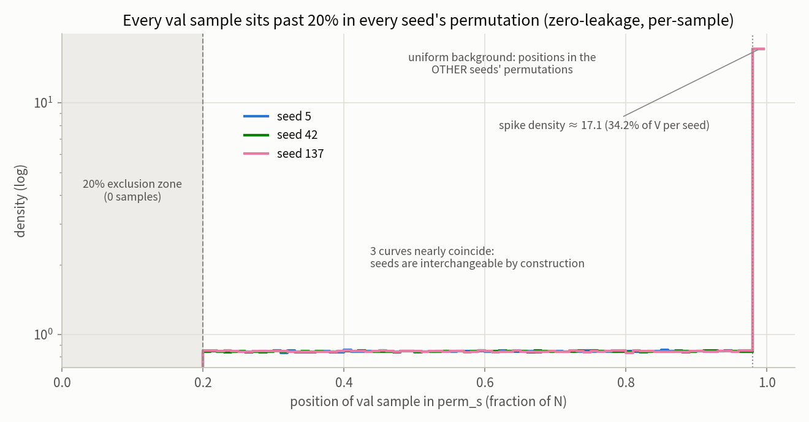
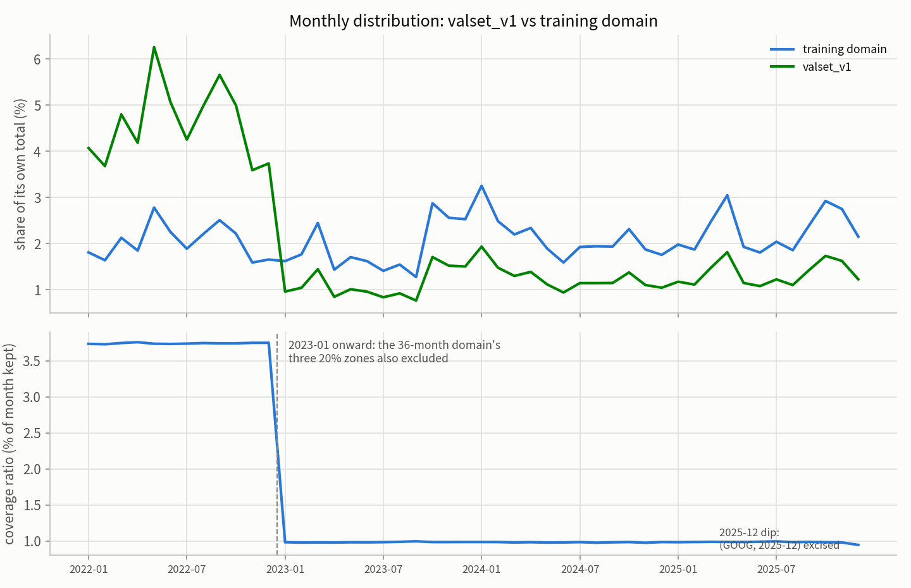
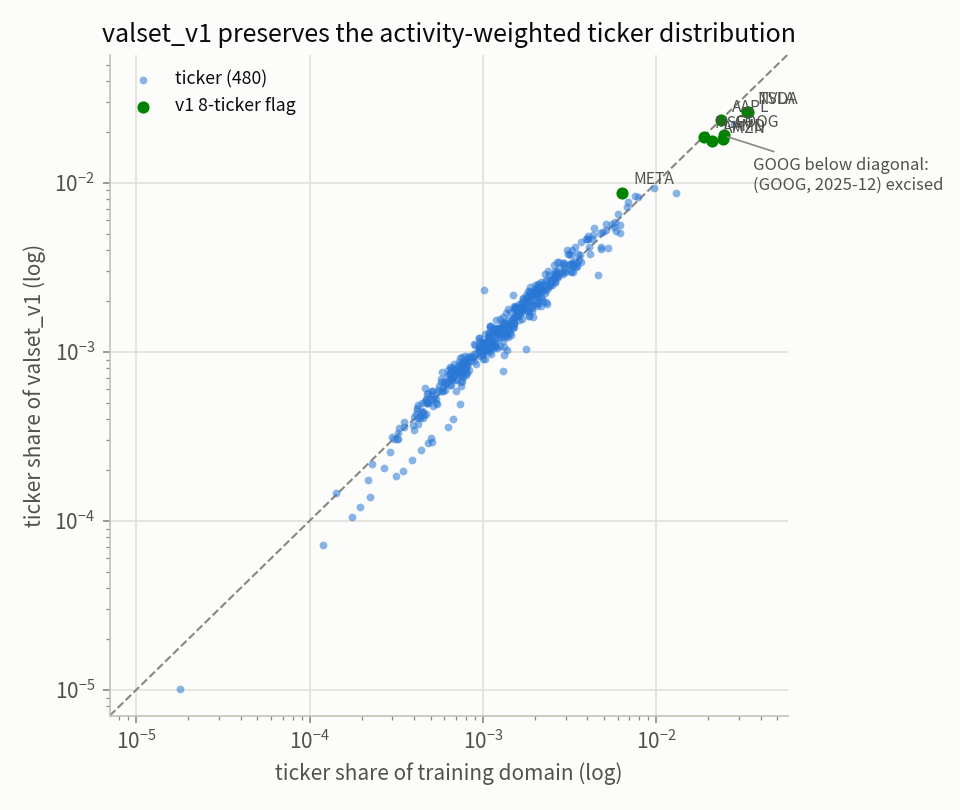
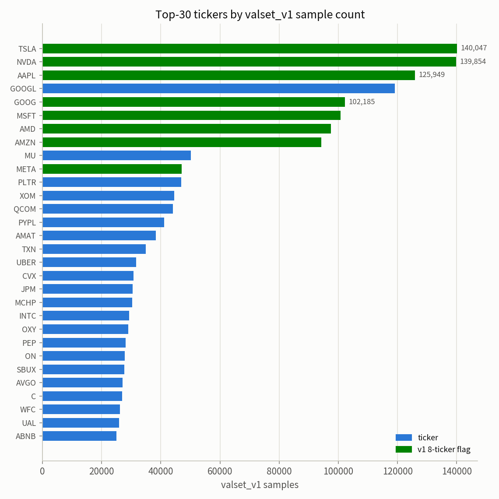

# valset_v1：S&P 500 限价订单簿建模固定验证集

*Frozen Validation Set for the S&P 500 Limit-Order-Book Scaling-Law Study · 2026-07-29*

---

## 执行摘要

valset_v1 是从 S&P 500 限价订单簿预训练语料中一次性建成、此后永久固定的验证集，共 **5,367,734 个样本**（占全域 1.661%，约 26.8 亿条消息、698 亿 token）。它解决一个具体问题：scaling-law 研究里的 33 个训练 run 要在同一把尺子上反复对比，这把尺子必须满足三件事——**训练确实没见过它**、**它和训练数据同分布**、**它永远不变**。

三个核心保证，每一个都有独立证据：第一，**零泄漏**。我们逐一核查了全部训练记录（含中途失败的重试），确认每个 run 只消费了其数据排列的一个前缀、最深至 16.63%，而验证集全部取自 20% 之后的区域，并做了逐样本核验（§4）；独立的行为学实验在 78M 与 350M 两个模型上完成交叉确认——模型对"确定见过"的数据没有任何损失优势，验证集与"确定没见过"的数据在同构成比较下不可区分（§10）。第二，**同分布**。样本位置由随机排列决定、与内容无关，因此验证集在内容上就是全域的均匀抽样：股票维度与全域的占比相关系数达 0.9861，488 只股票全覆盖（§5）。第三，**永久固定**。索引、SHA-256、完整构造档案一次冻结；未来训练只要不越过预留的排除边界，验证集永远有效（§4）。

使用上提供两种形态：**索引清单**（43 MB，配合源数据使用，附三档嵌套子集）和**实体数据包**（独立 squashfs 文件，自带全部样本数据，与训练数据包格式完全一致，现有代码零修改可读，§6）。实体包已交付两档——30,720 样本档（359 MB）与 307,200 样本档（3.51 GB），均通过逐字节质检。

---

## 1. 背景与动机

Scaling-law 研究的因变量是"held-out 交叉熵"：把不同规模的模型放在同一份从未参与训练的数据上测损失，再拟合损失随参数量与数据量的变化规律。本项目的主训练矩阵包含 33 个 run（12 个模型规模、每规模至多 3 个数据种子），后续还有长数据量探针、Transformer 对照矩阵等实验都要在同一把尺子上反复出数。

这带来两个要求。其一，这把尺子必须严格独立于所有训练数据——任何一个 run 见过的样本混进来，都会让对应点的损失被系统性低估，直接弯曲拟合曲线。其二，这把尺子必须一次定死——如果每次评测都临时抽一份数据，不同批次之间的对比就掺入了抽样噪声，而我们要分辨的 run 间损失差异只有千分之一的量级。

困难在于"独立"并不显然：三个数据种子各自对应一种数据打乱顺序，33 个 run 消费的区域彼此交错；此外还有若干支线实验（另一时间窗上的 Transformer 训练、一次微调、若干试运行）也接触过同一份语料。valset_v1 的构造把所有这些消费轨迹逐一核清，然后只从"确定无人碰过"的区域取样。

## 2. 数据集概览

| Property | Value |
|---|---|
| Source corpus | S&P 500 LOB, 488 tickers, 2022-01 – 2025-12, 26-token encoding |
| Sample definition | non-overlapping 500-message window (message + order-book stream) |
| Domain size N | **323,221,385** windows (472,442 ticker-day files) |
| **Validation set V** | **5,367,734 windows = 1.661% of N** |
| Volume | ≈ 2.68 B messages ≈ 69.8 B tokens |
| Nested subsets | 30,720 ⊂ 307,200 ⊂ 3,232,213 (= 1% of N) |
| Ticker coverage | 488 / 488 (GOOG missing only its 2025-12 slice) |
| Files touched | 434,842 / 472,442 (92.0%) |
| Legacy-corpus flag | 847,533 samples (15.79%) carry the `v1_8ticker` flag |
| Freezing | index lists + SHA-256 + full construction manifest |
| Materialized form | standalone squashfs shards, layout-identical to training shards (§6.2) |

## 3. 构造方法

构造的出发点是训练管线的一个结构性质：数据打乱由三个种子（5、42、137）驱动，每个种子把全部 3.23 亿个窗口排成一个确定的顺序，而任何一个 run 消费的都是这个顺序的**开头一段**——跑多少步，就消费多少（每步 128 个样本），从不跳跃。另一个同样关键的性质是：窗口在文件内的起始位置由一个与训练种子无关的固定随机数决定，所有 run 看到的"第 j 个窗口"覆盖的消息完全相同。这两条性质合起来意味着：只要知道每个种子下最深的消费步数，"哪些样本被碰过"就是一个可以精确回答的问题，且精确到消息级。

在此基础上分五步取样。第一步，对每个种子取其排列的**最后 2%**——这段离消费前沿最远，三个种子合并去重得到 19,007,384 个候选。第二步，删去落在任何一个种子排列**前 20%** 之内的候选：全部历史消费中最深的一条（种子 5 下的 700B-token 长训）也只到 16.63%，20% 这条线把所有已消费区域整体包住，还留出余量；剩余 12,106,704 个。第三步，处理另一条时间窗：Transformer 与位置编码实验是在 2023–2025 共 36 个月的子域上训练的，且该子域即将承载 Transformer 矩阵的重跑。我们把该子域三个种子排列的前 20% 对应回全域窗口（两个域的窗口起点有错位，相邻窗口一并删除），删去 6,735,581 个。第四步，一次 466 只股票子集上的试运行消费过 19,200 个样本，同法对应回来删去 1,347 个。第五步，GOOG 的 2025 年 12 月曾被一次微调完整训练过，整月删去 10,377 个。最终得到 5,367,734 个样本。

| Step | Samples | % of N |
|---|---:|---:|
| Union of each seed's last 2% (deduplicated) | 19,007,384 | 5.881% |
| Remove samples inside any seed's first 20% | 12,106,704 | 3.746% |
| Remove mapped windows of the 36-month domain's three 20% zones (incl. adjacent windows) | −6,735,581 | |
| Remove windows consumed by the 466-ticker pilot run | −1,347 | |
| Remove the entire (GOOG, 2025-12) month | −10,377 | |
| **Final validation set** | **5,367,734** | **1.661%** |

值得强调的是，"取排列的最后 2%"不会引入时间或内容上的偏向：排列是均匀随机的，样本被排到哪个位置与它是什么内容无关，所以最后 2% 在内容上就是全域的一份均匀随机抽样。这一点与"取数据集末尾一段时间"的朴素做法有本质区别，也是 §5 中分布一致性的来源。

## 4. 零泄漏保证

零泄漏的证据分三层，层层独立。

**第一层：全量消费核查。** 我们从实验跟踪系统逐一提取了这份语料上全部训练记录的实际步数——包括 270 个主项目 run、23 个长训 run，也包括中途崩溃的重试（它们同样消费了数据）。每个种子下的最深消费如下，全部落在 20% 排除线以内：

| Seed | Deepest consumer | Steps | Samples | % of N | Margin to 20% |
|---|---|---:|---:|---:|---:|
| 5 | 700B-token long-run | 420,000 | 53.76M | **16.63%** | 1.20× |
| 42 | 350M full-data run | 168,200 | 21.53M | 6.66% | 3.00× |
| 137 | primary matrix (6M size) | 106,909 | 13.68M | 4.23% | 4.72× |

一个反直觉的细节：主矩阵内消费最深的不是大模型而是 6M 小模型（4.23%）——固定墙钟与固定全局 batch 之下，小模型跑的步数多，消费反而大；最大的 350M 只消费 0.42%。但无论大小，全部远低于 20%。

**第二层：逐样本核验。** 构造完成后，我们对最终集合的每一个样本计算它在三个种子排列中的位置，确认全部位于 20% 之后（三个种子下的最小位置分别为 0.2000003、0.2000004、0.2000002，紧贴边界），且每个样本都属于至少一个种子的最后 2%。图 3 是这一验证的可视化：



灰色区域（排列的前 20%）内没有任何样本；中段的均匀背景是样本在"其它种子"排列中的位置；右端的尖峰对应"最后 2% 成员"身份。三条曲线几乎重合，说明三个种子在构造上完全对称。

**第三层：行为学实验**（§10）：用训练出的模型实测"验证集样本的损失是否与确定未见过的数据一致"，作为构造性证明之外的独立交叉证据。

零泄漏是需要维护的性质。manifest 中写入了**未来训练预算**：全域上每个种子的总步数不得超过 505,033（种子 5 已用 420,000，余量约 8.5 万步），36 个月子域上不得超过 381,251（是 Transformer 重跑单个 run 上限的 5.8 倍，重跑计划安全）；启用新的数据子域训练前必须重新审计。只要预算不破，验证集永远有效。

## 5. 统计性质

### 5.1 时间分布



图 2 上半：验证集与全域的月度占比曲线形状一致（都跟随市场活跃度波动），但 2022 年各月在验证集中的占比整体更高。下半图给出原因——覆盖率存在两个平台：

| Year | Coverage (val / domain) | Mechanism |
|---|---:|---|
| 2022 | **3.744%** | only the main-domain exclusions apply |
| 2023–2025 | 0.984–0.985% | the 36-month domain's three 20% zones also apply |

2022 年只受主域排除规则影响，保留率 3.744%；2023 年起叠加 36 个月子域的排除，保留率降到 0.984%。这个数字与理论预测完全吻合：一个样本要在 3 个种子 × 2 个相邻窗口共 6 次相互独立的 20% 随机排除中全部幸免，存活率应为 3.746% × 0.8⁶ ≈ 0.981%。构造行为与数学预期一致，本身就是一次正确性检验。

由此，验证集内部 2022 年与 2023–2025 年的比重约为 55:45（全域为 24.5:75.5）。做需要与全域同权重的结论时，按月加权即可精确还原——逐样本的月份解码已随交付物提供。

### 5.2 股票分布



图 1 把每只股票在验证集中的占比对全域占比作图（对数坐标）：488 个点紧贴对角线，相关系数 **0.9861**。也就是说，虽然验证集只有全域的 1.661%，它在股票维度上是全域分布的忠实缩尺——高活跃股票多、低活跃股票少，权重与真实消息流一致。



| # | Ticker | Val samples | Val share | Domain share | v1 flag |
|---|---|---:|---:|---:|:---:|
| 1 | TSLA | 140,047 | 2.609% | 2.634% | ✅ |
| 2 | NVDA | 139,854 | 2.605% | 2.937% | ✅ |
| 3 | AAPL | 125,949 | 2.346% | 2.312% | ✅ |
| 4 | GOOGL | 119,141 | 2.220% | 2.211% | — |
| 5 | GOOG | 102,185 | 1.904% | 2.444% | ✅ |
| 6 | MSFT | 100,678 | 1.876% | 1.842% | ✅ |
| 7 | AMD | 97,544 | 1.817% | 1.797% | ✅ |
| 8 | AMZN | 94,293 | 1.757% | 1.741% | ✅ |
| 9 | MU | 50,128 | 0.934% | 0.911% | — |
| 10 | META | 46,983 | 0.875% | 0.652% | — |

Top-10 股票合计占验证集 18.94%（全域 23.03%，差异主要来自 GOOG 与 NVDA 受排除规则影响略多）。表中带旗标的 8 只股票（GOOG、AAPL、NVDA、AMZN、META、TSLA、MSFT、AMD）合计 847,533 个样本（15.79%）：它们的原始消息曾被更早的 8 股票语料时代实验在不同预处理下接触过。评测本 S&P 500 训练队列不受任何影响；仅当评测那批早期模型时，须用旗标列排除这些样本。旗标默认保留而非删除，以免扭曲活跃度加权的分布。

## 6. 使用方法

### 6.1 索引方式（配合源数据）

三档嵌套子集按评测精度需求选用；子集是总池一次固定洗牌的前缀，严格嵌套，小档结论可无缝换大档加密：

| Subset | Size | Purpose | CE std. err. (per checkpoint, est.) |
|---|---:|---|---|
| `val_subset_30720` | 30,720 | routine quick eval (same size as the pre-registered test set) | < 1e-4 nats |
| `val_subset_307200` | 307,200 | high-precision comparisons | ~3e-5 nats |
| `val_subset_3232213` | 3,232,213 (= 1% of N) | final eval / paper numbers | ~1e-5 nats |
| `val_pool_indices` | 5,367,734 | full pool (superset of the above) | |

用法：以与训练完全相同的数据配置重建数据集（manifest 记录了全部配置项），把子集文件里的索引直接交给数据加载器取样本。最小档 30,720 与预注册测试集同规模，单个 checkpoint 的交叉熵标准误低于 1e-4 nats，足以分辨 run 之间千分之一量级的损失差异。

### 6.2 实体数据包（standalone squashfs）

对不便挂载全部源数据、或需要把验证集发给合作者的场景，我们把样本数据整体物化成独立的 squashfs 文件。它挂载后就是一个普通数据目录，目录结构、文件命名、索引格式与训练数据的月度包**完全一致**，现有代码把数据路径指过去即可读取：

```bash
mkdir -p /tmp/valset && squashfuse shard_valset_v1_30720.squashfs /tmp/valset
# 评测命令：DATA_ROOT=/tmp/valset，另加参数 --random_offsets_train False
# 用毕：fusermount -u /tmp/valset
```

需要加那个参数的原因：训练时读数据会在每个文件开头随机丢弃一段消息（避免每轮切窗位置相同），而实体包里每个文件恰好就是一个 500 条消息的样本，开头一条都不能丢。这是唯一的使用差异。

每个样本存为一对文件——消息流与订单簿各一个，文件名形如 `AAPL/AAPL_2023-05-17_message_val00123456.npy.zst`：股票、日期一目了然，`val` 后的编号是样本在验证集中的全局编号，凭它可以在随附的来历档案中查到该样本出自哪个源文件的哪些行。

| Property | Value / behaviour |
|---|---|
| Self-contained | one file carries all sample data; no dependency on the 48 monthly source shards |
| Layout-compatible | identical directory / naming / index scheme as training shards; no code change |
| Read-only | squashfs is immutable after packing |
| Integrity | SHA-256 of the shard; per-sample provenance (`provenance_*.npz`) |
| Deterministic order | loader sorts by ticker → date → id; evaluation order reproducible |
| Verified | L1: 2,048 samples byte-compared against source rows; L2: read end-to-end by the training dataloader |

| Tier | File | Size | Status |
|---|---|---:|---|
| 30,720 | `squashfs/output/shard_valset_v1_30720.squashfs` | 359 MB | **verified & delivered** (sha256 `ffcb71d90d96…`) |
| 307,200 | `squashfs/output/shard_valset_v1_307200.squashfs` | 3.51 GB | **verified & delivered** (sha256 `c344f4c84cd0…`) |
| 3,232,213 (1% N) | on demand | ~38 GB (est.) | not built |
| full pool (5,367,734) | on demand | ~63 GB (est.) | not built |

30,720 档覆盖 487 只股票（唯一例外是低活跃的 Q，在该档恰好无样本）；307,200 档覆盖全部 488 只。两档均通过双层质检（各抽 2,048 个样本逐字节比对，dataloader 全量读取核对）。质检为两层：L1 抽 2,048 个样本，把包内数据与源数据对应行**逐字节比对**；L2 用训练同款数据加载器把整个包挂载读一遍（样本总数核对与三点抽读）。两层全部通过后才登记 SHA-256 交付。

## 7. 质量审计（对照业界标准）

依据公开的验证集质量标准（数据泄漏防护、代表性、统计功效、版本化、复用纪律、行为学检验、文档化；来源见文末）逐项对照：

| # | Criterion | Standard | valset_v1 | Verdict |
|---|---|---|---|---|
| 1 | Disjointness / no leakage | disjoint from all training data; look-ahead care for time series | per-sample position proof, message-exact; cross-domain consumption subtracted with guards | **PASS** |
| 2 | Representativeness | i.i.d. with training distribution, all strata covered | ticker-share corr 0.9861, 488/488 tickers, activity-weighted; monthly re-weighting supported | **PASS** |
| 3 | Size / statistical power | judged by absolute count and metric SE (large-corpus norm 0.1–1%) | 5.37M samples (1.661%); CE SE < 1e-4 nats already at the 30,720 subset | **PASS** |
| 4 | Frozen & versioned | fixed once, hashed, reproducible | SHA-256 + manifest + deterministic build in the training environment | **PASS** |
| 5 | Reuse discipline | adaptive reuse wears a holdout out (Dwork et al.); keep an untouched final set | tiered subsets for routine use; pre-registered Feb-2026 test set untouched for final claims | **PASS** (policy) |
| 6 | Empirical leakage check | back construction proofs with a behavioral test | seen/held-out/val CE compared on 78M & 350M: no memorization gap; composition-adjusted VAL−MID CI contains 0 (§10) | **PASS** |
| 7 | Documentation | datasheet-style provenance, known biases disclosed | manifest + this report + §8 disclosures | **PASS** |

使用时需要长期记住三点。其一，验证集的年度权重偏向 2022（55:45），做与全域同权重的结论时按月加权。其二，(GOOG, 2025-12) 缺失与 8 股票旗标是已知的分布缺口。其三，本验证集度量的是与训练同分布的 held-out 交叉熵——这是 scaling-law 拟合需要的因变量；前向时移的泛化能力由另行预注册的 2026 年测试集负责，两者互补而不可互替。此外，理论文献提醒 holdout 在被自适应地反复使用后会缓慢失效，因此论文级结论应在触碰次数最少的大子集或预注册测试集上出数。

## 8. 已知局限与披露

除上节三点外，有两项构造期的残余不确定性，均已量化并写入 manifest。其一，语料早期（预处理管线定型之前）存在一批短暂的调试运行，其数据读取顺序已不可重建，估计至多 0.3% 的验证集样本存在消息级接触的可能；这些调试运行的模型早已废弃、不参与任何评测，因此不构成实际风险。其二，一组已删除记录的试运行若使用了标准种子则已被现有排除区覆盖，若使用了其它种子则期望影响约 0.05%。

## 9. 交付物清单

索引产物（`artifacts_valset_v1_j5790795/`，SHA-256 见目录内 `SHA256SUMS.txt`）：

```
val_pool_indices.npy          # 总池 5,367,734 × int64（已排序）
val_pool_decode.npz           # 逐样本解码：全局编号/文件/窗口/起始行/旗标
val_subset_{30720,307200,3232213}.npy   # 三档嵌套子集（30720 另有 json 副本）
files_48mo.csv                # 472,442 个源文件的元数据
manifest.json                 # 完整配方、证据链、未来预算、披露
```

实体数据包（`squashfs/output/`）：`shard_valset_v1_30720.squashfs`（已交付）及后续档位，各随附 `provenance_*.npz` 与 `SHA256SUMS.txt`。

配套：统计数据 `stats_valset_v1.json`；构建与质检脚本 `build_valset.py`、`valset_report_figs.py`、`squashfs/materialize_valset.py`、`squashfs/verify_valset_squashfs.py`（全部入库，可复现）。构建过程的三道正确性闸门全部通过：重建的数据集规模与两条独立历史日志锚点吻合；离线排列与训练数据加载器的等价性测试通过；最终集合逐种子逐样本位置核验通过（图 3）。

## 10. 泄漏检验实验（行为学验证）

在构造性证明之外，另设一个独立的行为学检验：如果训练确实没见过验证集，那么用训练出的模型去测，验证集样本的损失应当与"确定没见过的数据"不可区分，而与"确定见过的数据"有可测的差距。这类检验（文献中称 dataset inference / memorization-gap 检验）最常见的失效方式是对照组与被测组分布不同、产生假信号；本设计从源头规避——三组样本都是同一全域的均匀随机子集，唯一差别是训练暴露状态：

| Group | Definition | Training exposure |
|---|---|---|
| SEEN | uniform sample from the consumed prefix of seed 5 | seen exactly once |
| MID | uniform sample from positions [20%, 98%], outside every tail | never seen, not in val |
| VAL | `val_subset_30720` | never seen (claimed) |

对两个训练完成的模型（350M 与 78M，种子 5）各取三组、每组 30,720 个样本，比较平均交叉熵，置信区间用 bootstrap 估计。预注册判据：H1（检测力）——SEEN 组损失显著低于 MID 组，证明实验能测出"见过一次"的痕迹；H2（无泄漏）——VAL 组与 MID 组损失之差的置信区间包含零。两个判据同时成立即为无泄漏的实验证据；若 H1 不成立，说明单次曝光的记忆效应低于检测限，此时任何残余泄漏对损失评测的影响同样低于检测限，结论同样支持验证集的可用性。

**结果（78M，种子 5；每组 1,280 个 batch，bootstrap 20,000 次重采样）**：

| Metric | Mean CE (nats) | 95% CI |
|---|---|---|
| SEEN (seen once in training) | 0.559668 | [0.554663, 0.564737] |
| MID (never seen, mid-permutation) | 0.559874 | [0.554962, 0.564877] |
| VAL (validation set) | 0.604456 | [0.599929, 0.608963] |
| SEEN − MID | −0.000205 | [−0.007292, +0.006999] |
| VAL − MID | +0.044582 | [+0.037968, +0.051373] |

第一个判定：H1 未检出。SEEN 与 MID 的损失差为 −0.0002 nats，置信区间横跨零，检测限约 ±0.007 nats。也就是说，模型对确定在训练中见过一次的 30,720 个样本没有表现出任何可测量的损失优势。按预注册的解释路径，这直接支持验证集的可用性：连"真见过"的数据都留不下超过 0.007 nats 的痕迹，任何假想中的残余泄漏对损失评测的影响必然同样低于这个检测限。

第二个判定需要多一步分析。VAL 与 MID 的原始差为 +0.045 nats，显著为正，即验证集比中段对照组更难。这个方向本身就与泄漏相反：泄漏的特征是被泄漏数据的损失更低。真实来源是第 5.1 节已经记录的年份构成——36 个月子域（2023-01 至 2025-12）的排除只作用于这三年，2022 年样本全部存活，验证集因此以 55.3% 的比重偏向 2022 年，而 MID 组按全域均匀抽样、2022 年只占约 24.6%。2022 年恰是市场高波动、消息流本征熵最高的年份。按年份分层后两组几乎重合：

| Year | CE(MID) | CE(VAL) | VAL − MID |
|---|---|---|---|
| 2022 | 0.634013 | 0.640580 | +0.006567 |
| 2023 | 0.596778 | 0.601371 | +0.004593 |
| 2024 | 0.503214 | 0.506493 | +0.003279 |
| 2025 | 0.507776 | 0.507641 | −0.000135 |

（分层按 batch 内多数年份归类，batch 年份纯度 72–76%。）2022 年的损失比 2024–2025 年高约 0.13 nats，是原始差异的全部来源；同一年份之内两组的差不超过 +0.0066 nats。把验证集各年损失按 MID 组的年份权重重新加权后，构成调整后的 VAL − MID 为 **+0.003551，95% CI [−0.002575, +0.009780]**，置信区间横跨零。结论：在同构成比较下，验证集与"确定没被任何训练见过的数据"在统计上不可区分；原始 +0.045 的差异完全由 2022 年占比这一已记录的构造性质解释（见第 5.1、7 节），与泄漏无关。

**结果（350M，种子 5；每组 5,120 个 batch，bootstrap 20,000 次重采样）**：

| Metric | Mean CE (nats) | 95% CI |
|---|---|---|
| SEEN (seen once in training) | 0.571704 | [0.568466, 0.574844] |
| MID (never seen, mid-permutation) | 0.573214 | [0.569990, 0.576425] |
| VAL (validation set) | 0.619364 | [0.616462, 0.622313] |
| SEEN − MID | −0.001511 | [−0.006019, +0.003007] |
| VAL − MID | +0.046150 | [+0.041881, +0.050457] |

350M 完整复现了 78M 的模式。H1 同样未检出（−0.0015 nats，置信区间含零且更窄）。VAL − MID 的原始差 +0.0461 与 78M 的 +0.0446 几乎相同，这本身就是构成解释的又一强证据：年份构成是样本组的固有属性，两个模型看到的偏移量自然一致；若差异来自记忆或泄漏，效应量应随模型容量变化。按年份分层（350M batch 更小，年份纯度 91%）：

| Year | CE(MID) | CE(VAL) | VAL − MID |
|---|---|---|---|
| 2022 | 0.676993 | 0.680968 | +0.003975 |
| 2023 | 0.613392 | 0.605371 | −0.008021 |
| 2024 | 0.496920 | 0.501899 | +0.004978 |
| 2025 | 0.506774 | 0.509872 | +0.003098 |

逐年差有正有负、量级不超过 0.008 nats，构成调整后的 VAL − MID 为 **+0.001285，95% CI [−0.002490, +0.005097]**，置信区间横跨零。

**联合判定**：两个规模的模型给出一致证据。第一，两个模型都测不出"见过一次"的记忆痕迹（78M：−0.0002 ± 0.007；350M：−0.0015 ± 0.005），说明该训练规程下单次曝光不在损失上留痕，任何残余泄漏的影响低于检测限。第二，验证集与"确定没被训练见过的同分布数据"在构成调整后不可区分（两个模型的调整后置信区间都含零）。第三，验证集偏难的原始差异在两个模型上数值一致、可被构造参数定量预测，属于已记录的年份构成性质而非泄漏。行为学证据与 §4 的构造性证明相互独立、结论一致：验证集干净。

逐 batch 损失与分析脚本随交付物存档（`leakage_exp/results/`、`leakage_exp/analysis/`）。

## 11. 首个应用

验证集的第一个用途是重做 scaling-law 的 IsoFLOP 分析。33 条训练链的 432 个 checkpoint 已在本验证集上完成评测（磁盘上现存的全部存档），据此得到最优模型规模随算力的标度指数点估计 0.46，但对训练链做 bootstrap 后的 95% 置信区间宽达 [0.12, 0.56]，说明现有数据尚不足以把该指数定到小数点后一位。分析同时暴露出低算力切片的一个结构性缺口：小模型的早期 checkpoint 在训练时已被轮转删除，导致那些切片只有欠训大模型构成的单侧数据，顶点估计不可靠。完整的方法、逐切片结果与推荐的报告口径见 [`VALSET_ISOFLOP_ANALYSIS.md`](VALSET_ISOFLOP_ANALYSIS.md)。

## 参考来源

[Unidata: Validation Dataset in ML](https://unidata.pro/blog/validation-dataset-in-ml/) · [IBM: What is Data Leakage in Machine Learning](https://www.ibm.com/think/topics/data-leakage-machine-learning) · [Google Research: The reusable holdout](https://research.google/blog/the-reusable-holdout-preserving-validity-in-adaptive-data-analysis/) · [Dwork et al. 2015, Generalization in Adaptive Data Analysis and Holdout Reuse](https://arxiv.org/pdf/1506.02629) · [mlbenchmarks.org: Test set reuse](https://mlbenchmarks.org/05-test-set-reuse.html) · [The Reliability Gap in Benchmark Auditing (arXiv 2606.03305)](https://arxiv.org/html/2606.03305) · [Gap-K%: Measuring Top-1 Prediction Gap for Detecting Pretraining Data (arXiv 2601.19936)](https://arxiv.org/pdf/2601.19936) · [awesome-data-contamination paper list](https://github.com/lyy1994/awesome-data-contamination)

*报告：2026-07-29；§10 行为学实验结果补入：2026-07-30。构建于与训练完全一致的软件环境与数据管线（torch 2.8.0）；统计与图表由 `valset_report_figs.py` 生成，图表文字为英文、正文为中文。*
